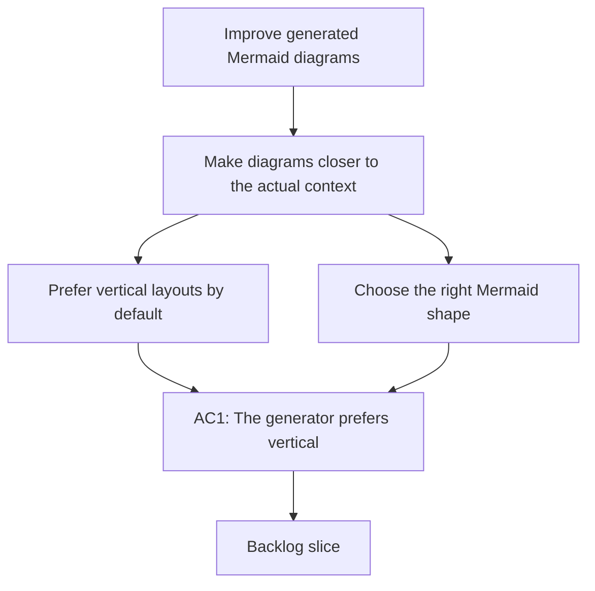

## req_146_improve_generated_mermaid_diagrams_for_logics_docs - Improve generated Mermaid diagrams for Logics docs
> From version: 1.23.0
> Schema version: 1.0
> Status: Draft
> Understanding: 91%
> Confidence: 88%
> Complexity: Medium
> Theme: Logics doc quality and Mermaid relevance
> Reminder: Update status/understanding/confidence and references when you edit this doc.

# Needs
- Make generated Mermaid diagrams in Logics docs feel closer to the actual document context instead of generic template filler.
- Prefer vertical Mermaid layouts by default so diagrams read top to bottom instead of as flat linear lists.
- Reduce the tendency to generate diagrams that just enumerate `1/2/3/4/5` style steps when the document is really about relationships, states, choices, or feedback loops.
- Allow the generator to choose different Mermaid shapes when they better fit the document, such as flowchart, sequence, state, pie, mindmap, or other supported diagram families.
- Keep the diagrams compact, readable, and safe for the current Logics rendering and linting rules.

# Context
- The repository already has a request that made Mermaid diagrams more context aware and less generic, but the current output can still feel too templated and too linear.
- In practice, the generated diagrams often default to a plain step list even when the document would be clearer as a branching flow, a state progression, a sequence of interactions, or a compact topical map.
- This is especially noticeable when the request or backlog item has:
  - a clear branching decision;
  - a repeated feedback loop;
  - state transitions;
  - multiple actors or phases;
  - or a strong conceptual structure that does not fit a numbered chain.
- The preferred direction is:
  - vertical diagrams first;
  - context-derived nodes and edges instead of generic placeholders;
  - multiple Mermaid diagram families when they better match the doc;
  - and concise labels that summarize the real need rather than narrating every implementation step.
- The change should stay aligned with Logics Mermaid safety rules and the repository preview contract:
  - ASCII labels only;
  - no markdown formatting inside labels;
  - compact business-readable content;
  - and compatibility with current preview and lint behavior.

# Acceptance criteria
- AC1: Generated Mermaid blocks default to a vertical orientation when that improves readability, instead of flattening every diagram into a horizontal or list-like shape.
- AC2: The generator uses document context to choose a diagram form that fits the need, rather than always producing the same generic flowchart structure.
- AC3: The generated diagram avoids needless linear step lists when the document is better represented by a branching, stateful, or relational structure.
- AC4: The generator can produce different Mermaid families when appropriate, including at least one non-flowchart option for cases where a sequence, state, or topical map is a better fit.
- AC5: The diagram remains compact and business-readable, with node text that reflects the actual request, backlog slice, or task rather than boilerplate placeholders.
- AC6: The implementation preserves current Mermaid safety and rendering constraints in Logics docs.
- AC7: The new behavior is covered by tests or fixtures that prove the generator selects a better-shaped diagram for representative document types.

# Scope
- In:
  - choosing Mermaid orientation based on document structure and readability
  - generating diagrams that are more context-specific and less generic
  - selecting alternate Mermaid families when they fit the document better
  - updating or adding tests for representative request, backlog, and task docs
- Out:
  - replacing Mermaid entirely
  - allowing arbitrary diagrams that break current safety rules
  - making every document use the same diagram family
  - rewriting historical Mermaid blocks that are unrelated to the generator behavior

# Dependencies and risks
- Dependency: the current Mermaid generation path in the Logics kit remains the main place to improve diagram quality.
- Dependency: current preview and lint rules must still accept the generated output.
- Risk: choosing too many diagram families could make the output feel inconsistent or harder to scan.
- Risk: overly eager verticalization could make some diagrams taller without making them more useful.
- Risk: trying to be more contextual without guardrails could produce diagrams that are more specific but less readable.
- Risk: if the generator only changes labels and not structure, the diagrams may still feel like generic scaffolds.

# AC Traceability
- AC1 -> the vertical-layout preference in `# Needs` and `# Context`. Proof: the request explicitly asks for top-to-bottom diagrams by default.
- AC2 -> the context-driven diagram selection requirement. Proof: the request requires the generator to pick the shape based on the document, not a fixed template.
- AC3 -> the anti-list requirement. Proof: the request explicitly calls out less `1/2/3/4/5` style output when that shape is not useful.
- AC4 -> the alternate Mermaid-family requirement. Proof: the request explicitly names flowchart, sequence, state, pie, and mindmap as examples of better-fitting shapes.
- AC5 -> the context-first label requirement. Proof: the request requires diagram text to reflect the actual need rather than boilerplate.
- AC6 -> the safety and rendering constraints. Proof: the request keeps the current Mermaid contract intact.
- AC7 -> the test requirement. Proof: the request explicitly asks for fixtures or tests that lock in representative shape choices.

# Definition of Ready (DoR)
- [x] Problem statement is explicit and user impact is clear.
- [x] Scope boundaries (in/out) are explicit.
- [x] Acceptance criteria are testable.
- [x] Dependencies and known risks are listed.

# Companion docs
- Product brief(s): (none yet)
- Architecture decision(s): (none yet)

# AI Context
- Summary: Improve the Mermaid generator so Logics docs get more contextual, vertical, and shape-appropriate diagrams instead of generic linear placeholders.
- Keywords: mermaid, vertical layout, context aware, flowchart, sequence, state, pie, mindmap, diagram quality
- Use when: Use when the generated Mermaid block is too generic, too linear, or the wrong diagram family for the document.
- Skip when: Skip when the work is about Mermaid linting, signature refresh, or preview rendering rather than diagram generation itself.

# References
- `logics/request/req_061_generate_context_aware_mermaid_diagrams_and_keep_them_updated_in_logics_docs.md`
- `logics/tasks/task_074_orchestration_delivery_for_req_061_context_aware_mermaid_in_logics_docs.md`
- `logics/skills/logics-flow-manager/SKILL.md`
- `logics/skills/logics-flow-manager/scripts/logics_flow_core.py`
- `logics/skills/logics-flow-manager/scripts/logics_flow_doc_commands.py`
- `logics/skills/logics-flow-manager/scripts/logics_flow_hybrid_runtime_core.py`
- `src/logicsReadPreviewHtml.ts`

# Backlog
- `item_269_improve_mermaid_orientation_and_diagram_variety`
