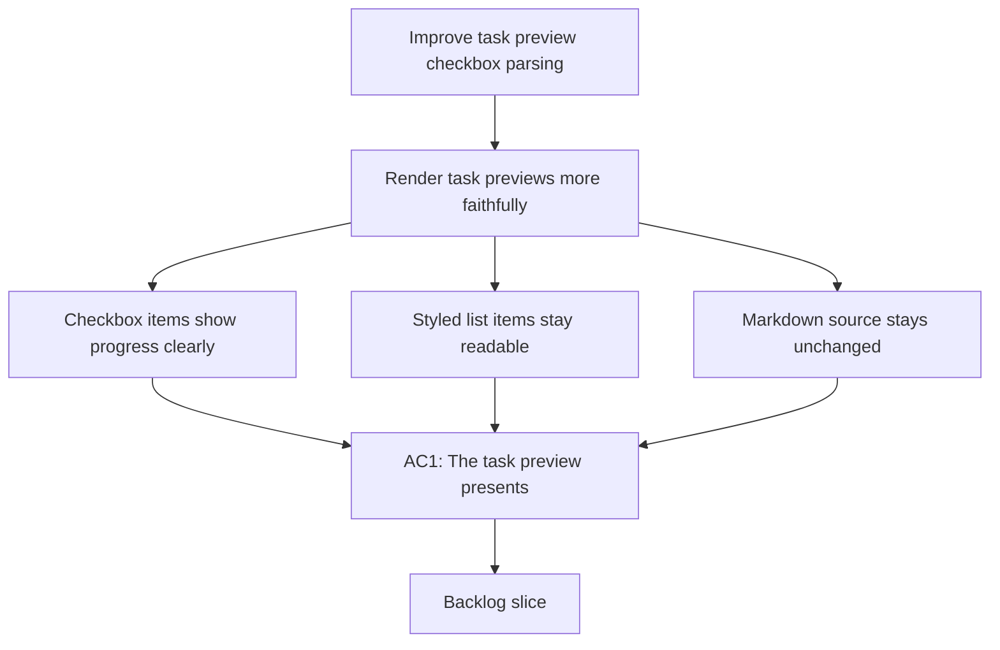

## req_147_improve_task_preview_checkbox_parsing_in_board_preview - Improve task preview checkbox parsing in board preview
> From version: 1.23.0
> Schema version: 1.0
> Status: Done
> Understanding: 91%
> Confidence: 87%
> Complexity: Medium
> Theme: Board preview and task markdown rendering
> Reminder: Update status/understanding/confidence and references when you edit this doc.

# Needs
- Render task previews in the board more faithfully when the document contains checkboxes, styled list items, and similar Markdown task syntax.
- Make unchecked and checked items visually clearer in preview so task progress reads at a glance instead of looking like plain text.
- Preserve the task markdown source while improving how the preview interprets the body.
- Keep the preview compact and operational, not decorative.

# Context
- Tasks in Logics docs often use Markdown checklist syntax such as `- [ ]` and `- [x]` to express progress, validation steps, and remaining work.
- The current board preview surface can make those items feel too raw or too flat, which reduces the value of the preview when the selected object is a task.
- Similar issues apply to other lightly styled Markdown elements that should remain readable in preview, such as:
  - indented checklist groups;
  - bold or emphasized task labels;
  - inline code used for commands or filenames;
  - ordered steps that belong to the task body;
  - and short nested list structures that summarize delivery or validation work.
- The goal is not to turn the board into a full markdown editor. The goal is to make the task preview parse the task body more intelligently so the operational content is easier to scan.
- The board header already carries identity information, so the preview should spend its space on task structure and progress cues rather than repeating identity metadata.
- This request stays in the preview-rendering layer and should not alter the persisted task markdown format.

# Acceptance criteria
- AC1: Task previews in the board present checklist items in a visibly distinct form so checked and unchecked items are easy to tell apart.
- AC2: The preview recognizes common task markdown patterns, including checkbox lists and lightly styled inline elements, instead of flattening them into plain text where practical.
- AC3: The preview preserves the meaning and ordering of the task body so progress steps, validation notes, and remaining items stay understandable.
- AC4: The change improves readability without requiring a full markdown editor experience in the board preview.
- AC5: The underlying markdown files remain unchanged on disk; only the preview rendering changes.
- AC6: The new rendering behavior is covered by tests or fixtures for representative task documents with checkboxes and nested list content.

# Scope
- In:
  - improving board preview parsing for task checkbox items
  - rendering checked and unchecked task items more clearly
  - handling simple styled markdown elements that commonly appear in task bodies
  - updating preview tests or fixtures for representative task docs
- Out:
  - changing the task markdown file format
  - adding a full markdown editor to the board
  - reworking request or backlog document formatting
  - altering task source content on disk

# Dependencies and risks
- Dependency: the board preview layer already has access to the task body and can render task-specific preview content.
- Dependency: the markdown rendering path must keep compatibility with the current preview and UI contracts.
- Risk: over-parsing could make the preview look too busy or too close to a full editor.
- Risk: a too-literal render of checklist syntax might preserve raw markdown while still failing to improve scanability.
- Risk: styling changes without test coverage could regress other document types that share the preview renderer.

# AC Traceability
- AC1 -> the checkbox visibility requirement in `# Acceptance criteria`. Proof: the request explicitly asks for checked and unchecked items to be easy to distinguish.
- AC2 -> the checklist and styled-element parsing requirement in `# Context`. Proof: the request calls out checkbox lists, bold labels, inline code, and nested lists as common patterns that should be rendered better.
- AC3 -> the ordering and meaning preservation requirement. Proof: the request keeps validation and progress semantics intact while improving readability.
- AC4 -> the preview-only scope. Proof: the request limits the change to board preview rendering rather than a full editing surface.
- AC5 -> the out-of-scope notes. Proof: persisted markdown content remains untouched.
- AC6 -> the testing requirement. Proof: the request explicitly asks for fixtures or tests covering representative task documents.

# Definition of Ready (DoR)
- [x] Problem statement is explicit and user impact is clear.
- [x] Scope boundaries (in/out) are explicit.
- [x] Acceptance criteria are testable.
- [x] Dependencies and known risks are listed.

# Companion docs
- Product brief(s): (none yet)
- Architecture decision(s): (none yet)

# AI Context
- Summary: Improve how task previews in the board render checklist syntax and lightly styled markdown so task progress and validation steps are easier to scan without changing the underlying markdown source.
- Keywords: task preview, checkbox parsing, markdown rendering, board preview, checklist, nested lists, progress
- Use when: Use when task bodies in board previews need clearer rendering for checkboxes and other common markdown patterns.
- Skip when: Skip when the work is about the persisted task markdown content or unrelated board layout changes.

# References
- `media/renderDetails.js`
- `media/renderMarkdown.js`
- `media/logicsModel.js`
- `src/logicsReadPreviewHtml.ts`
- `src/logicsViewDocumentController.ts`

# Backlog
- `item_270_improve_task_preview_markdown_parsing`

# Task
- `task_123_orchestration_delivery_for_req_144_to_req_147_board_preview_and_doc_quality_improvements`
