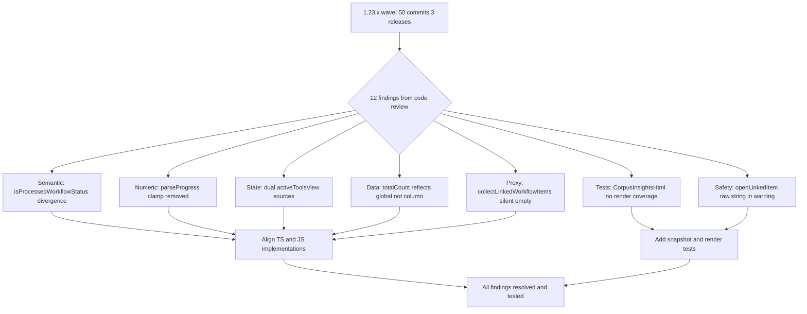

## req_148_fix_post_1_23_review_findings_across_indexer_semantics_render_consistency_and_test_coverage - Fix post-1.23 review findings across indexer semantics render consistency and test coverage
> From version: 1.23.2 (refreshed)
> Schema version: 1.0
> Status: Done
> Understanding: 96%
> Confidence: 90%
> Complexity: Medium
> Theme: UI
> Reminder: Update status/understanding/confidence and linked backlog/task references when you edit this doc.

# Needs
- A code review of the 1.23.x wave (50 commits, 3 releases in 24h) surfaced 12 findings spanning semantic divergence, unclamped numeric parsers, duplicated state, untested render paths, and missing unit coverage.
- These are not blocking regressions today but will silently degrade correctness as the codebase grows — especially the `isProcessedWorkflowStatus` divergence and the `parseProgress` clamping removal.
- The goal is to fix all 12 findings before they compound, with clear acceptance criteria per finding.

# Context
- The 1.23.x wave added: Logics Corpus Insights panel (740 lines), enriched Read Preview, native markdown task-list rendering, compact metric badges, and a split 3-button toolbar replacing the single tools toggle.
- Two implementations of `isProcessedWorkflowStatus` now diverge: `src/logicsIndexer.ts` accepts `ready | done | complete | completed | archived` while `media/webviewSelectors.js` accepts only `done`. Items with `Status: ready` are treated as processed by the indexer but not by the webview.
- `parseProgress` in `logicsIndexer.ts` removed the `Math.max(0, Math.min(100, ...))` clamp; `isProcessedWorkflowItem` checks `progress === 100`, so a `Progress: 150` value will no longer be detected as complete.
- `collectLinkedWorkflowItems` was moved from inline JS to a `modelApi` proxy — if the model does not expose the function, the proxy returns `[]` silently.
- `totalCount` in board column groups is set to `visibleItems.length` (global total) rather than the column item count, which distorts any ratio display.
- `activeToolsView` is maintained independently in both `webviewChrome.js` and `toolsPanelLayout.js`, creating two sources of truth for the same UI state.
- `logicsCorpusInsightsHtml.ts` (740 lines of HTML-generating code) has no snapshot or render tests; only the controller is tested via mocks.
- `openLinkedItem` in `logicsViewDocumentController.ts` interpolates a raw `reference` string into a `showWarningMessage` call without sanitization.
- The onboarding keyboard navigation between tool panel views was removed along with the tab toggle system.

# Acceptance criteria
- AC1: `isProcessedWorkflowStatus` in `src/logicsIndexer.ts` and `media/webviewSelectors.js` accept the same set of statuses — divergence resolved and covered by tests.
- AC2: `parseProgress` clamps its return value to `[0, 100]` so that `isProcessedWorkflowItem` correctly detects `Progress: 150` as complete.
- AC3: `activeToolsView` has a single authoritative source shared by `webviewChrome.js` and `toolsPanelLayout.js`; no stale secondary copy.
- AC4: `totalCount` on board column groups reflects the item count of that column, not the global `visibleItems.length`.
- AC5: `collectLinkedWorkflowItems` proxy in `webviewSelectors.js` does not silently return `[]` when `modelApi` does not expose the function — either the proxy is guarded with a clear fallback or the model always exposes the function.
- AC6: `logicsCorpusInsightsHtml.ts` has at least one snapshot or render test covering the main HTML output paths (pie chart, badge, relative date, empty state).
- AC7: `openLinkedItem` in `logicsViewDocumentController.ts` sanitizes or encodes the `reference` value before interpolating it into the warning message.
- AC8: The 5 functions flagged as untested by the graph (`openHarnessReadTab`, `assistCommitAll`, `isProcessedWorkflowStatus`, `parseProgress`, `collectLinkedWorkflowItems`) each have at least one direct unit test.
- AC9: `createProgressComplexityBadge` in `renderBoard.js` has at least one test covering an unknown stage value to guard against silent edge-case failures.
- AC10: All existing tests pass after the fixes (`npm run test`).

# Definition of Ready (DoR)
- [x] Problem statement is explicit and user impact is clear.
- [x] Scope boundaries (in/out) are explicit.
- [x] Acceptance criteria are testable.
- [x] Dependencies and known risks are listed.

# Companion docs
- Product brief(s): (none needed — purely correctness fixes)
- Architecture decision(s): (none needed)

# AI Context
- Summary: Post-1.23 code review findings — semantic divergence, numeric clamp, state duplication, silent proxies, missing render tests
- Keywords: isProcessedWorkflowStatus, parseProgress, activeToolsView, totalCount, collectLinkedWorkflowItems, CorpusInsightsHtml, openLinkedItem
- Use when: Triaging or planning fixes for the 12 findings identified in the 1.23.x review wave.
- Skip when: The work targets new features or unrelated modules.

# Backlog
- `logics/backlog/item_272_fix_isprocessedworkflowstatus_divergence_parseprogress_clamp_and_totalcount_semantics.md`
- `logics/backlog/item_273_fix_activetoolsview_dual_state_collectlinkedworkflowitems_proxy_and_openlinkeditem_safety.md`
- `logics/backlog/item_274_add_missing_render_tests_for_corpusinsightshtml_untested_functions_and_badge_edge_cases.md`
