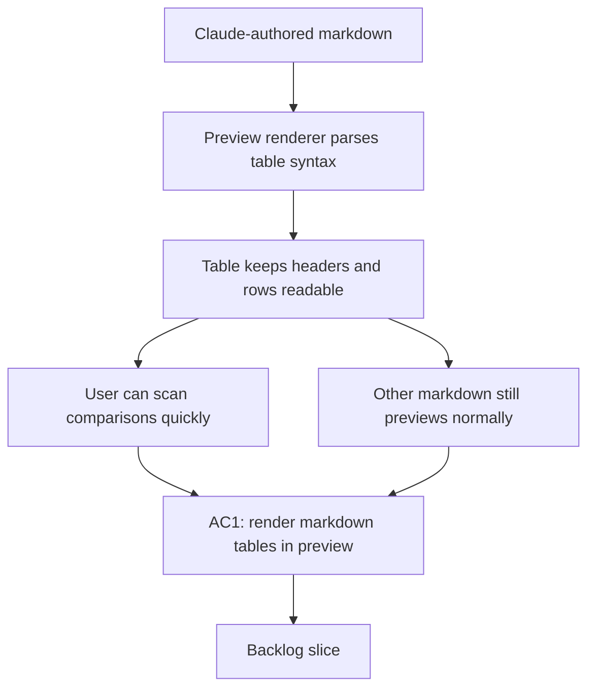

## req_149_improve_markdown_preview_table_rendering_in_claude_authored_docs - Improve Markdown preview table rendering in Claude-authored docs
> From version: 1.23.3
> Schema version: 1.0
> Status: Draft
> Understanding: 94%
> Confidence: 91%
> Complexity: Medium
> Theme: Board preview and markdown rendering
> Reminder: Update status/understanding/confidence and linked backlog/task references when you edit this doc.

# Needs
- Render Markdown tables in preview surfaces so they stay visually structured instead of collapsing into hard-to-scan plain text.
- Preserve headers, rows, and cell boundaries well enough that comparison tables remain readable at a glance.
- Keep the underlying `.md` source unchanged and limit the fix to preview rendering behavior.
- Handle partially formed or malformed tables gracefully so other document content still previews correctly.

# Context
- Claude often writes tables when comparing roles, states, options, or responsibilities in Logics docs.
- The current preview tool struggles to present those tables graphically, which makes the document harder to review even when the Markdown source is valid.
- Example:

  | Surface | Pre-V2 role | Post-V2 role |
  |---|---|---|
  | DeepVault - Navy | Primary local explorer for validation | Internal operator tool for content inspection and ingestion debugging |
  | DeepVault - Bishop | Primary local chat for answer quality testing | Internal QA surface for retrieval and ranking regression checks |
  | DeepVault - Gordon | Planned Teams channel | Primary production user-facing channel |
- The goal is not to rewrite authored content or introduce a full spreadsheet-like editor.
- The goal is to make the preview renderer recognize standard Markdown table syntax and present it in a readable layout inside the existing preview surface.
- Any change should remain compatible with the rest of the Markdown preview pipeline and should not make non-table documents worse.

# Acceptance criteria
- AC1: Markdown tables render in preview with a visibly structured layout instead of flattening into plain text.
- AC2: Table headers, rows, and cell separation remain readable enough to support quick comparison across columns.
- AC3: The preview keeps the original `.md` source unchanged on disk.
- AC4: The fix does not degrade preview behavior for non-table Markdown content.
- AC5: Representative table cases, including the example above, are covered by tests or fixtures.
- AC6: Malformed or partial table-like input fails gracefully without breaking the rest of the preview.

# Scope
- In:
  - table-aware preview rendering for standard Markdown tables
  - keeping table structure legible in preview output
  - tests or fixtures for representative table content
  - safe fallback behavior for malformed tables
- Out:
  - changing the persisted Markdown source
  - adding a spreadsheet editor or interactive table controls
  - reformatting authored docs to avoid tables
  - altering unrelated Markdown rendering behavior that does not touch tables

# Definition of Ready (DoR)
- [x] Problem statement is explicit and user impact is clear.
- [x] Scope boundaries (in/out) are explicit.
- [x] Acceptance criteria are testable.
- [x] Dependencies and known risks are listed.

# Companion docs
- Product brief(s): (none yet)
- Architecture decision(s): (none yet)

# AI Context
- Summary: Make the Markdown preview render standard tables in a readable structured form so Claude-authored docs remain easy to review.
- Keywords: markdown, preview, table, rendering, claude-authored docs, structured layout, comparison tables
- Use when: Use when the preview surface cannot present authored Markdown tables clearly enough for review.
- Skip when: Skip when the problem is unrelated to table rendering or the Markdown preview pipeline.

# Dependencies and risks
- Dependency: the preview renderer can already detect Markdown block structure before it turns content into HTML or UI elements.
- Dependency: table rendering must coexist with the existing preview layout and typography rules.
- Risk: a too-literal table render could overflow small panels or become harder to read than the current fallback.
- Risk: changing table handling could regress other Markdown constructs if the parser treats tables too broadly.
- Risk: malformed tables may appear in real docs, so fallback behavior matters as much as the happy path.

# References
- `media/renderMarkdown.js`
- `src/logicsReadPreviewHtml.ts`
- `src/logicsViewDocumentController.ts`

# AC Traceability
- AC1 -> the structured table rendering requirement in `# Acceptance criteria`. Proof: the request explicitly asks for tables to render in a visibly structured layout rather than plain text.
- AC2 -> the readability requirement in `# Acceptance criteria`. Proof: the request keeps headers, rows, and cell boundaries legible for quick comparison.
- AC3 -> the source-preservation requirement in `# Needs` and `# Scope`. Proof: the request limits the change to preview rendering and leaves the `.md` source unchanged.
- AC4 -> the non-regression requirement in `# Acceptance criteria` and `# Scope`. Proof: the request says non-table Markdown should not get worse.
- AC5 -> the example table in `# Context`. Proof: the request asks for representative table coverage, including the provided example.
- AC6 -> the malformed-input fallback requirement in `# Needs` and `# Scope`. Proof: the request explicitly calls for graceful handling of partial or malformed tables.

# Backlog
- `item_275_improve_markdown_preview_table_rendering_in_claude_authored_docs`
