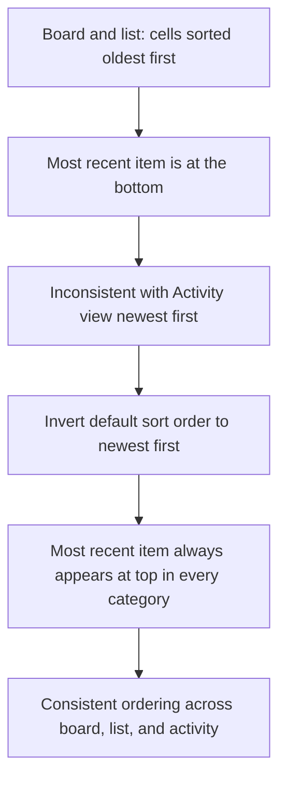

## req_150_invert_default_sort_order_in_board_and_list_so_most_recent_items_appear_first - Invert default sort order in board and list so most recent items appear first
> From version: 1.24.0
> Schema version: 1.0
> Status: Ready
> Understanding: 100% (refreshed)
> Confidence: 100%
> Complexity: Low
> Theme: UI
> Reminder: Update status/understanding/confidence and linked backlog/task references when you edit this doc.

# Needs
- In the board and list views, cells within each category/column are currently sorted oldest-first (ascending by date). The order should be inverted so the most recent item always appears at the top, for every item type (requests, backlog, tasks, specs, etc.).
- The sort field is `updatedAt` — a recently modified item is more relevant than one recently created but never touched since.
- This matches the existing behaviour already in place in the Activity view, where the most recent entry is always shown first.

# Context
Today, when a user opens the board or the list, items inside each column/category are ranked oldest-to-newest. This means the freshest work is buried at the bottom and the user must scroll to find it. The Activity view already uses newest-first ordering and users expect the same convention in the board and list.

# Acceptance criteria
- AC1: Board and list cells are sorted newest-first (descending by `updatedAt`) by default, for all item types including specs.
- AC2: The ordering is consistent across all category columns in both board and list modes.
- AC3: The behaviour matches the Activity view, where the most recent entry is always first.
- AC4: No manual sort toggle is required — the inversion applies as the new default.
- AC5: Existing sort/filter controls (if any) remain functional and compose correctly with the new default order.

# Scope
- In:
  - Change the default sort direction from ascending to descending for date-based ordering in board and list views.
  - Apply the change to every item type (requests, backlog items, tasks, specs, etc.) and every category/column.
- Out:
  - Adding a new sort control or toggle — the request is to fix the default, not to introduce new UI controls.
  - Changing the Activity view (it already behaves correctly).
  - Changing grouping or filtering logic.

# Dependencies and risks
- Dependency: the sort direction must be applied at the rendering layer, not only for one item type.
- Dependency: `updatedAt` must be a stable, populated field across all item types — verify before implementing.
- Risk: any component that hard-codes ascending date order would need to be updated individually.

# Definition of Ready (DoR)
- [x] Problem statement is explicit and user impact is clear.
- [x] Scope boundaries (in/out) are explicit.
- [x] Acceptance criteria are testable.
- [x] Dependencies and known risks are listed.

# Companion docs
- Product brief(s): (none yet)
- Architecture decision(s): (none yet)

# Backlog
- `item_276_invert_default_sort_order_in_board_and_list_so_most_recent_items_appear_first`
