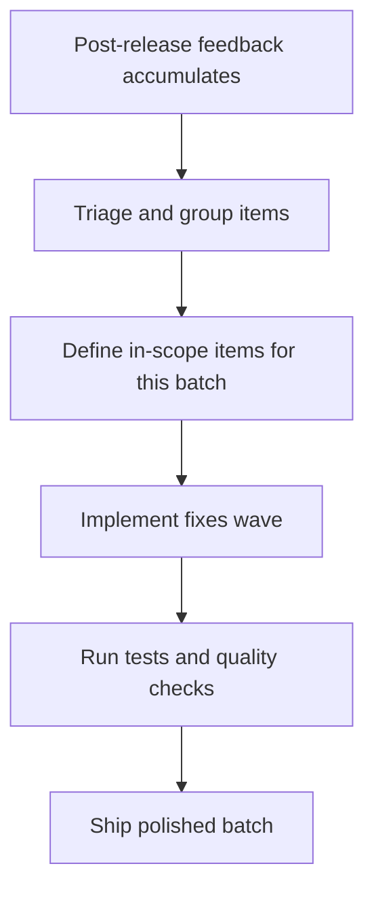

## req_151_address_miscellaneous_post_release_feedback_across_the_plugin - Address miscellaneous post-release feedback across the plugin
> From version: 1.24.0
> Schema version: 1.0
> Status: Draft
> Understanding: 100%
> Confidence: 100%
> Complexity: Low
> Theme: UI
> Reminder: Update status/understanding/confidence and linked backlog/task references when you edit this doc.

# Needs
- Collect and resolve small, independent feedback items that surface after each release but are too minor or unrelated to each other to warrant their own dedicated request.
- Keep the plugin polished by ensuring these loose ends are triaged, grouped, and closed as a single delivery wave rather than accumulated as noise in the backlog.

# Context
After each release cycle, a set of small observations accumulates: minor visual inconsistencies, wording adjustments, edge-case behaviours that are slightly off, and low-effort UX improvements. Individually they are too small to track as standalone requests, but left unaddressed they degrade the overall quality of the experience. This request acts as a landing zone for that category of feedback so it can be groomed, batched, and shipped efficiently.

# Acceptance criteria
- AC1: All feedback items listed in scope are addressed or explicitly deferred with a reason.
- AC2: Each fix is covered by at least a manual verification step or an automated test where practical.
- AC3: No regressions are introduced in existing board, list, activity, or preview behaviours.
- AC4: The batch is committed as a coherent wave with updated Logics docs.

# Scope
- In:
  - Small visual, wording, or UX inconsistencies reported after the latest release.
  - Low-complexity edge-case fixes that do not require a dedicated architectural decision.
  - Items explicitly listed here as they are identified during grooming.
- Out:
  - New features or significant behaviour changes — those belong in their own dedicated requests.
  - Performance or security work.
  - Items already tracked in an open dedicated request.

# Feedback items (to be populated during grooming)
<!-- Add individual items here as they are identified, e.g.:
- [ ] Item description — source / reported by
-->
- [ ] Spec cells in board/list must not display the Flow information
- [ ] Cell borders must not be coloured by status — the colour should be reserved for the hover effect

# Dependencies and risks
- Risk: scope creep — items must stay small and independent; anything requiring design discussion should be spun off into its own request.
- Risk: items may overlap with open requests; check before adding to avoid duplicate work.

# Clarifications
- Items in this batch are shipped as a single grouped backlog item — no need to promote each one individually.
- Items already tracked in a dedicated request (e.g. req_150 for sort order) must not be listed here to avoid confusion.
- A feedback item that grows in complexity during implementation should be spun off into its own request at that point.

# Definition of Ready (DoR)
- [x] Problem statement is explicit and user impact is clear.
- [x] Scope boundaries (in/out) are explicit.
- [x] Acceptance criteria are testable.
- [x] Dependencies and known risks are listed.

# Companion docs
- Product brief(s): (none yet)
- Architecture decision(s): (none yet)

# Backlog
- (none yet)
