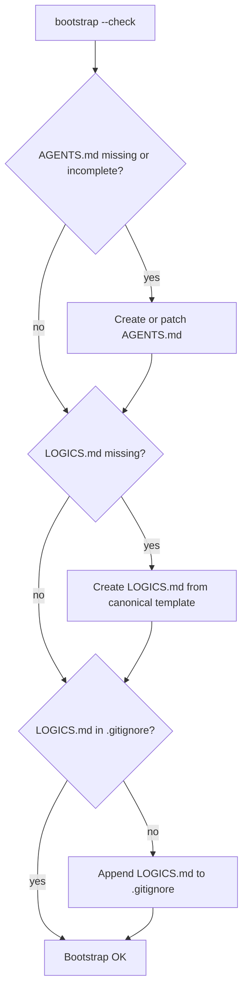

## req_152_extend_bootstrap_repair_to_create_and_maintain_agents_md_and_logics_md - Extend bootstrap repair to create and maintain AGENTS.md and LOGICS.md
> From version: 1.24.0
> Schema version: 1.0
> Status: Draft
> Understanding: 100%
> Confidence: 90%
> Complexity: Low
> Theme: UI
> Reminder: Update status/understanding/confidence and linked backlog/task references when you edit this doc.

# Needs
- The bootstrap repair flow must ensure that `AGENTS.md` and `LOGICS.md` exist at the repo root and are correctly wired together, the same way it already ensures that `logics/` folders and `.gitkeep` files exist.
- `LOGICS.md` must be added to `.gitignore` automatically if it is not already there.
- `AGENTS.md` must contain the `@LOGICS.md` reference if the file exists but the line is missing.

# Context
`AGENTS.md` and `LOGICS.md` are local AI assistant config files (gitignored) that teach the AI how to use the Logics kit in this repository. They are currently created manually. If a developer sets up a fresh clone, or if the files are accidentally deleted, there is no automatic recovery path — the AI loses its Logics context silently.

The bootstrap script already handles idempotent creation of missing repo structure. Extending it to cover these two files makes the AI context as resilient as the rest of the Logics setup.

# Acceptance criteria
- AC1: `bootstrap --check` detects a missing `AGENTS.md` and reports it as a required action.
- AC2: `bootstrap` creates `AGENTS.md` with at least the `@LOGICS.md` reference when it does not exist.
- AC3: `bootstrap` patches an existing `AGENTS.md` to add `@LOGICS.md` if the reference is absent, without overwriting other existing references.
- AC4: `bootstrap` creates `LOGICS.md` from the canonical template when it does not exist.
- AC5: `bootstrap` adds `LOGICS.md` to `.gitignore` when it is not already listed.
- AC6: All actions are idempotent — re-running bootstrap on an already-correct setup produces no changes.
- AC7: `--dry-run` mode reports what would be created or patched without writing anything.

# Scope
- In:
  - Extending the bootstrap script to handle `AGENTS.md`, `LOGICS.md`, and the `.gitignore` entry.
  - Shipping a canonical `LOGICS.md` template inside the kit that bootstrap uses as its source.
- Out:
  - Changing the content of `LOGICS.md` or `AGENTS.md` on repos that already have them correctly configured.
  - Managing other AI config files (`CODE_REVIEW_GRAPH.md`, `RTK.md`, etc.).
  - Committing or pushing these files — they remain gitignored and local.

# Dependencies and risks
- Dependency: a canonical `LOGICS.md` template must live inside `logics/skills/logics-bootstrapper/` so bootstrap can source it without hardcoding content in the script.
- Risk: patching an existing `AGENTS.md` must be additive only — never overwrite lines the user has added manually.

# Definition of Ready (DoR)
- [x] Problem statement is explicit and user impact is clear.
- [x] Scope boundaries (in/out) are explicit.
- [x] Acceptance criteria are testable.
- [x] Dependencies and known risks are listed.

# Companion docs
- Product brief(s): (none yet)
- Architecture decision(s): (none yet)

# Backlog
- (none yet)
