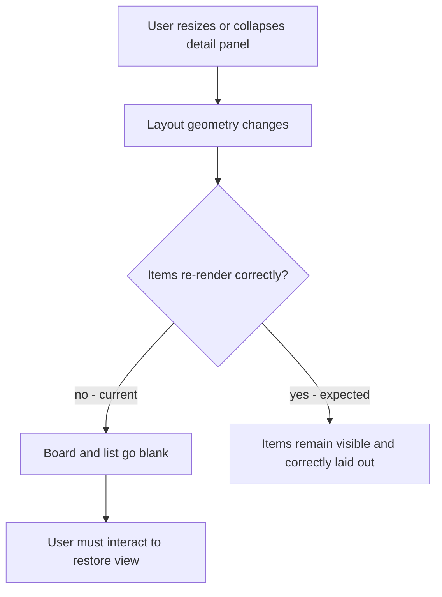

## req_153_fix_board_and_list_items_disappearing_when_the_detail_panel_is_resized_or_collapsed - Fix board and list items disappearing when the detail panel is resized or collapsed
> From version: 1.24.0
> Schema version: 1.0
> Status: Ready
> Understanding: 100%
> Confidence: 100%
> Complexity: Low
> Theme: UI
> Reminder: Update status/understanding/confidence and linked backlog/task references when you edit this doc.

# Needs
- When the detail panel is resized or collapsed, board and list items intermittently disappear from the view.
- The items must remain visible and correctly rendered at any panel size, including when the detail panel is fully collapsed.

# Context
The plugin layout includes a resizable detail panel alongside the board/list. When the user reduces or collapses that panel, the available space for the board/list changes. In some cases this resize event causes the item list to go blank — the items are no longer rendered even though they still exist. The user must interact with the view (scroll, click, switch tabs) to get them to reappear. This is a rendering/layout synchronisation bug: the board/list does not correctly reflow or re-render when the panel geometry changes.

# Acceptance criteria
- AC1: Board and list items remain visible and correctly rendered when the detail panel is resized to any width.
- AC2: Board and list items remain visible and correctly rendered when the detail panel is fully collapsed.
- AC3: No user interaction (scroll, click, tab switch) is required to restore the view after a resize.
- AC4: The fix does not introduce layout regressions in normal panel states (open, half-open).

# Scope
- In:
  - Fix the render/reflow logic that causes items to disappear on panel resize or collapse.
- Out:
  - Changing the resize or collapse behaviour itself.
  - Changing the layout model of the detail panel.

# Dependencies and risks
- Risk: the bug may be intermittent and depend on specific panel width thresholds — reproducing it reliably is a prerequisite for a confident fix.

# Definition of Ready (DoR)
- [x] Problem statement is explicit and user impact is clear.
- [x] Scope boundaries (in/out) are explicit.
- [x] Acceptance criteria are testable.
- [x] Dependencies and known risks are listed.

# Companion docs
- Product brief(s): (none yet)
- Architecture decision(s): (none yet)

# Backlog
- `item_279_fix_board_and_list_items_disappearing_when_the_detail_panel_is_resized_or_collapsed`
