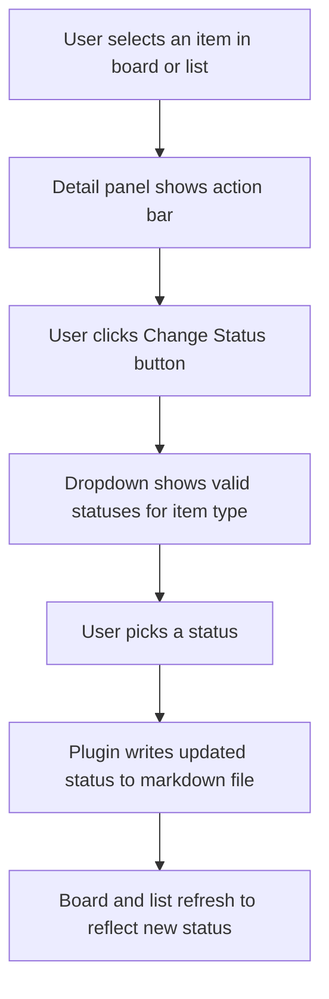

## req_154_add_a_manual_status_selector_button_in_the_detail_panel_to_change_item_status_directly - Add a manual status selector button in the detail panel to change item status directly
> From version: 1.24.0
> Schema version: 1.0
> Status: Draft
> Understanding: 100%
> Confidence: 100%
> Complexity: Medium
> Theme: UI
> Reminder: Update status/understanding/confidence and linked backlog/task references when you edit this doc.

# Needs
- Add a button in the detail panel action bar (below the Obsolete button) that opens a status selector, allowing the user to change the status of the selected item directly without opening the file.
- The selector must show only the statuses that are valid for the item's type.

# Context
Currently, the detail panel exposes a fixed set of actions: Edit, Read, Promote, Done, Obsolete. There is no way to set arbitrary statuses (e.g. `Ready`, `In progress`, `Blocked`, `Archived`) without manually editing the markdown file. This forces the user out of the plugin for a common workflow operation. A status selector button would close this gap and make status management fully accessible from the panel.

The valid status sets per type are:
- **Request**: `Draft` → `Ready` → `Done` | `Archived`
- **Backlog**: `Draft` → `Ready` → `In progress` → `Blocked` → `Done` | `Archived`
- **Task**: `Draft` → `Ready` → `In progress` → `Blocked` → `Done` | `Archived`
- **Spec**: `Draft` → `Ready` → `In progress` → `Done` | `Archived`

# Acceptance criteria
- AC1: A status selector button appears in the detail panel action bar for all supported item types (request, backlog, task, spec).
- AC2: The selector shows only the statuses that are valid for the selected item's type.
- AC3: The current status is visually highlighted in the selector.
- AC4: Selecting a status updates the `Status:` indicator in the markdown file and triggers a board/list refresh.
- AC5: The button is disabled or hidden when no item is selected.
- AC6: The action composes correctly with the existing Done and Obsolete buttons — it does not duplicate their function but complements them.

# Scope
- In:
  - Add a status selector button to the detail panel action bar.
  - Implement per-type valid status sets.
  - Write the updated status to the markdown file and refresh the view.
- Out:
  - Replacing the existing Done or Obsolete buttons — they can coexist.
  - Adding status transitions to the board cells directly (only the detail panel for now).
  - Status history or audit trail.

# Dependencies and risks
- Dependency: the plugin must be able to write the `Status:` line in a markdown file reliably without corrupting surrounding content.
- Risk: if the status set varies across kit versions, the selector must stay in sync with the canonical set defined in `logics/instructions.md`.
- Risk: the selector label must stay short enough to remain readable at full width.

# Clarifications
- The button is placed immediately below the Obsolete button, as the last element in the action bar.
- It takes full width, matching the width of the Obsolete button.
- Its visual style (shape, size, border, typography) must match the Obsolete button — same component or same CSS treatment, just different label and colour intent.
- It opens an inline dropdown or VS Code quick-pick on click; it does not navigate away from the panel.

# Definition of Ready (DoR)
- [x] Problem statement is explicit and user impact is clear.
- [x] Scope boundaries (in/out) are explicit.
- [x] Acceptance criteria are testable.
- [x] Dependencies and known risks are listed.

# Companion docs
- Product brief(s): (none yet)
- Architecture decision(s): (none yet)

# Backlog
- (none yet)
