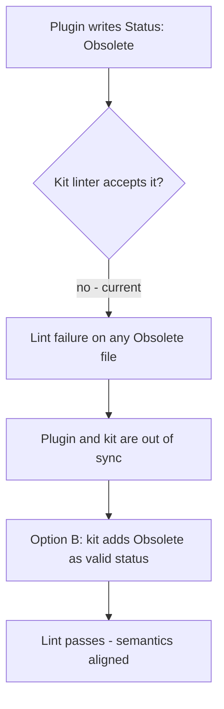

## req_155_align_obsolete_status_between_plugin_and_logics_kit - Align Obsolete status between plugin and Logics kit
> From version: 1.24.0
> Schema version: 1.0
> Status: Ready
> Understanding: 100%
> Confidence: 100%
> Complexity: Low
> Theme: UI
> Reminder: Update status/understanding/confidence and linked backlog/task references when you edit this doc.

# Needs
- The plugin's "Obsolete" button writes `Status: Obsolete` to markdown files, but `Obsolete` is not a valid status in the Logics kit — the linter rejects it.
- The valid kit statuses are: `Draft | Ready | In progress | Blocked | Done | Archived`.
- This mismatch must be resolved by adding `Obsolete` to the kit's canonical allowed set, preserving the distinct semantic between "abandoned without delivery" (Obsolete) and "completed and shelved" (Archived).

# Context
The plugin implements a "mark as Obsolete" action that sets `Status: Obsolete` and `Progress: 100%` directly in the markdown file. This value is not in the canonical allowed set defined by the doc linter (`logics/skills/logics-doc-linter/scripts/logics_lint.py`). Any file marked Obsolete by the plugin would fail `lint --require-status`.

The two resolution paths are:
- **Option A** — Replace `Obsolete` with `Archived` in the plugin (no kit change needed, but loses semantic precision).
- **Option B** — Add `Obsolete` to the kit's allowed set in the linter, SKILL.md, instructions.md, and README (preserves the distinct meaning).

Preferred resolution is **Option B**: the semantic difference is real and worth an explicit value.

# Acceptance criteria
- AC1: After the fix, no file marked by the plugin's Obsolete action fails `lint --require-status`.
- AC2: `Obsolete` is added to the kit's allowed status set for request, backlog, and task doc types.
- AC3: The linter, SKILL.md, instructions.md, and README in the kit are updated consistently.
- AC4: Existing files already written with `Status: Obsolete` pass lint after the kit update.

# Scope
- In:
  - Add `Obsolete` to the kit linter's allowed set for workflow doc kinds.
  - Update kit documentation (SKILL.md, instructions.md, README) to reflect the new value.
- Out:
  - Migrating existing `Archived` files — only new files going forward will use `Obsolete` explicitly.
  - Changing what the plugin button does behaviourally.

# Clarifications
- The kit is a git submodule (`logics/skills/`) — the linter change lives there and must be applied to the submodule source.
- `Obsolete` means: item was abandoned or superseded without being implemented.
- `Archived` remains valid for completed items that are no longer active.

# Dependencies and risks
- Dependency: the linter change is in the kit submodule, not in the plugin repo directly.
- Risk: if the submodule is not updated after the kit change, the lint will still fail on the plugin side.

# Definition of Ready (DoR)
- [x] Problem statement is explicit and user impact is clear.
- [x] Scope boundaries (in/out) are explicit.
- [x] Acceptance criteria are testable.
- [x] Dependencies and known risks are listed.

# Companion docs
- Product brief(s): (none yet)
- Architecture decision(s): (none yet)

# Backlog
- `item_282_align_obsolete_status_between_plugin_and_logics_kit`
