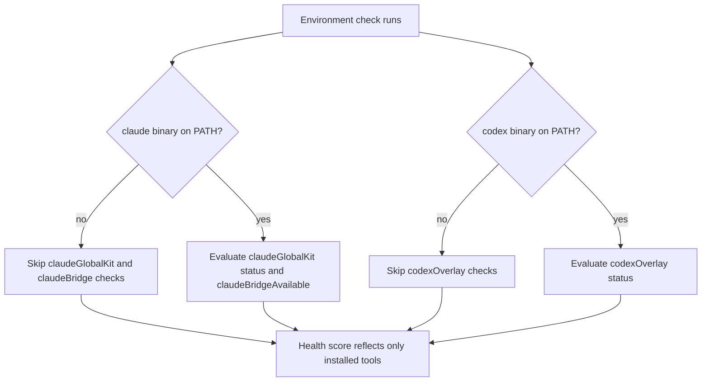

## req_156_gate_claude_and_codex_environment_checks_on_whether_those_assistants_are_installed_and_used - Gate Claude and Codex environment checks on whether those assistants are installed and used
> From version: 1.24.0
> Schema version: 1.0
> Status: Ready
> Understanding: 100%
> Confidence: 100%
> Complexity: Low
> Theme: UI
> Reminder: Update status/understanding/confidence and linked backlog/task references when you edit this doc.

# Needs
- The plugin currently checks `codexOverlay.status`, `claudeGlobalKit.status`, and `claudeBridgeAvailable` unconditionally and includes them in the "Degraded" environment count regardless of whether the user has Claude or Codex installed.
- These checks should only be evaluated and surfaced as issues when the corresponding assistant is actually installed and in use on the user's machine.
- A user who does not use Claude or Codex should see a clean, healthy environment without spurious degradation warnings about tools they have not installed.

# Context
`inspectRuntimeLaunchers` in `src/runtimeLaunchers.ts` already detects whether the `claude` and `codex` binaries are present on PATH (`hasClaude`, `hasCodex`). However, the environment health computation in `src/logicsViewProviderSupport.ts` does not use these flags as a gate — it counts `codexOverlay.status !== "healthy"` and `claudeGlobalKit.status` issues unconditionally.

The result is that users who only use Ollama, OpenAI, or no AI assistant at all are shown degradation warnings about Claude and Codex configuration, which are irrelevant to them and create noise in the environment check panel.

# Acceptance criteria
- AC1: When the `claude` binary is not detected on PATH, `claudeGlobalKit` and `claudeBridgeAvailable` checks are excluded from the degraded count and not surfaced as issues.
- AC2: When the `codex` binary is not detected on PATH, `codexOverlay` checks are excluded from the degraded count and not surfaced as issues.
- AC3: When both binaries are absent, the environment reports as healthy (assuming no other issues), with no Claude or Codex warnings.
- AC4: When a binary is present, the existing checks behave exactly as before — no regression for users who do have the assistants installed.
- AC5: The environment summary text does not mention Claude or Codex configuration issues if the corresponding binary is absent.

# Scope
- In:
  - Gate `codexOverlay` health evaluation on `hasCodex`.
  - Gate `claudeGlobalKit` and `claudeBridgeAvailable` health evaluation on `hasClaude`.
  - Propagate `hasClaude` / `hasCodex` from `RuntimeLaunchersSnapshot` into the health computation logic in `logicsViewProviderSupport.ts`.
- Out:
  - Changing the detection logic itself (`runtimeLaunchers.ts` already does this correctly).
  - Changing what is shown when the binary IS present — all existing checks remain in place.
  - Adding a user preference or toggle — the gate is purely presence-based.

# Dependencies and risks
- Dependency: `inspectRuntimeLaunchers` must be called before the health computation, and its result passed through. Check whether it is already available at the call sites in `logicsViewProviderSupport.ts`.
- Risk: if `hasClaude` / `hasCodex` detection is slow (subprocess), ensure the gate does not add latency to the environment check path.

# Definition of Ready (DoR)
- [x] Problem statement is explicit and user impact is clear.
- [x] Scope boundaries (in/out) are explicit.
- [x] Acceptance criteria are testable.
- [x] Dependencies and known risks are listed.

# Companion docs
- Product brief(s): (none yet)
- Architecture decision(s): (none yet)

# Backlog
- `item_283_gate_claude_and_codex_environment_checks_on_whether_those_assistants_are_installed_and_used`
