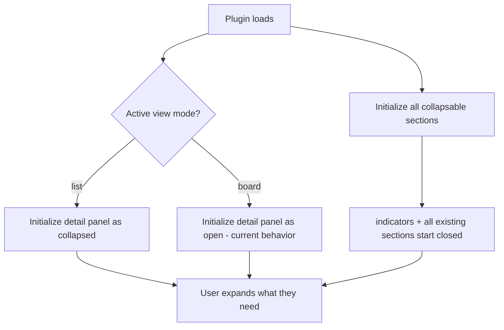

## req_157_initialize_detail_panel_collapsed_in_list_mode_and_all_collapsable_sections_closed_by_default - Initialize detail panel collapsed in list mode and all collapsable sections closed by default
> From version: 1.24.0
> Schema version: 1.0
> Status: Ready
> Understanding: 100%
> Confidence: 100%
> Complexity: Low
> Theme: UI
> Reminder: Update status/understanding/confidence and linked backlog/task references when you edit this doc.

# Needs
- **Need 1** — When the plugin loads in list mode (`viewMode: "list"`), the detail panel must initialize as collapsed (`detailsCollapsed: true`). Currently it always starts open regardless of the view mode.
- **Need 2** — All collapsable sections inside the detail panel must initialize closed. Currently the `indicators` section starts open; all others already default to collapsed.

# Context
In `media/main.js`, `uiState` is initialized with `detailsCollapsed: false` unconditionally (line 138). In list mode, the detail panel occupies horizontal space that is less useful than in board mode — the list is already information-dense and having the detail panel open by default pushes content off-screen and distracts from the list.

The `defaultCollapsedDetailSections` array (line 99) already collapses 8 of the 9 sections (`attentionExplain`, `contextPack`, `dependencyMap`, `companionDocs`, `specs`, `primaryFlow`, `references`, `usedBy`), but `indicators` (the section key defined at line 385 of `media/renderDetails.js`) is missing from this list and therefore starts expanded. All sections should start closed so the detail panel opens progressively as the user expands what they need.

# Acceptance criteria
- AC1: On first load in list mode, the detail panel is collapsed (`detailsCollapsed: true`).
- AC2: On first load in board mode, the detail panel remains open — existing behaviour preserved.
- AC3: The `indicators` section is added to `defaultCollapsedDetailSections` and starts closed.
- AC4: All 9 collapsable sections in the detail panel start closed on plugin load.
- AC5: Persisted state (from a previous session) is still restored correctly — the new defaults only apply when there is no prior persisted state.

# Scope
- In:
  - Set `detailsCollapsed: true` as the default when `viewMode` is `"list"` at init time in `media/main.js`.
  - Add `"indicators"` to `defaultCollapsedDetailSections` in `media/main.js`.
- Out:
  - Changing the collapse behaviour after the user has manually toggled a section or the panel.
  - Changing the default view mode.
  - Persisting the new defaults across sessions — persisted state always wins.

# Dependencies and risks
- Risk: if persisted state already exists from a previous session, it will override the new defaults. This is the correct behaviour (AC5), but it means the fix is only visible on fresh installs or after a state reset.

# Definition of Ready (DoR)
- [x] Problem statement is explicit and user impact is clear.
- [x] Scope boundaries (in/out) are explicit.
- [x] Acceptance criteria are testable.
- [x] Dependencies and known risks are listed.

# Companion docs
- Product brief(s): (none yet)
- Architecture decision(s): (none yet)

# Backlog
- `item_284_initialize_detail_panel_collapsed_in_list_mode_and_all_collapsable_sections_closed_by_default`
