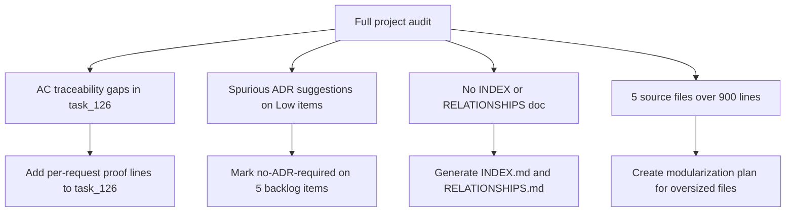

## req_158_address_post_audit_improvements_across_workflow_traceability_docs_and_oversized_source_files - Address post-audit improvements across workflow traceability docs and oversized source files
> From version: 1.24.0
> Schema version: 1.0
> Status: Done
> Understanding: 100%
> Confidence: 100% (final)
> Complexity: Medium
> Theme: UI
> Reminder: Update status/understanding/confidence and linked backlog/task references when you edit this doc.

# Needs
- Fix AC traceability gaps: the 10 new requests (req_150 → req_157) promoted to task_126 are missing per-request AC proof lines in the task doc — the audit flags them as untraced.
- Suppress spurious ADR suggestions: item_277, item_279, item_280, item_281, item_282 are all Low complexity UI fixes. The audit suggests ADRs, but they are not warranted. Their backlog docs should explicitly record "no ADR required" to silence the signal.
- Generate `logics/INDEX.md` and `logics/RELATIONSHIPS.md` so the growing doc set (158 requests, 285 backlog items, 121 tasks) is navigable without scanning every folder.
- Plan modularization of the largest source files: `logicsViewProviderSupport.ts` (1 025 lines), `logicsViewProvider.ts` (1 004 lines), `media/main.js` (1 002 lines), `media/renderBoard.js` (935 lines), `media/logicsModel.js` (910 lines). These are the highest-risk files in the codebase.

# Context
A full project audit (global review + workflow audit) surfaced four categories of improvement. The first two (AC traceability and ADR noise) are documentation hygiene. The third (INDEX/RELATIONSHIPS) is a navigation aid. The fourth (oversized files) is a risk flag — the three files above 1 000 lines are each single points of failure for large surface areas of the plugin.

# Acceptance criteria
- AC1: AC traceability proof lines are added to task_126 for each of req_150 to req_157, so the audit no longer reports traceability gaps.
- AC2: item_277, item_279, item_280, item_281, item_282 each have an explicit note in their Architecture decision section stating no ADR is required, silencing the audit signal.
- AC3: `logics/INDEX.md` is generated and up to date.
- AC4: `logics/RELATIONSHIPS.md` is generated and up to date.
- AC5: A modularization plan exists for the 5 oversized files — either as a new request/backlog item or as explicit notes in `logics/architecture/`.

# Scope
- In:
  - Documentation updates to task_126 (AC proof lines).
  - Backlog doc updates for 5 items (no-ADR notes).
  - Generating INDEX.md and RELATIONSHIPS.md via kit scripts.
  - Scoping a modularization plan (not implementing the refactor in this request).
- Out:
  - Actually refactoring the oversized files — that is a separate delivery.
  - Changing any functional behaviour.

# Dependencies and risks
- Risk: INDEX.md and RELATIONSHIPS.md are generated files — they should be regenerated after each significant workflow change to stay accurate.

# AC Traceability
- AC1 -> Task `task_126_orchestration_delivery_for_req_150_to_req_154_plugin_polish_and_status_selector` and backlog items `item_285_fix_ac_traceability_gaps_in_task_126_and_suppress_spurious_adr_signals_on_low_complexity_backlog_items`, `item_286_generate_index_md_and_relationships_md_for_the_logics_doc_corpus`, and `item_287_create_modularization_plan_for_the_five_oversized_source_files`. Proof: implemented in task_126 waves 9 to 11 and closed by the task finish flow on 2026-04-11.
- AC2 -> Task `task_126_orchestration_delivery_for_req_150_to_req_154_plugin_polish_and_status_selector` and backlog items `item_285_fix_ac_traceability_gaps_in_task_126_and_suppress_spurious_adr_signals_on_low_complexity_backlog_items`, `item_286_generate_index_md_and_relationships_md_for_the_logics_doc_corpus`, and `item_287_create_modularization_plan_for_the_five_oversized_source_files`. Proof: implemented in task_126 waves 9 to 11 and closed by the task finish flow on 2026-04-11.
- AC3 -> Task `task_126_orchestration_delivery_for_req_150_to_req_154_plugin_polish_and_status_selector` and backlog items `item_285_fix_ac_traceability_gaps_in_task_126_and_suppress_spurious_adr_signals_on_low_complexity_backlog_items`, `item_286_generate_index_md_and_relationships_md_for_the_logics_doc_corpus`, and `item_287_create_modularization_plan_for_the_five_oversized_source_files`. Proof: implemented in task_126 waves 9 to 11 and closed by the task finish flow on 2026-04-11.
- AC4 -> Task `task_126_orchestration_delivery_for_req_150_to_req_154_plugin_polish_and_status_selector` and backlog items `item_285_fix_ac_traceability_gaps_in_task_126_and_suppress_spurious_adr_signals_on_low_complexity_backlog_items`, `item_286_generate_index_md_and_relationships_md_for_the_logics_doc_corpus`, and `item_287_create_modularization_plan_for_the_five_oversized_source_files`. Proof: implemented in task_126 waves 9 to 11 and closed by the task finish flow on 2026-04-11.
- AC5 -> Task `task_126_orchestration_delivery_for_req_150_to_req_154_plugin_polish_and_status_selector` and backlog items `item_285_fix_ac_traceability_gaps_in_task_126_and_suppress_spurious_adr_signals_on_low_complexity_backlog_items`, `item_286_generate_index_md_and_relationships_md_for_the_logics_doc_corpus`, and `item_287_create_modularization_plan_for_the_five_oversized_source_files`. Proof: implemented in task_126 waves 9 to 11 and closed by the task finish flow on 2026-04-11.

# Definition of Ready (DoR)
- [x] Problem statement is explicit and user impact is clear.
- [x] Scope boundaries (in/out) are explicit.
- [x] Acceptance criteria are testable.
- [x] Dependencies and known risks are listed.

# Companion docs
- Product brief(s): (none yet)
- Architecture decision(s): (none yet)

# Backlog
- `item_285_fix_ac_traceability_gaps_in_task_126_and_suppress_spurious_adr_signals_on_low_complexity_backlog_items`
- `item_286_generate_index_md_and_relationships_md_for_the_logics_doc_corpus`
- `item_287_create_modularization_plan_for_the_five_oversized_source_files`
