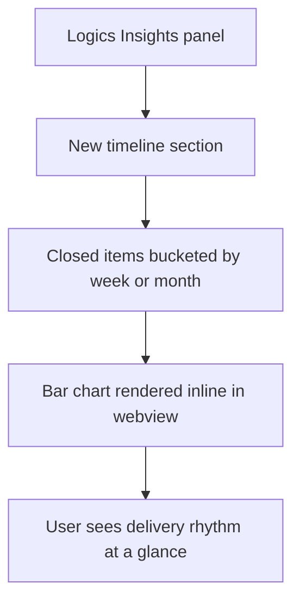

## req_159_add_a_timeline_view_in_logics_insights_showing_delivery_activity_over_time - Add a timeline view in Logics Insights showing delivery activity over time
> From version: 1.24.0
> Schema version: 1.0
> Status: Done
> Understanding: 100%
> Confidence: 100% (final)
> Complexity: Medium
> Theme: UI
> Reminder: Update status/understanding/confidence and linked backlog/task references when you edit this doc.

# Needs
- Add a timeline section inside the Logics Insights panel that shows delivery activity over time: which items were closed (Done/Archived/Obsolete) per week or month.
- Give the user a visual sense of project rhythm and pace without leaving VS Code.

# Context
The Logics Insights panel (`src/logicsCorpusInsightsHtml.ts`) already aggregates corpus stats (counts by type, status distribution, stale signals). It does not yet show a temporal dimension. A timeline view would answer "what did we ship this week?", "has the pace slowed down?", "when was the last active delivery period?".

The data is available: every Logics doc has an `updatedAt` timestamp (file mtime or git log). Items with `Status: Done` and a known close date can be bucketed per week/month and rendered as a simple bar chart or sparkline directly in the webview, consistent with the existing Insights HTML generation pattern.

# Acceptance criteria
- AC1: Logics Insights includes a timeline section showing closed items (Done/Archived/Obsolete) grouped by week or month.
- AC2: The timeline covers at least the last 12 weeks or 6 months of activity.
- AC3: The chart renders inline in the existing Insights webview without a new panel or external chart library dependency.
- AC4: The section is clearly labelled and visually distinct from existing stats sections.
- AC5: An empty state is shown gracefully when no closed items exist in the selected window.

# Scope
- In:
  - A new timeline section in `logicsCorpusInsightsHtml.ts`.
  - Bucketing logic based on `updatedAt` of closed items (done in extension host).
  - Inline SVG or DOM-based bar rendering (no third-party chart library).
- Out:
  - A separate panel or tab.
  - Open or in-progress items in the timeline — closed items only for clarity.
  - Interactive zoom or date range picker (static view for the first pass).

# Dependencies and risks
- Dependency: accurate `updatedAt` timestamps — git log dates are more reliable than file mtime on some platforms.
- Risk: rendering performance for large corpora — bucketing must be computed in the extension host, not in the webview rendering loop.

# AC Traceability
- AC1 -> Task `task_126_orchestration_delivery_for_req_150_to_req_154_plugin_polish_and_status_selector` and backlog item `item_288_add_a_timeline_view_in_logics_insights_showing_delivery_activity_over_time`. Proof: implemented in task_126 wave 13 and closed by the task finish flow on 2026-04-11.
- AC2 -> Task `task_126_orchestration_delivery_for_req_150_to_req_154_plugin_polish_and_status_selector` and backlog item `item_288_add_a_timeline_view_in_logics_insights_showing_delivery_activity_over_time`. Proof: implemented in task_126 wave 13 and closed by the task finish flow on 2026-04-11.
- AC3 -> Task `task_126_orchestration_delivery_for_req_150_to_req_154_plugin_polish_and_status_selector` and backlog item `item_288_add_a_timeline_view_in_logics_insights_showing_delivery_activity_over_time`. Proof: implemented in task_126 wave 13 and closed by the task finish flow on 2026-04-11.
- AC4 -> Task `task_126_orchestration_delivery_for_req_150_to_req_154_plugin_polish_and_status_selector` and backlog item `item_288_add_a_timeline_view_in_logics_insights_showing_delivery_activity_over_time`. Proof: implemented in task_126 wave 13 and closed by the task finish flow on 2026-04-11.
- AC5 -> Task `task_126_orchestration_delivery_for_req_150_to_req_154_plugin_polish_and_status_selector` and backlog item `item_288_add_a_timeline_view_in_logics_insights_showing_delivery_activity_over_time`. Proof: implemented in task_126 wave 13 and closed by the task finish flow on 2026-04-11.

# Definition of Ready (DoR)
- [x] Problem statement is explicit and user impact is clear.
- [x] Scope boundaries (in/out) are explicit.
- [x] Acceptance criteria are testable.
- [x] Dependencies and known risks are listed.

# Companion docs
- Product brief(s): (none yet)
- Architecture decision(s): (none yet)

# Backlog
- `item_288_add_a_timeline_view_in_logics_insights_showing_delivery_activity_over_time`
