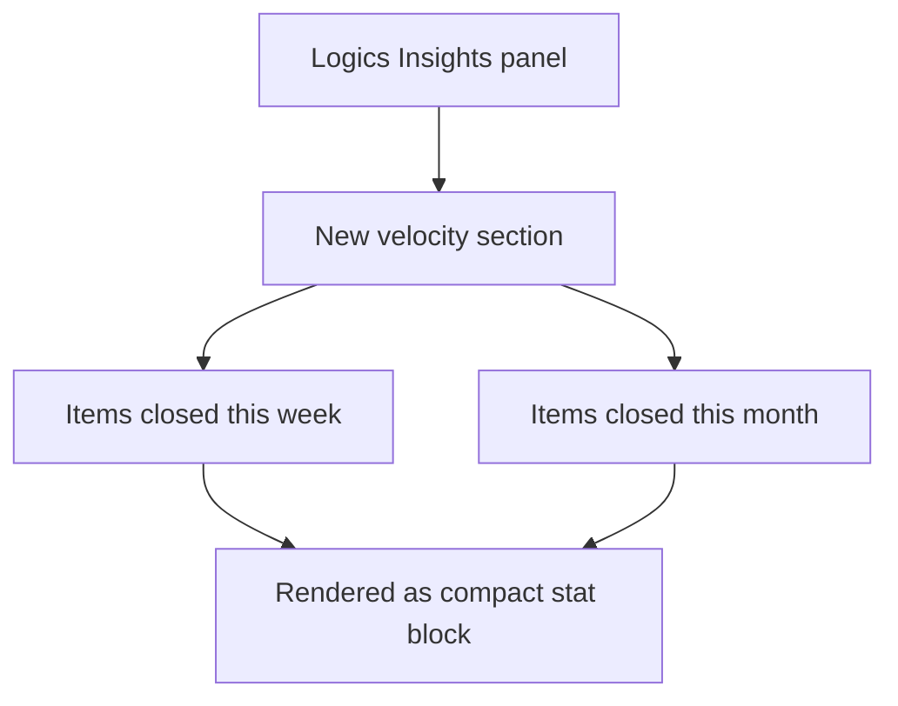

## req_160_add_a_velocity_counter_in_logics_insights_showing_items_closed_per_week_and_month - Add a velocity counter in Logics Insights showing items closed per week and month
> From version: 1.24.0
> Schema version: 1.0
> Status: Ready
> Understanding: 100%
> Confidence: 95%
> Complexity: Low
> Theme: UI
> Reminder: Update status/understanding/confidence and linked backlog/task references when you edit this doc.

# Needs
- Add a velocity counter section in Logics Insights showing how many items were closed (Done/Archived/Obsolete) in the current week and the current month.
- Provide a simple, motivating signal of delivery pace — visible at a glance without any interaction.

# Context
The Logics Insights panel shows corpus stats but no delivery velocity. A velocity counter answers "how productive have we been recently?" with two numbers: items closed this week and items closed this month. It is a lightweight complement to the timeline view (req_159): the timeline shows history, the counter shows current momentum.

The data already exists in the indexed corpus. This is a small, additive section — 2–3 numbers computed from `updatedAt` + `Status` of closed items, rendered as a stat block consistent with the rest of the Insights layout.

# Acceptance criteria
- AC1: Logics Insights shows a velocity section with the count of items closed in the current ISO week.
- AC2: Logics Insights shows the count of items closed in the current calendar month.
- AC3: The counts cover all workflow item types (requests, backlog items, tasks).
- AC4: The section updates when the Insights panel is refreshed.
- AC5: A zero count is displayed explicitly (not hidden) so the absence of activity is visible.

# Scope
- In:
  - A new velocity section in `logicsCorpusInsightsHtml.ts`.
  - Counts computed from closed items whose `updatedAt` falls within the current week/month.
- Out:
  - Trend comparison (e.g. vs. previous week) — out for the first pass.
  - Per-item-type breakdown — a single total per period is sufficient.
  - The timeline chart (that is req_159).

# Dependencies and risks
- Dependency: `updatedAt` timestamps must be reliable — same risk as req_159.
- Risk: "closed this week" depends on whether `updatedAt` reflects the actual close date or the last edit. If an item is edited after being closed, it may be double-counted. Acknowledge and document the approximation.

# Clarifications
- "This week" means the current ISO week (Monday to Sunday).
- "This month" means the current calendar month.
- The velocity counter and the timeline view (req_159) are related but independent — the counter can be delivered before or after the timeline.

# Definition of Ready (DoR)
- [x] Problem statement is explicit and user impact is clear.
- [x] Scope boundaries (in/out) are explicit.
- [x] Acceptance criteria are testable.
- [x] Dependencies and known risks are listed.

# Companion docs
- Product brief(s): (none yet)
- Architecture decision(s): (none yet)

# Backlog
- `item_289_add_a_velocity_counter_in_logics_insights_showing_items_closed_per_week_and_month`
