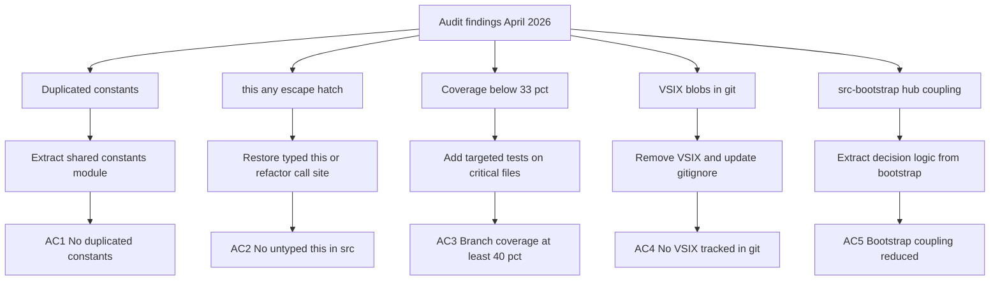

## req_161_address_plugin_audit_findings_from_april_2026_structural_review - Address plugin audit findings from April 2026 structural review
> From version: 1.25.0
> Schema version: 1.0
> Status: Draft
> Understanding: 95%
> Confidence: 90%
> Complexity: High
> Theme: Quality

# Needs

A full structural audit of the plugin codebase (April 2026) surfaced five concrete problems that impact maintainability, correctness risk, and release hygiene. These need to be addressed in a focused delivery wave before the next feature work resumes.

The five issues are:
1. **Duplicated constants** — six state-key and version constants are copy-pasted between `src/logicsViewProvider.ts` and `src/logicsViewProviderSupport.ts`, creating silent drift risk.
2. **`this: any` escape hatch** — `logicsViewProviderSupport.ts:55` uses an untyped `this` parameter that bypasses TypeScript guarantees.
3. **Test coverage too low** — plugin-wide coverage sits at 33 % lines / 28 % branches; the critical workflow files (`logicsProviderUtils`, `logicsCodexWorkflowBootstrapSupport`, `logicsHybridAssistController`) are the weakest spots.
4. **Binary `.vsix` artefacts committed** — `cdx-logics-vscode-1.21.0.vsix` and `cdx-logics-vscode-1.22.0.vsix` are tracked in git, growing the repo history with non-diffable blobs.
5. **`src-bootstrap` hub coupling** — `logicsCodexWorkflowBootstrapSupport.ts` acts as a God-module with 46+ cross-community edges to `src-kit` and 20+ to both `src-tools` and `src-item`; the concentration of decision logic here makes changes risky.

# Context

The audit was run on 2026-04-11 against v1.25.0. The knowledge graph (83 files · 1 414 nodes · 17 011 edges · 78 communities) flagged 20 cross-community coupling warnings. The most actionable for production code are listed above — the remaining warnings are concentrated in test infrastructure communities (tests-harness, tests-default, tests-when) and are addressed separately.

Related prior work:
- `req_131` handled the first modularisation pass (files > 1000 lines).
- `req_130` addressed coverage measurement tooling.
- `req_158` covered post-audit workflow traceability improvements.

This request is complementary and targets issues **not yet closed** by those requests.

# Acceptance criteria

- AC1: `ROOT_OVERRIDE_STATE_KEY`, `ACTIVE_AGENT_STATE_KEY`, `ONBOARDING_LAST_VERSION_KEY`, `STARTUP_KIT_UPDATE_PROMPT_STATE_PREFIX`, `MIN_LOGICS_KIT_MAJOR`, and `MIN_LOGICS_KIT_MINOR` are declared in exactly one place and imported wherever needed.
- AC2: No `this: any` parameter signature remains in `src/logicsViewProviderSupport.ts`; the impacted function has a correct call-site or is properly typed.
- AC3: Plugin branch coverage rises from 28 % to at least 40 %; the three critical files (`logicsProviderUtils.ts`, `logicsCodexWorkflowBootstrapSupport.ts`, `logicsHybridAssistController.ts`) each reach at least 40 % branch coverage.
- AC4: Both committed `.vsix` files are removed from git history (or at minimum untracked), and `*.vsix` is confirmed in `.gitignore`.
- AC5: `logicsCodexWorkflowBootstrapSupport.ts` no longer acts as a single hub; the cross-community edge count between `src-bootstrap` and `src-kit` / `src-tools` / `src-item` is reduced by extracting at least one cohesive sub-responsibility into a dedicated module.

# AC Traceability

- AC1 -> Task `task_127_orchestrate_april_2026_audit_remediation_across_plugin_and_logics_kit` and backlog item `item_290_extract_duplicated_constants_into_a_shared_plugin_module`. Proof: single declaration file; `npm run lint:ts` passes.
- AC2 -> Task `task_127_orchestrate_april_2026_audit_remediation_across_plugin_and_logics_kit` and backlog item `item_291_fix_untyped_this_and_raise_plugin_branch_coverage_on_critical_files`. Proof: no `this: any` in src; lint passes.
- AC3 -> Task `task_127_orchestrate_april_2026_audit_remediation_across_plugin_and_logics_kit` and backlog item `item_291_fix_untyped_this_and_raise_plugin_branch_coverage_on_critical_files`. Proof: per-file branch coverage ≥ 40 % in `npm run test:coverage:src` report.
- AC4 -> Task `task_127_orchestrate_april_2026_audit_remediation_across_plugin_and_logics_kit` and backlog item `item_292_remove_committed_vsix_binaries_and_enforce_gitignore`. Proof: `git ls-files "*.vsix"` returns empty.
- AC5 -> Task `task_127_orchestrate_april_2026_audit_remediation_across_plugin_and_logics_kit` and backlog item `item_293_reduce_src_bootstrap_hub_coupling_by_extracting_a_dedicated_module`. Proof: new dedicated module exists; smoke + lifecycle tests pass.

# Definition of Ready (DoR)

- [x] Problem statement is explicit and user impact is clear.
- [x] Scope boundaries (in/out) are explicit.
- [x] Acceptance criteria are testable.
- [ ] Dependencies and known risks are listed.

# Dependencies and risks

- AC1 touches both `logicsViewProvider.ts` and `logicsViewProviderSupport.ts` in the same change; both files must stay in sync during the refactor.
- AC3 requires real behavioural coverage on files that depend on `vscode` API — the existing vitest mock layer must be extended, not replaced.
- AC4 (removing binary blobs from history) may require `git filter-repo` or a BFG run; this needs explicit consent and a forced push to origin — out of scope for the initial backlog item, which will only untrack and gitignore.
- AC5 must not regress the bootstrap flow; `npm run test:smoke` and `npm run test:lifecycle` must pass after the split.

# Companion docs

- Product brief(s): (none)
- Architecture decision(s): `logics/architecture/adr_020_split_the_oversized_plugin_and_workflow_surfaces_into_focused_modules.md`

# References

- `logics/architecture/adr_020_split_the_oversized_plugin_and_workflow_surfaces_into_focused_modules.md`
- `src/logicsViewProvider.ts`
- `src/logicsViewProviderSupport.ts`
- `src/logicsCodexWorkflowBootstrapSupport.ts`
- `src/logicsProviderUtils.ts`
- `src/logicsHybridAssistController.ts`

# AI Context

- Summary: Address five structural findings from the April 2026 plugin audit — duplicated constants, untyped this, low branch coverage, committed VSIX blobs, and bootstrap hub coupling.
- Keywords: audit, constants, duplication, this-any, coverage, vsix, git, bootstrap, coupling, refactor
- Use when: Planning or executing the remediation of the April 2026 structural audit findings for the plugin.
- Skip when: The work targets the Logics kit (Part 2 of the audit) or unrelated feature work.

# Backlog
- `logics/backlog/item_290_extract_duplicated_constants_into_a_shared_plugin_module.md`
- `logics/backlog/item_291_fix_untyped_this_and_raise_plugin_branch_coverage_on_critical_files.md`
- `logics/backlog/item_292_remove_committed_vsix_binaries_and_enforce_gitignore.md`
- `logics/backlog/item_293_reduce_src_bootstrap_hub_coupling_by_extracting_a_dedicated_module.md`
