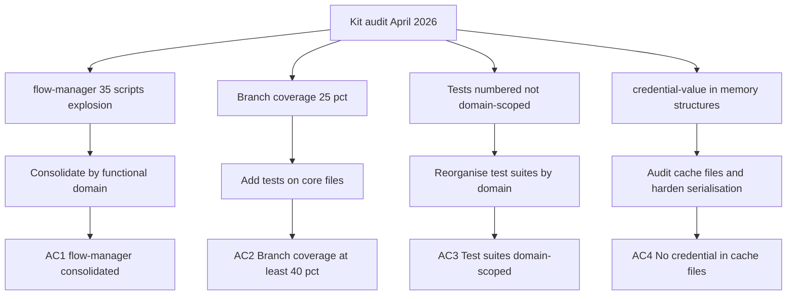

## req_162_address_logics_kit_audit_findings_from_april_2026_structural_review - Address Logics kit audit findings from April 2026 structural review
> From version: 1.25.0
> Schema version: 1.0
> Status: Done
> Understanding: 95%
> Confidence: 90%
> Complexity: High
> Theme: Quality

# Needs

A full structural audit of the Logics kit submodule (`logics/skills/`) was performed on 2026-04-11 (kit v1.12.0). Four concrete problems were identified that impact maintainability, correctness risk, and long-term evolvability of the kit:

1. **`logics-flow-manager` explosion** — the module has grown to 35 Python scripts (~13 000 lines total); the split strategy produced overlapping `*_core.py` / `*_extra.py` / `*_support.py` files whose boundaries are unclear and hard to navigate.
2. **Branch coverage critically low** — kit-wide coverage sits at 40 % lines / 25 % branches; the `*_core.py` files (974 lines each) are the weakest and highest-risk spots.
3. **Test organisation by number, not domain** — tests are named `test_logics_flow_01.py` through `test_logics_flow_11.py` and grow additively; all suites share a global `logics_flow_test_base.py` which creates implicit cross-suite coupling.
4. **`credential_value` in observable memory structures** — `HybridProviderDefinition` carries `credential_value: str | None` which circulates in-memory in structures that could be logged or serialised; the audit cache files must be verified to never expose this field.

# Context

The audit was run against the kit at v1.12.0, consumed as a submodule under `logics/skills/`. The plugin pins a minimum kit version of `1.7.x` but has no upper bound, meaning kit regressions can pass silently if the major/minor floor is still met.

Related prior work:
- `req_084` addressed kit diagnostics, safety, and runtime contracts.
- `req_085` added repo-config, runtime entrypoints, and transactional scaling.
- `req_124` hardened hybrid assist efficiency (diff preprocessing, caching, fallback).

This request is complementary and targets issues not yet closed by those requests.

# Acceptance criteria

- AC1: `logics-flow-manager/scripts/` is reorganised into functional sub-domains (e.g. `workflow/`, `hybrid/`, `transport/`, `audit/`) so that no top-level grouping name is `*_core.py` / `*_extra.py` / `*_support.py` without a clear owning domain prefix; existing entry points remain callable without change.
- AC2: Kit branch coverage rises from 25 % to at least 40 %; the three heaviest `*_core.py` files (`logics_flow_hybrid_transport_core.py`, `logics_flow_support_workflow_core.py`, `logics_flow_hybrid_runtime_core.py`) each reach at least 35 % branch coverage.
- AC3: At least the numbered test files `test_logics_flow_07.py` through `test_logics_flow_11.py` are replaced by domain-named suites with local fixtures; `logics_flow_test_base.py` is either narrowed to truly shared setup or eliminated.
- AC4: A script or CI step verifies that neither `logics/.cache/hybrid_assist_audit.jsonl` nor `logics/.cache/hybrid_assist_measurements.jsonl` ever contains a `credential_value` key; the `HybridProviderDefinition` dataclass is updated to exclude `credential_value` from any dict/JSON serialisation path.

# AC Traceability

- AC1 -> Task `task_127_orchestrate_april_2026_audit_remediation_across_plugin_and_logics_kit` and backlog item `item_294_reorganise_flow_manager_scripts_by_functional_domain`. Proof: domain sub-directories exist; `logics.py flow` commands succeed end-to-end.
- AC2 -> Task `task_127_orchestrate_april_2026_audit_remediation_across_plugin_and_logics_kit` and backlog item `item_295_raise_kit_branch_coverage_and_reorganise_numbered_test_suites_by_domain`. Proof: per-file branch coverage in `coverage.xml`; overall kit coverage above 40 %.
- AC3 -> Task `task_127_orchestrate_april_2026_audit_remediation_across_plugin_and_logics_kit` and backlog item `item_295_raise_kit_branch_coverage_and_reorganise_numbered_test_suites_by_domain`. Proof: numbered test files 07–11 absent; domain-named suites present; `npm run coverage:kit` passes.
- AC4 -> Task `task_127_orchestrate_april_2026_audit_remediation_across_plugin_and_logics_kit` and backlog item `item_296_harden_hybridproviderdefinition_credential_serialisation_and_audit_cache_files`. Proof: unit test asserts `credential_value` absent from `to_dict()`; `audit:logics` exits non-zero on synthetic poisoned cache.

# Definition of Ready (DoR)

- [x] Problem statement is explicit and user impact is clear.
- [x] Scope boundaries (in/out) are explicit.
- [x] Acceptance criteria are testable.
- [x] Dependencies and known risks are listed.

# Dependencies and risks

- AC1 (reorganisation) touches import paths used by the plugin's `src/logicsClaudeGlobalKit.ts` and `src/logicsCodexWorkflowOperations.ts`; both must be verified after any rename.
- AC1 must keep `python logics/skills/logics.py flow ...` and `python logics/skills/logics.py audit ...` working end-to-end; smoke tests must pass before merge.
- AC2 requires new tests on files that make file-system mutations and subprocess calls; tests must stay hermetic (tmp dirs, no real git writes).
- AC3 is a pure rename/split with no logic change; the CI `coverage:kit` target must keep passing throughout.
- AC4 is a security-adjacent check; it should be added as a lightweight assertion in the existing `workflow_audit.py` pipeline so it runs on every `npm run audit:logics`.
- The kit has its own independent git repository (`logics/skills/.git`); changes require a separate commit and version bump tracked in `logics/skills/VERSION` and `logics/skills/CHANGELOG.md`.

# Companion docs

- Product brief(s): (none)
- Architecture decision(s): `logics/architecture/adr_001_keep_logics_kit_hardening_incremental_generic_and_agent_productive.md`

# References

- `logics/architecture/adr_001_keep_logics_kit_hardening_incremental_generic_and_agent_productive.md`
- `logics/skills/logics-flow-manager/scripts/logics_flow_hybrid_transport_core.py`
- `logics/skills/logics-flow-manager/scripts/logics_flow_hybrid_runtime_core.py`
- `logics/skills/logics-flow-manager/scripts/logics_flow_support_workflow_core.py`
- `logics/skills/tests/logics_flow_test_base.py`
- `logics/skills/coverage/coverage.xml`

# AI Context

- Summary: Address four structural findings from the April 2026 kit audit — flow-manager module explosion, low branch coverage, numbered test organisation, and credential_value in observable memory structures.
- Keywords: kit, audit, flow-manager, coverage, tests, domain, credential, serialisation, refactor, submodule
- Use when: Planning or executing the remediation of the April 2026 structural audit findings for the Logics kit submodule.
- Skip when: The work targets the VS Code plugin (Part 1, see req_161) or unrelated feature work.

# Backlog
- `logics/backlog/item_294_reorganise_flow_manager_scripts_by_functional_domain.md`
- `logics/backlog/item_295_raise_kit_branch_coverage_and_reorganise_numbered_test_suites_by_domain.md`
- `logics/backlog/item_296_harden_hybridproviderdefinition_credential_serialisation_and_audit_cache_files.md`
- `logics/backlog/item_298_add_maximum_kit_version_bound_in_plugin.md`
- `logics/backlog/item_299_add_programmatic_skill_discovery_to_replace_hardcoded_names.md`
