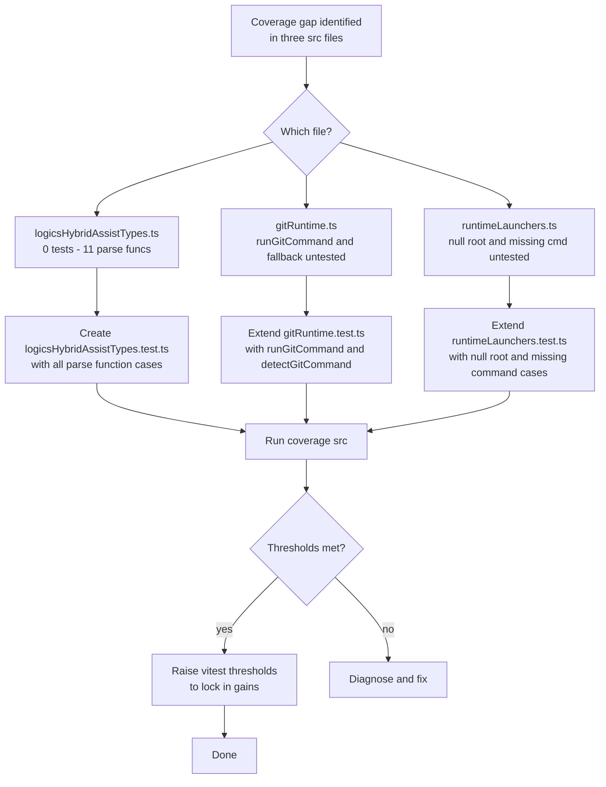

## req_163_improve_test_coverage_for_hybrid_assist_types_git_runtime_and_runtime_launchers - improve test coverage for hybrid assist types git runtime and runtime launchers
> From version: 1.25.2
> Schema version: 1.0
> Status: Done
> Understanding: 95%
> Confidence: 95%
> Complexity: Medium
> Theme: Quality

# Needs

- Three source files (`logicsHybridAssistTypes.ts`, `gitRuntime.ts`, `runtimeLaunchers.ts`) have significant coverage gaps despite containing pure, deterministic logic that is straightforward to unit-test.
- `logicsHybridAssistTypes.ts` has **no test file at all** (39% statements) and exports 11 parse functions that are 100% side-effect-free.
- `gitRuntime.ts` sits at 52.7% statements because `runGitCommand`, `detectGitCommand`, and the fallback-on-missing-git path are untested.
- `runtimeLaunchers.ts` sits at 40% statements because the `root = null` path, the missing-command path, and `detectCommandOnPath` on win32 are untested.
- Overall src coverage is currently 64.16% statements / 53.99% branches. These three files alone could lift it by several percentage points.

# Context

The coverage thresholds in `vitest.config.mts` are currently set conservatively (lines: 58%, branches: 49%). We are passing, but the actual coverage is low enough that regressions in core logic could go undetected. The three targeted files expose well-defined, injectable interfaces (detectCommand option, execFile wrapper) that make it easy to add hermetic tests without VS Code or external process dependencies.

**Current coverage snapshot (src, as of 1.25.2):**

| File | Stmts | Branches | Funcs |
|------|-------|----------|-------|
| `logicsHybridAssistTypes.ts` | 39.32% | 39.52% | 50% |
| `runtimeLaunchers.ts` | 40% | 58.82% | 20% |
| `gitRuntime.ts` | 52.7% | 31.14% | 42.1% |
| Overall src | 64.16% | 53.99% | 70.16% |

**Uncovered logic per file:**

- `logicsHybridAssistTypes.ts`: `describeHybridAssistOutcome` (backend/backendRequested fallback paths, degraded from result_status), `parseHybridCommitPlanSteps` (invalid steps filtered), `parseHybridTriageResult`, `parseHybridDiffRiskResult`, `parseHybridValidationSummaryResult`, `parseHybridChangelogSummaryResult`, `parseHybridValidationChecklistResult`, `parseHybridDocConsistencyResult`, `parseHybridPrepareReleaseResult`, `parseHybridPublishReleaseResult`, `parseHybridInsightsSources`, `parseHybridRuntimeProviders`.
- `gitRuntime.ts`: `runGitCommand` (happy path + missing git + fallback on error), `detectGitCommand` (returns true/false), `normalizeGitPathSetting` (array form), macOS/linux candidate list.
- `runtimeLaunchers.ts`: `inspectRuntimeLaunchers` with `root = null`, with one or both commands missing, with `codexOverlay` in `warning` status; `detectCommandOnPath` win32 multi-candidate loop.

# Acceptance criteria

- AC1: A new file `tests/logicsHybridAssistTypes.test.ts` exists and covers all 11 exported parse/describe functions, including null-input guards, partial-field scenarios, and type-narrowing branches. Coverage for this file reaches at least 85% statements.
- AC2: `tests/gitRuntime.test.ts` is extended to cover `runGitCommand` (git found + git missing), `detectGitCommand` (true/false), and the fallback-on-missing-git path. Coverage for `gitRuntime.ts` reaches at least 75% statements.
- AC3: `tests/runtimeLaunchers.test.ts` is extended to cover: `root = null` (both launchers disabled), one or both commands absent on PATH, `codexOverlay` in `warning` status. Coverage for `runtimeLaunchers.ts` reaches at least 75% statements.
- AC4: Overall src statement coverage reaches at least 68% and branch coverage reaches at least 57% after the new tests are added. Thresholds in `vitest.config.mts` are updated to reflect the new floor.
- AC5: All 383+ existing tests continue to pass. No regressions introduced.

# Definition of Ready (DoR)

- [x] Problem statement is explicit and user impact is clear.
- [x] Scope boundaries (in/out) are explicit.
- [x] Acceptance criteria are testable.
- [x] Dependencies and known risks are listed.

**In scope:** `logicsHybridAssistTypes.ts`, `gitRuntime.ts`, `runtimeLaunchers.ts`, `vitest.config.mts` threshold update.

**Out of scope:** `logicsViewDocumentController.ts` (13% coverage but high complexity — separate request), `logicsViewProvider.ts` (34% functions — tracked separately), media/webview coverage.

**Known risks:**
- `runGitCommand` tests require mocking `execFile`; the existing `gitRuntime` test file does not yet use mocks — need to introduce `vi.mock` without breaking existing tests.
- `detectCommandOnPath` on win32 spawns multiple candidates; the mock must simulate the full candidate loop.

# AC Traceability

- AC1 -> Task `task_128_orchestrate_test_coverage_improvements_for_item_300_301_and_302` and backlog item `item_300_add_missing_tests_for_logicshybridassisttypes`. Proof: `npm run test:coverage:src` shows ≥ 85% stmts for `logicsHybridAssistTypes.ts`.
- AC2 -> Task `task_128_orchestrate_test_coverage_improvements_for_item_300_301_and_302` and backlog item `item_301_extend_unit_tests_for_gitruntime`. Proof: `npm run test:coverage:src` shows ≥ 75% stmts for `gitRuntime.ts`.
- AC3 -> Task `task_128_orchestrate_test_coverage_improvements_for_item_300_301_and_302` and backlog item `item_302_extend_unit_tests_for_runtimelaunchers`. Proof: `npm run test:coverage:src` shows ≥ 75% stmts for `runtimeLaunchers.ts`.
- AC4 -> Task `task_128_orchestrate_test_coverage_improvements_for_item_300_301_and_302` and backlog item `item_302_extend_unit_tests_for_runtimelaunchers`. Proof: `vitest.config.mts` updated and `npm run test:coverage:src` exits 0 with `lines: 68, branches: 57`.
- AC5 -> Task `task_128_orchestrate_test_coverage_improvements_for_item_300_301_and_302` and backlog item `item_300_add_missing_tests_for_logicshybridassisttypes`. Proof: `npm run test` exits 0 with ≥ 383 passing tests.

# Companion docs

- Product brief(s): (none — pure test quality, no product framing needed)
- Architecture decision(s): (none)

# AI Context

- Summary: Add a missing test file for logicsHybridAssistTypes and extend existing tests for gitRuntime and runtimeLaunchers to close the largest deterministic coverage gaps in the src layer.
- Keywords: coverage, vitest, unit tests, logicsHybridAssistTypes, gitRuntime, runtimeLaunchers, parse functions, mocking
- Use when: Planning or implementing test additions targeting the three named files and the vitest threshold update.
- Skip when: Working on webview/media coverage, or on a different source module.

# Backlog

- `item_300_add_missing_tests_for_logicshybridassisttypes`
- `item_301_extend_unit_tests_for_gitruntime`
- `item_302_extend_unit_tests_for_runtimelaunchers`
