## req_164_improve_branch_coverage_for_logicscodexworkspace_and_logicsglobalkitlifecycle - improve branch coverage for logicsCodexWorkspace and logicsGlobalKitLifecycle
> From version: 1.25.2
> Schema version: 1.0
> Status: Done
> Understanding: 95%
> Confidence: 95%
> Complexity: Medium
> Theme: Quality

# Needs

- `logicsCodexWorkspace.ts` has 38.23% branch coverage despite 67.9% statement coverage. The gap reveals that many conditional paths — especially in `publishCodexWorkspaceOverlay`, `shouldPublishRepoKit`, and the `stale`/`warning` inspection branches — are never exercised.
- `logicsGlobalKitLifecycle.ts` has 46.55% branch coverage with no dedicated test file. Its defensive branches in `copyDirectory` (symlink entries) and `readSkillTier` (YAML parse errors, non-object results, try/catch fallback) are completely untested despite being directly reachable with filesystem fixtures.
- The two files are tightly coupled: `logicsCodexWorkspace.ts` depends on exported functions from `logicsGlobalKitLifecycle.ts`. Improving branch coverage on both together is more effective than doing them separately.

# Context

After delivering req_163 (item_300/301/302), overall src branch coverage rose to **58.57%**. The next largest gap is `logicsCodexWorkspace.ts` at **38.23% branches** — a 20+ point gap relative to its statement coverage — followed by `logicsGlobalKitLifecycle.ts` at **46.55% branches**.

**Uncovered branches per file:**

`logicsCodexWorkspace.ts` (lines 141–242, 275–298):
- `publishCodexWorkspaceOverlay`: copy-mode fallback when `publishSkill` returns `"copy"` instead of `"symlink"`; cleanup loop removing previously-published skills no longer in the new set
- `shouldPublishRepoKit`: `missing-manager` returns false; `missing-overlay`/`stale` returns true; version newer returns true; same version but different revision returns true; all conditions false returns false

`logicsGlobalKitLifecycle.ts` (lines 382–408):
- `copyDirectory`: `entry.isSymbolicLink()` branch — symlink entries inside a copied directory
- `readSkillTier`: YAML parse errors array non-empty returns `"core"`; `parsed` is null or array returns `"core"`; `try/catch` fallback returns `"core"`
- `existsOrSymlink`: `lstatSync` fallback when `existsSync` returns false but target is a dangling symlink

**Current state:**

| File | Stmts | Branches | Funcs |
|------|-------|----------|-------|
| `logicsCodexWorkspace.ts` | 67.9% | **38.23%** | 78.94% |
| `logicsGlobalKitLifecycle.ts` | 59% | **46.55%** | 92.59% |

```mermaid
%% logics-kind: request
%% logics-signature: request|improve-branch-coverage-for-logicscodexw|logicscodexworkspace-ts-has-38-23-branch|ac1-logicscodexworkspace-ts-branch-cover
flowchart TD
    A[Branch coverage gap identified] --> B{Which file?}
    B --> C[logicsCodexWorkspace.ts<br>38.23% branches]
    B --> D[logicsGlobalKitLifecycle.ts<br>46.55% branches - no dedicated tests]
    C --> E[Extend logicsCodexWorkspace.test.ts<br>shouldPublishRepoKit all conditions<br>publishCodexWorkspaceOverlay copy-mode and cleanup]
    D --> F[Create logicsGlobalKitLifecycle.test.ts<br>copyDirectory symlink branch<br>readSkillTier YAML error paths<br>existsOrSymlink dangling symlink]
    E --> G[Run coverage - verify branch targets met]
    F --> G
    G --> H[Raise vitest branch threshold to 61]
    H --> I[Done]
```

# Acceptance criteria

- AC1: `logicsCodexWorkspace.ts` branch coverage reaches at least 60%. New test cases cover `shouldPublishRepoKit` for all 5 conditions, and `publishCodexWorkspaceOverlay` for the copy-mode fallback and previous-skill cleanup.
- AC2: A new file `tests/logicsGlobalKitLifecycle.test.ts` exists and covers `copyDirectory` (symlink entries), `readSkillTier` (YAML parse error, non-object result, try/catch), and `existsOrSymlink` (dangling symlink via `lstatSync`). `logicsGlobalKitLifecycle.ts` branch coverage reaches at least 65%.
- AC3: Overall src branch coverage reaches at least 61% after both items are done. `vitest.config.mts` `branches` threshold is updated to reflect the new floor.
- AC4: All 410+ existing tests continue to pass. No regressions introduced.

# Definition of Ready (DoR)

- [x] Problem statement is explicit and user impact is clear.
- [x] Scope boundaries (in/out) are explicit.
- [x] Acceptance criteria are testable.
- [x] Dependencies and known risks are listed.

**In scope:** `logicsCodexWorkspace.ts` branch gaps, `logicsGlobalKitLifecycle.ts` branch gaps (new test file), `vitest.config.mts` threshold update.

**Out of scope:** `logicsViewDocumentController.ts` (13% — needs modularisation first), `logicsViewProvider.ts` (34% funcs — tracked separately), media/webview coverage.

**Known risks:**
- `publishCodexWorkspaceOverlay` copy-mode path requires that `fs.symlinkSync` throws — use `vi.spyOn(fs, 'symlinkSync')` to force failure rather than relying on OS symlink restrictions.
- `existsOrSymlink` dangling-symlink path requires creating a real symlink pointing to a non-existent target in `tmpdir` — this works on macOS/Linux but needs care on Windows CI.

# AC Traceability

- AC1 -> Task `task_129_orchestrate_branch_coverage_improvements_for_item_303_and_304` and backlog item `item_303_extend_branch_tests_for_logicscodexworkspace`. Proof: `npm run test:coverage:src` shows ≥ 60% branches for `logicsCodexWorkspace.ts`.
- AC2 -> Task `task_129_orchestrate_branch_coverage_improvements_for_item_303_and_304` and backlog item `item_304_create_branch_tests_for_logicsglobalkitlifecycle`. Proof: `npm run test:coverage:src` shows ≥ 65% branches for `logicsGlobalKitLifecycle.ts`.
- AC3 -> Task `task_129_orchestrate_branch_coverage_improvements_for_item_303_and_304` and backlog item `item_304_create_branch_tests_for_logicsglobalkitlifecycle`. Proof: `npm run test:coverage:src` exits 0 with `branches ≥ 61`.
- AC4 -> Task `task_129_orchestrate_branch_coverage_improvements_for_item_303_and_304` and backlog item `item_303_extend_branch_tests_for_logicscodexworkspace`. Proof: `npm run test` exits 0 with ≥ 410 passing tests.

# Companion docs

- Product brief(s): (none — pure test quality)
- Architecture decision(s): (none)

# AI Context

- Summary: Extend logicsCodexWorkspace.test.ts and create logicsGlobalKitLifecycle.test.ts to close the branch coverage gap in the two most under-tested conditional paths in the kit publication and overlay inspection layer.
- Keywords: branch coverage, logicsCodexWorkspace, logicsGlobalKitLifecycle, shouldPublishRepoKit, publishCodexWorkspaceOverlay, copyDirectory, readSkillTier, vitest
- Use when: Planning or implementing branch coverage improvements for the workspace overlay and global kit lifecycle files.
- Skip when: Working on webview/media coverage or on logicsViewDocumentController/logicsViewProvider.

# Backlog

- `item_303_extend_branch_tests_for_logicscodexworkspace`
- `item_304_create_branch_tests_for_logicsglobalkitlifecycle`
