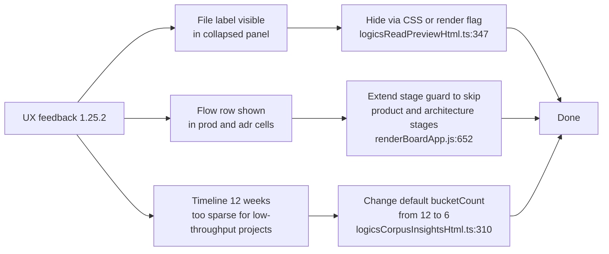

## req_165_plugin_ux_feedback_panel_detail_cell_labels_and_insights_timeline_period - plugin ux feedback panel detail cell labels and insights timeline period
> From version: 1.25.2
> Schema version: 1.0
> Status: Done
> Understanding: 95%
> Confidence: 95%
> Complexity: Low
> Theme: UI

# Needs

Three UX friction points collected from real usage of the 1.25.2 plugin release:

1. **Detail panel — "File: ..." visible when panel is collapsed/reduced in vertical mode.** When the detail panel is collapsed, the `File: <path>` line is still rendered inside the read-preview header (`src/logicsReadPreviewHtml.ts:347`). In reduced mode this label wastes the limited available height and adds no value — the path is not actionable when the panel is small.

2. **Board/list cells — "Flow ..." shown in product brief and ADR card previews.** `media/renderBoardApp.js:652` calls `createPreviewRow("Flow", linkage)` for all non-spec stages, which includes `prod_` (product brief) and `adr_` (architecture decision) items. The "Flow" linkage row is meaningful for requests, backlog items, and tasks, but not for companion docs. It should be suppressed for `product` and `architecture` stages.

3. **Insights — delivery timeline shows 12 weeks, producing a near-empty chart for active projects.** `src/logicsCorpusInsightsHtml.ts:310` calls `summarizeTimeline` with the default `bucketCount = 12`. On projects with modest weekly throughput, most of the 12 bars are empty and only 1–2 have data, making the chart useless for trend detection. Reducing the default window to 6 weeks would concentrate visible activity and make the chart actionable.

# Context

All three issues are independent, self-contained, and low-risk. None requires structural changes — they are targeted conditional guards and a single constant change.

**Issue 1 — File label in collapsed panel:**
- Source: `src/logicsReadPreviewHtml.ts:347`
- The `
File: <code>...</code>
` element is always rendered.
- Fix: hide it via CSS when the panel carries the collapsed/compact class, or conditionally exclude it from the template based on a `compact` render flag already passed to the function.

**Issue 2 — Flow row in product brief / ADR cells:**
- Source: `media/renderBoardApp.js:652`
- Current guard: `String(item?.stage || "").trim() === "spec"` skips rendering only for spec items.
- `prod_` items have `stage === "product"` and `adr_` items have `stage === "architecture"` (see `media/logicsModel.js:72–75`).
- Fix: extend the guard to also skip the Flow row for `"product"` and `"architecture"` stages.

**Issue 3 — Timeline default window:**
- Source: `src/logicsCorpusInsightsHtml.ts:310` — `bucketCount = 12`
- Callsites: `logicsCorpusInsightsHtml.ts:422` (`summarizeTimeline(items, Date.now())` — uses default), and the description strings on lines 344, 771–772.
- Fix: change the default from `12` to `6`. Update the three description strings ("12 weeks" → "6 weeks"). No API change needed — `bucketCount` is already a parameter so tests can still override it.

# Acceptance criteria

- AC1: The `File: <path>` label is hidden when the detail panel is in its collapsed/reduced state in vertical layout. It remains visible in the full expanded state.
- AC2: The "Flow" row is no longer shown in the card preview for `product` (product brief) and `architecture` (ADR) stage items. It continues to appear for `request`, `backlog`, `task`, and `spec` stages where it is meaningful.
- AC3: The delivery timeline in Logics Insights uses a 6-week default window instead of 12 weeks. The description text is updated to match. The chart shows denser, more readable data for projects with modest weekly throughput.
- AC4: All 410+ existing tests continue to pass. No regressions introduced.

# Definition of Ready (DoR)

- [x] Problem statement is explicit and user impact is clear.
- [x] Scope boundaries (in/out) are explicit.
- [x] Acceptance criteria are testable.
- [x] Dependencies and known risks are listed.

**In scope:** `src/logicsReadPreviewHtml.ts`, `media/renderBoardApp.js`, `src/logicsCorpusInsightsHtml.ts`.

**Out of scope:** changing the timeline period to a user-configurable setting (that is a separate request), changing other insight chart windows, any other card preview fields.

**Known risks:**
- AC1: the collapsed-panel CSS class name must be confirmed in the webview stylesheet before adding a CSS rule — check `logicsWebviewHtml.ts` or the media CSS for the actual collapsed state class.
- AC2: stage values for product brief and ADR must be verified in `media/logicsModel.js:72–75` — confirmed as `"product"` and `"architecture"`.
- AC3: `summarizeTimeline` is tested in `logicsCorpusInsightsHtml.ts` tests with explicit `bucketCount` override — those tests are unaffected by changing the default.

# AC Traceability

- AC1 -> Task `task_130_orchestrate_ux_feedback_fixes_for_item_305_306_and_307` and backlog item `item_305_hide_file_label_in_collapsed_detail_panel`. Proof: manual verification in the plugin — collapsed panel shows no File label; expanded panel shows it.
- AC2 -> Task `task_130_orchestrate_ux_feedback_fixes_for_item_305_306_and_307` and backlog item `item_306_suppress_flow_row_in_product_brief_and_adr_card_previews`. Proof: prod_ and adr_ cards no longer show a Flow row in the board preview.
- AC3 -> Task `task_130_orchestrate_ux_feedback_fixes_for_item_305_306_and_307` and backlog item `item_307_reduce_insights_timeline_default_window_from_12_to_6_weeks`. Proof: Logics Insights renders a 6-bar timeline with matching description text.
- AC4 -> Task `task_130_orchestrate_ux_feedback_fixes_for_item_305_306_and_307` and backlog item `item_305_hide_file_label_in_collapsed_detail_panel`. Proof: `npm run test` exits 0 with ≥ 410 tests.

# Companion docs

- Product brief(s): (none — targeted UX fixes, no product framing needed)
- Architecture decision(s): (none)

# AI Context

- Summary: Three small UX fixes for the 1.25.2 plugin release: hide File label in collapsed detail panel, suppress Flow row in product brief and ADR card previews, reduce insights timeline from 12 to 6 weeks.
- Keywords: detail panel, collapsed, File label, Flow row, product brief, ADR, insights timeline, 6 weeks, renderBoardApp, logicsReadPreviewHtml, logicsCorpusInsightsHtml
- Use when: Planning or implementing any of the three UX fixes.
- Skip when: Working on coverage, modularisation, or unrelated plugin surfaces.

# Backlog

- `item_305_hide_file_label_in_collapsed_detail_panel`
- `item_306_suppress_flow_row_in_product_brief_and_adr_card_previews`
- `item_307_reduce_insights_timeline_default_window_from_12_to_6_weeks`
