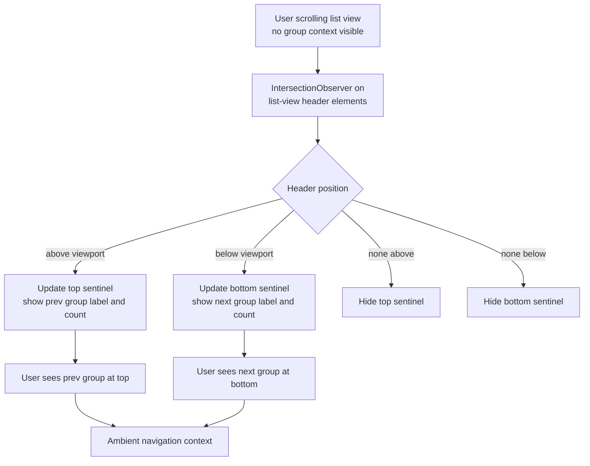

## req_166_sticky_ambient_section_headers_in_list_view_showing_prev_and_next_group_context - sticky ambient section headers in list view showing prev and next group context
> From version: 1.25.2
> Schema version: 1.0
> Status: Done
> Understanding: 95%
> Confidence: 90%
> Complexity: Medium
> Theme: UI

# Needs

When scrolling through a long list view (e.g., browsing backlog items), the user loses positional context — they can no longer see which group is above or below the visible area. Adding two ambient sticky sentinels solves this:

- A **top sentinel** that always shows the header of the nearest group whose header has already scrolled off the top of the viewport — i.e. the group you just left.
- A **bottom sentinel** that always shows the header of the nearest group whose header has not yet scrolled into view at the bottom — i.e. the next group you are approaching.

When the user is inside a section (e.g., `Backlog — In progress`) they immediately see:
- Top: the previous group label (e.g., `Backlog — Ready`)
- Bottom: the next group label (e.g., `Tasks`)

This is the ambient navigation pattern used by iOS contact lists and many native document viewers.

# Context

**Current list view structure** (list mode only — board column mode is unaffected):
- Scroll container: `.board--list` — `display: block; overflow-y: auto` (`media/css/board.css:16–21`)
- Each group: `.list-view__section[data-group][data-stage]` — a `<section>` element
- Each header: `.list-view__header` — a `<button>` with `.list-view__header-label` (text) and `.list-view__header-count` (badge)
- Section body: `.list-view__body` — the cards

**Proposed implementation — 4 design decisions locked:**

**D1 — Overlay, not layout space.** The sentinels use `position: absolute; top: 0` / `bottom: 0` on a `position: relative` wrapper wrapping `.board--list`. They float over the list content without shifting layout or causing scroll jumps on appear/disappear. A few pixels of the first/last visible item pass behind the sentinel — acceptable and consistent with the iOS ambient header pattern.

**D2 — Directional chevron.** Each sentinel includes a `chevronIcon()` (reusing the existing helper) pointing upward on the top sentinel and downward on the bottom sentinel. This makes the ambient nature immediately readable — the user knows these are navigational indicators, not real section headers.

**D3 — Collapsed groups participate normally.** A collapsed group's `.list-view__header` is in the DOM with real height. The observer treats it identically to an expanded group. Silently skipping collapsed groups would create surprising sentinel jumps.

**D4 — Bottom sentinel triggers immediately.** The bottom sentinel activates as soon as the first header below the visible area exists, regardless of whether the current header is still in view. This is the most useful behaviour: if you are deep inside a long section and the next group is off-screen, the sentinel shows it immediately without waiting for the current header to scroll past the top.

A single `IntersectionObserver` with `root: boardListWrapperEl` tracks all `.list-view__header` elements. On each callback:
- Top sentinel → label + count of the last header fully above the root's top edge (`isIntersecting === false && boundingClientRect.bottom < rootBounds.top`)
- Bottom sentinel → label + count of the first header fully below the root's bottom edge (`isIntersecting === false && boundingClientRect.top > rootBounds.bottom`)
- When no candidate exists for either: that sentinel is hidden (`hidden` attribute)

The sentinels are **read-only visual indicators** — `pointer-events: none`, no click/keyboard handlers.

**Constraints:**
- List mode only (`.board--list` class). Board column mode is unaffected.
- Collapsed sections participate in sentinel computation (D3).
- The observer must be disconnected and re-created on each full list re-render to avoid stale references.

# Acceptance criteria

- AC1: In list mode, a top sentinel element is visible at the top of the scroll container whenever the user has scrolled past at least one section header. It shows the label and item count of the most recent group whose header has scrolled off the top. It is hidden when no group header has scrolled off the top.
- AC2: A bottom sentinel element is visible at the bottom of the scroll container whenever at least one section header is below the visible area. It shows the label and item count of the nearest upcoming group. It is hidden when all remaining group headers are visible or there are no more groups.
- AC3: Both sentinels are purely visual — they do not intercept scroll events, do not collapse/expand sections, and do not interfere with keyboard navigation.
- AC4: The sentinels are absent in board column mode. They appear only when the `.board--list` class is active.
- AC5: The observer is cleaned up (disconnected) on each list re-render so stale DOM references do not accumulate.
- AC6: All 410+ existing tests continue to pass. No regressions introduced.

# Definition of Ready (DoR)

- [x] Problem statement is explicit and user impact is clear.
- [x] Scope boundaries (in/out) are explicit.
- [x] Acceptance criteria are testable.
- [x] Dependencies and known risks are listed.

**In scope:** list view only (`.board--list`), two sentinel overlay elements, `IntersectionObserver`-based update logic, CSS for sentinels.

**Out of scope:** board column mode, making sentinels clickable/tappable to scroll-to (nice-to-have, deferred), adding sentinels to the board's column headers.

**Known risks:**
- `IntersectionObserver` with `root: boardListWrapperEl` (the `position: relative` wrapper) requires the wrapper to have a defined height — confirm `.board--list` fills its parent height in the layout.
- Re-render timing: `renderListView` is called on state changes — the observer must be attached after the new DOM is in place, not before.
- The webview test harness uses jsdom which does not implement `IntersectionObserver` — sentinel logic must be skipped gracefully when the API is absent.
- The overlay approach means a few pixels of list content sit behind the sentinel visually — sentinel height should be kept compact (same as `.list-view__header`, ~28px) to minimise the occlusion area.

# AC Traceability

- AC1 -> Task `task_131_implement_sticky_ambient_section_headers_in_list_view` and backlog item `item_308_implement_sticky_ambient_section_headers_in_list_view`. Proof: manual scroll test — top sentinel shows correct previous group label and count.
- AC2 -> Task `task_131_implement_sticky_ambient_section_headers_in_list_view` and backlog item `item_308_implement_sticky_ambient_section_headers_in_list_view`. Proof: manual scroll test — bottom sentinel shows correct next group label and count.
- AC3 -> Task `task_131_implement_sticky_ambient_section_headers_in_list_view` and backlog item `item_308_implement_sticky_ambient_section_headers_in_list_view`. Proof: keyboard navigation and section collapse/expand still work as before.
- AC4 -> Task `task_131_implement_sticky_ambient_section_headers_in_list_view` and backlog item `item_308_implement_sticky_ambient_section_headers_in_list_view`. Proof: in board column mode, no sentinel elements are injected.
- AC5 -> Task `task_131_implement_sticky_ambient_section_headers_in_list_view` and backlog item `item_308_implement_sticky_ambient_section_headers_in_list_view`. Proof: rapid list re-render does not accumulate multiple observers.
- AC6 -> Task `task_131_implement_sticky_ambient_section_headers_in_list_view` and backlog item `item_308_implement_sticky_ambient_section_headers_in_list_view`. Proof: `npm run test` exits 0 with ≥ 410 passing tests.

# Companion docs

- Product brief(s): (none — focused UX feature, no product framing needed)
- Architecture decision(s): (none)

# AI Context

- Summary: Add two ambient sticky sentinel elements to the list view scroll container showing the previous group header at the top and the next group header at the bottom, implemented via IntersectionObserver on .list-view__header elements.
- Keywords: sticky header, ambient navigation, list view, IntersectionObserver, board--list, list-view__header, sentinel, prev group, next group, scroll context
- Use when: Planning or implementing the ambient sticky header feature for the list view.
- Skip when: Working on board column mode, coverage, or unrelated plugin surfaces.

# Backlog

- `item_308_sticky_ambient_section_headers_in_list_view_showing_prev_and_next_group_context`
