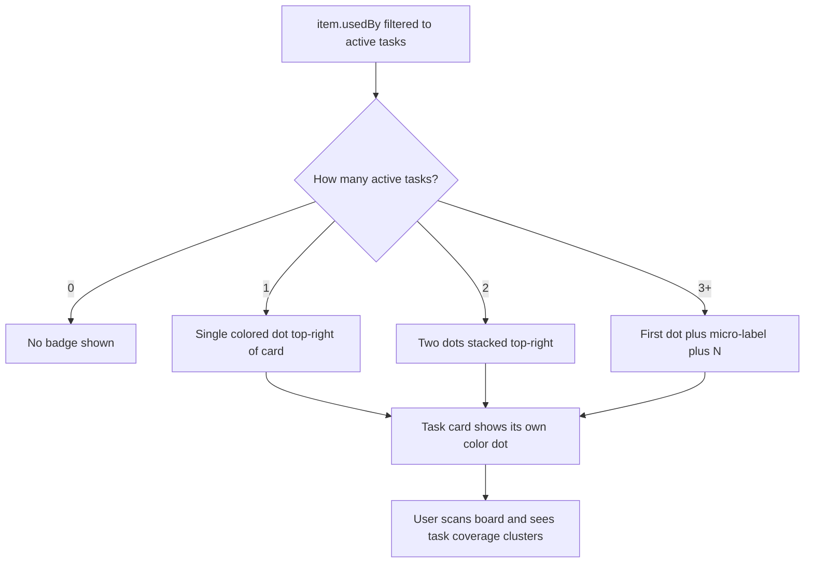

## req_167_task_color_badge_on_cards_to_visualize_active_task_coverage_at_a_glance - task color badge on cards to visualize active task coverage at a glance
> From version: 1.25.2
> Schema version: 1.0
> Status: Done
> Understanding: 95%
> Confidence: 90%
> Complexity: Medium
> Theme: UI

# Needs

When multiple tasks are active simultaneously, there is no visual way to tell at a glance which board or list cards are covered by which task. A small colored dot badge pinned to the top-right corner of each card gives an immediate, scannable signal:

- **Task cards** display their own color badge — the task "owns" the color.
- **Backlog and request cards** display the same badge when they appear in a task's `usedBy` chain — showing they are actively covered by that task.

The result: scanning the board you can see at a glance that a cluster of backlog items shares a purple dot (= covered by task_131), while another group has a teal dot (= covered by task_128), and uncovered items have no dot.

# Context

**Data model — link already exists:**
The relationship between a task and its covered items is already established in `logicsIndexer.ts`:
- A task's `# Links` section references its backlog items — those items get a `usedBy` entry pointing back to the task.
- `item.usedBy` already contains `{ id, title, stage, relPath }` for each task that covers the item.
- No indexer change is needed — the badge reads `item.usedBy` filtered to `stage === "task"` and `indicators.Status` not `"Done"` / `"Archived"`.

**Color derivation — deterministic, zero config:**
Extract the numeric suffix from the task ID (e.g., `task_131` → `131`), compute `131 % N` where N is the palette size, and map to a predefined set of N distinct muted hues (e.g., 10 colors). The color is always the same for a given task ID — no storage, no user action required.

**Palette**: 10 muted hues covering the VS Code dark theme well — teal, purple, amber, rose, sky, lime, orange, pink, indigo, cyan. Each as a CSS custom property or inline `background` value on the dot.

**Badge rendering:**
- A `` absolutely positioned `top: 6px; right: 6px` inside the card (which already has `position: relative`).
- Size: 8×8px circle, `border-radius: 50%`.
- Multiple tasks covering the same item: show up to 2 dots stacked or side-by-side, using the 2 most recently updated active tasks. Beyond 2, show the first dot with a `+N` micro-label.
- Only shown for tasks with `Status` that is **not** `Done`, `Archived`, or `Obsolete` — dots disappear automatically when a task closes.

**Scope: board and list view cards only.** Not in the detail panel, not in the activity view.

# Acceptance criteria

- AC1: Each active task (`Status` not Done/Archived/Obsolete) has a deterministic color derived from its numeric ID (`taskNumber % 10` → fixed 10-color palette). The same task always produces the same color across sessions.
- AC2: Task cards display their own color dot in the top-right corner of the card cell.
- AC3: Backlog and request cards that appear in an active task's `usedBy` display that task's color dot in the top-right corner. The dot matches the task's own dot exactly.
- AC4: When an item is covered by 2+ active tasks, up to 2 dots are shown side-by-side. If 3+, the first dot is shown with a micro-label `+N` (e.g., `+2`).
- AC5: When a task closes (Status → Done/Archived/Obsolete), its dot disappears from all cards without any manual action — the filter is live on each render.
- AC6: The dots do not appear in board column mode's column headers, in the detail panel, or in the activity view — only on individual item cards in board and list mode.
- AC7: All 410+ existing tests continue to pass. No regressions introduced.

# Definition of Ready (DoR)

- [x] Problem statement is explicit and user impact is clear.
- [x] Scope boundaries (in/out) are explicit.
- [x] Acceptance criteria are testable.
- [x] Dependencies and known risks are listed.

**In scope:** `media/renderBoardApp.js` card creation, `media/css/board.css` dot styles, color derivation utility, filter on `usedBy` active tasks only.

**Out of scope:** user-configurable task colors, dot in detail panel or activity view, tooltip on dot (nice-to-have, deferred), dot in board column headers.

**Known risks:**
- `item.usedBy` includes all referencing items, not just tasks — the filter `stage === "task"` is essential to avoid false positives from backlog items that reference a request.
- Color contrast: muted dots at 8px may be invisible against some VS Code themes. Use `opacity: 0.85` and a 1px white/transparent border to ensure legibility on both dark and light themes.
- The card element already uses `position: relative` — confirmed in `media/css/board.css`. No structural change to the card needed.

# AC Traceability

- AC1 -> Task `task_132_implement_task_color_badge_on_cards` and backlog item `item_309_implement_task_color_badge_on_cards`. Proof: task_131 and task_128 produce different colors; reloading the plugin produces the same colors.
- AC2 -> Task `task_132_implement_task_color_badge_on_cards` and backlog item `item_309_implement_task_color_badge_on_cards`. Proof: task cards in board/list show a colored dot top-right.
- AC3 -> Task `task_132_implement_task_color_badge_on_cards` and backlog item `item_309_implement_task_color_badge_on_cards`. Proof: backlog items linked to a task show the matching dot.
- AC4 -> Task `task_132_implement_task_color_badge_on_cards` and backlog item `item_309_implement_task_color_badge_on_cards`. Proof: item covered by 2 tasks shows 2 dots; 3+ shows dot + `+N`.
- AC5 -> Task `task_132_implement_task_color_badge_on_cards` and backlog item `item_309_implement_task_color_badge_on_cards`. Proof: marking a task Done removes its dot from all cards on next render.
- AC6 -> Task `task_132_implement_task_color_badge_on_cards` and backlog item `item_309_implement_task_color_badge_on_cards`. Proof: detail panel and activity view show no dots.
- AC7 -> Task `task_132_implement_task_color_badge_on_cards` and backlog item `item_309_implement_task_color_badge_on_cards`. Proof: `npm run test` exits 0 with ≥ 410 tests.

# Companion docs

- Product brief(s): (none — focused UI feature)
- Architecture decision(s): (none)

# AI Context

- Summary: Add a small colored dot badge to the top-right corner of task and covered backlog/request cards, with color derived deterministically from the task's numeric ID, reading the existing usedBy relationship from the indexer.
- Keywords: task badge, color dot, card, top-right, usedBy, task coverage, deterministic color, board, list view
- Use when: Planning or implementing the task color badge feature.
- Skip when: Working on coverage, sticky headers, or unrelated plugin surfaces.

# Backlog

- `item_309_task_color_badge_on_cards_to_visualize_active_task_coverage_at_a_glance`
- `item_310_render_task_coverage_badges_on_board_and_list_cards`
- `item_311_handle_stacked_task_coverage_badges_and_active_lifecycle_updates`

# Delivery

- Implemented in `media/renderBoardApp.js` and `media/css/board.css`.
- Added regression coverage in `tests/webview.board-renderer.test.ts`.
- Validated with `npm run compile` and `npm run test` (427 tests).
