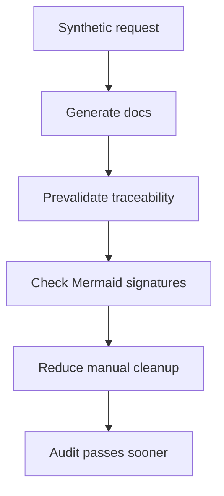

## req_169_am_liorer_la_cr_ation_de_requests_de_test_et_la_pr_validation_du_flow_manager - Improve test request creation and flow manager pre-validation
> From version: 1.25.4
> Schema version: 1.0
> Status: Done
> Understanding: 93%
> Confidence: 93%
> Complexity: Medium
> Theme: Workflow
> Reminder: Update status/understanding/confidence and linked backlog/task references when you edit this doc.

# Needs
- Make the flow manager better at generating synthetic requests for testing and smoke checks.
- Reduce the amount of manual cleanup needed after `flow new`, `flow split`, and `flow promote`.
- Catch the most common audit problems earlier, before the request has to be hand-fixed after generation.

# Context
- We just created a synthetic request to test Logics pastilles, and it exposed a few friction points.
- The generated docs were technically valid, but they needed several manual fixes before they were pleasant to use or easy to audit.
- The main pain points were:
  - request templates for test scenarios stay too generic;
  - AC traceability is not always created in the shape the audit expects;
  - Mermaid signatures drift after content edits;
  - audit errors are often discovered only after the docs already exist;
  - synthetic "smoke test" requests need a smaller, more opinionated shape than real delivery requests.
- The request is aimed at maintainers and operators who use the Logics workflow tools, especially when they are creating examples, fixtures, or smoke-test docs.

# Clarifications
- The new behavior should target synthetic or fixture-style requests first, not all real delivery requests.
- A dedicated `--fixture` or `--smoke-test` style mode is preferred over changing the default shape for every generated request.
- The flow manager should auto-generate the minimal request -> backlog -> task traceability for synthetic docs when it can do so deterministically.
- Structural problems such as stale Mermaid signatures or missing links should be caught during generation or promotion, not only during lint or audit.
- Safe, deterministic fixes should be applied automatically when possible; ambiguous issues should fail with an actionable message instead of being silently ignored.
- The same structural rules should remain in force for test docs, but the generated template can be smaller and more opinionated than the production template.
- The request should cover request, backlog item, and task generation together, because the friction showed up across the whole chain.
- The audit feedback should explain what failed, where it failed, and what command or doc stage should be used to repair it.
- The final behavior should reduce manual cleanup for maintainers who create examples, fixtures, or smoke-test documents.
- The README, getting started, and operator guidance pages should be updated so the new synthetic workflow and validation path are discoverable.

# Acceptance criteria
- AC1: Test or smoke-test requests can be generated with a more opinionated template that fits synthetic scenarios better than the default generic request shape.
- AC2: The flow manager can surface or create AC traceability in a form that matches the request, backlog item, and task chain used by the audit.
- AC3: The flow manager can detect stale Mermaid signatures or other doc-shape issues earlier, ideally during generation or promotion instead of only at lint or audit time.
- AC4: A synthetic test mode or equivalent flag exists so operators can ask for a smaller, fixture-friendly request shape without hand-editing the result heavily.
- AC5: The audit and validation feedback is more actionable for creators, making it clear what to fix and where to fix it before the docs are used downstream.
- AC6: The user-facing documentation set, including README and getting started guidance, is updated to explain the new synthetic workflow and the earlier validation path.

# AC Traceability
- AC1 -> Backlog and task slices for synthetic requests. Proof: the generated request for the pastille test had to be manually reshaped because the default template was too generic for a smoke-test scenario.
- AC2 -> Backlog and task slices for traceability. Proof: the generated request needed explicit request-to-item and item-to-task links to satisfy the audit.
- AC3 -> Mermaid validation. Proof: the request and its child docs required signature refreshes after content edits, showing that the issue is best caught earlier.
- AC4 -> Synthetic or fixture-friendly creation flow. Proof: the pastille test request is an example of a smaller, non-production request that should not need as much manual cleanup.
- AC5 -> Audit feedback and generator preflight. Proof: the current audit surfaced missing traceability only after generation, which is late for a simple smoke-test doc.
- AC6 -> `item_312_am_liorer_la_cr_ation_de_requests_de_test_et_la_pr_validation_du_flow_manager` and `task_133_am_liorer_la_cr_ation_de_requests_de_test_et_la_pr_validation_du_flow_manager`. Proof: `README.md`, `logics/skills/README.md`, and `logics/skills/logics-flow-manager/SKILL.md` now document `--fixture`/`--smoke-test` and the earlier validation path so the new workflow is discoverable from the operator guidance.

# Definition of Ready (DoR)
- [x] Problem statement is explicit and user impact is clear.
- [x] Scope boundaries are explicit enough for delivery.
- [x] Acceptance criteria are testable.
- [x] Dependencies and known risks are captured at a useful level.

# Companion docs
- Product brief(s): (none yet)
- Architecture decision(s): (none yet)

# AI Context
- Summary: Improve synthetic request generation, traceability, and prevalidation in the Logics flow manager.
- Keywords: flow manager, request generation, smoke test, fixture, traceability, mermaid, audit
- Use when: Use when you need better generated requests and earlier validation for synthetic or test-oriented workflow docs.
- Skip when: Skip when the work is a normal product delivery slice or unrelated workflow maintenance.

# Backlog
- `item_312_am_liorer_la_cr_ation_de_requests_de_test_et_la_pr_validation_du_flow_manager`
