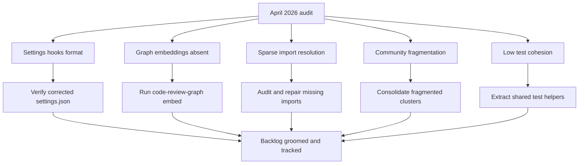

## req_170_address_codebase_audit_findings_from_april_2026_settings_hooks_graph_embeddings_and_test_fragmentation - address codebase audit findings from april 2026 settings hooks graph embeddings and test fragmentation
> From version: 1.25.4
> Schema version: 1.0
> Status: Draft
> Understanding: 95%
> Confidence: 90%
> Complexity: Medium
> Theme: Maintenance
> Reminder: Update status/understanding/confidence and linked backlog/task references when you edit this doc.

# Needs

A full codebase audit conducted in April 2026 revealed five categories of issues affecting developer tooling reliability, graph quality, and test maintainability. Each finding needs to be addressed in a bounded backlog item before they compound into larger quality regressions.

1. **Settings hooks format** — `.claude/settings.json` used the deprecated flat hook format (`command` at root) and an invalid `--quiet` flag in the `PostToolUse` command. Both were corrected in-session but need to be verified as final.
2. **Graph embeddings absent** — The knowledge graph has 0 semantic embeddings, disabling `semantic_search_nodes` and all semantic analysis paths.
3. **Sparse import resolution** — Only 416 `IMPORTS_FROM` edges vs 13 570 `CALLS` edges (ratio 1:33). Several files likely have unresolved imports in the graph, reducing impact-radius accuracy.
4. **Community fragmentation** — 109 communities for 117 files, with many duplicate-named sub-clusters (`src-tools`, `media-assist`, `tests-when` ×6, etc.), indicating disconnected sub-graphs within logical modules.
5. **Low test cohesion** — `tests-harness` (cohesion 0.085), `tests-after` (0.071), `tests-when` split across 6 clusters, and the majority of `tests-*` communities below cohesion 0.03. No shared helper infrastructure pulling test utilities together.

# Context

The audit was triggered by a `settings.json` parse error at session startup. A broader graph-based analysis followed using `code-review-graph` MCP tools. Observations:

- Extension: `cdx-logics-vscode` v1.25.4, VS Code `^1.86.0`, bundle via esbuild, no runtime deps.
- Graph: 117 files · 1 748 nodes · 23 216 edges · languages: TypeScript (83 communities), JavaScript (25), Python (1).
- Largest hub: `src-tools` (86 nodes, cohesion 0.39) — called by most communities, high blast radius.
- Tightest module: `media-can` (82 nodes, cohesion 0.90) — self-contained webview rendering core.
- Test-to-call ratio: 7 518 TESTED_BY / 13 570 CALLS ≈ 0.55 — reasonable but not exhaustive.

# Acceptance criteria

- AC1: `.claude/settings.json` uses the canonical hook format with `hooks` array and no invalid flags — verified by a clean session startup with no parse errors.
- AC2: `code-review-graph embed` runs successfully and reports at least one embedded node, enabling semantic search.
- AC3: `IMPORTS_FROM` edge count in the graph increases or a documented explanation is provided for why the ratio remains low (e.g. dynamic imports, test-only files).
- AC4: Duplicate-named community sub-clusters (`src-tools`, `media-assist`, `tests-when`, etc.) are investigated and either consolidated via missing imports or documented as intentional design.
- AC5: At least one shared test helper module is extracted or proposed to raise cohesion in the three largest fragmented test communities (`tests-harness`, `tests-after`, `tests-when`).

# Definition of Ready (DoR)

- [x] Problem statement is explicit and user impact is clear.
- [x] Scope boundaries (in/out) are explicit.
- [x] Acceptance criteria are testable.
- [ ] Dependencies and known risks are listed.

# Known risks

- Rebuilding graph embeddings may require a model or API key not available in the current environment.
- Consolidating community fragmentation may surface hidden coupling that requires larger refactors.
- Extracting test helpers risks breaking test isolation if done carelessly.

# Companion docs
- Product brief(s): (none yet)
- Architecture decision(s): (none yet)

# AI Context
- Summary: Five audit findings from April 2026 — settings hooks format, missing graph embeddings, sparse import resolution, community fragmentation, and low test cohesion.
- Keywords: audit, settings, hooks, embeddings, imports, communities, test-cohesion, code-review-graph
- Use when: Triaging or grooming work derived from the April 2026 project audit.
- Skip when: Work targets unrelated features or a different audit cycle.

# Backlog
- (none yet)
