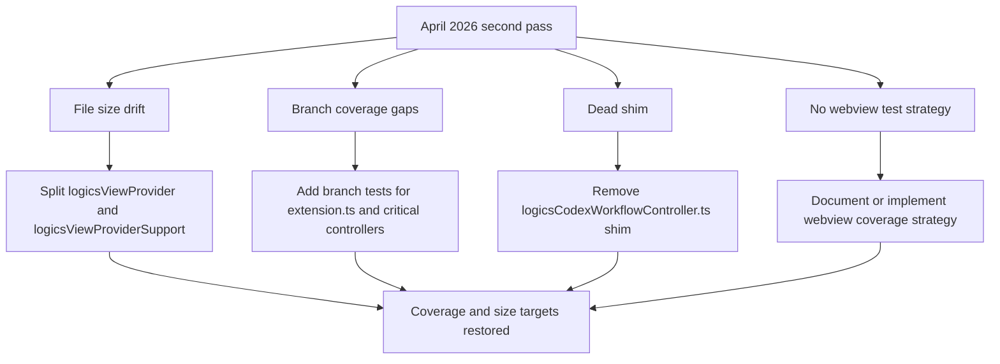

## req_171_address_post_audit_coverage_regressions_dead_shim_and_file_size_drift - address post audit coverage regressions dead shim and file size drift
> From version: 1.25.4
> Schema version: 1.0
> Status: Done
> Understanding: 97%
> Confidence: 95%
> Complexity: Medium
> Theme: Maintenance
> Reminder: Update status/understanding/confidence and linked backlog/task references when you edit this doc.

# Needs

A second pass of the April 2026 audit surfaced four concrete regressions and gaps not captured in `logics/request/req_170_address_codebase_audit_findings_from_april_2026_settings_hooks_graph_embeddings_and_test_fragmentation.md`:

1. **File size drift** — Two `src/` files exceed 1000 lines despite `req_131` (reduce all files below 1000 lines) being marked Done.
2. **Critical branch coverage gaps** — Three large source files are below 55% statement coverage and `extension.ts` sits at 30% branch coverage, leaving activation paths and error branches untested.
3. **Dead re-export shim** — `src/logicsCodexWorkflowController.ts` is a single-line barrel re-export left over from a prior refactor with 0% coverage and no known live importers.
4. **No compensatory webview test strategy** — All `media/*.js` files (7 500 lines, entire webview layer) report 0% coverage. `req_129` and `req_130` are Done but neither established a browser-side harness or integration test path to compensate for the structural impossibility of covering webview code with Vitest/Node.

# Context

These findings emerged from running `npm run test -- --coverage` and cross-referencing with graph statistics during the April 2026 session audit. Overall project coverage: **39.51% statements / 33.61% branches**.

**File size drift (req_131 regression):**

| File | Lines | Target |
|---|---|---|
| `src/logicsViewProviderSupport.ts` | 1098 | < 1000 |
| `src/logicsViewProvider.ts` | 1044 | < 1000 |

**Critical src/ coverage gaps:**

| File | Stmts | Branch | Funcs |
|---|---|---|---|
| `src/logicsCodexWorkflowOperations.ts` | 43% | 38% | 80% |
| `src/logicsViewProvider.ts` | 51% | 55% | 34% |
| `src/logicsHybridAssistController.ts` | 53% | 37% | 68% |
| `src/extension.ts` | 66% | **30%** | 41% |

**Dead shim:**
`src/logicsCodexWorkflowController.ts` — 1 line, 0% coverage, no import hit in `src/` or `tests/`.

**Webview coverage gap:**
`media/*.js` (16 files) — 0% on all metrics. The existing `webview.harness-core.test.ts` and `webview.chrome.test.ts` mock the VS Code API but do not import the actual media JS files.

# Acceptance criteria

- AC1: Both oversized `src/` files (`logicsViewProvider.ts` and `logicsViewProviderSupport.ts`) are split below 1000 lines each or a documented architectural reason is recorded for why the threshold does not apply.
- AC2: `src/extension.ts` branch coverage rises above 50% by adding activation-path and error-branch tests.
- AC3: `src/logicsCodexWorkflowController.ts` is removed (or a live importer is identified and documented); no dead re-export shims remain in `src/`.
- AC4: A documented decision exists for the `media/` coverage gap — either a compensatory test strategy (browser harness, playwright, or equivalent) is introduced, or an explicit ADR records why 0% webview coverage is accepted and how regressions will be caught.
- AC5: Overall project statement coverage does not regress below 39.51% after the changes in AC1–AC3.

# Definition of Ready (DoR)

- [x] Problem statement is explicit and user impact is clear.
- [x] Scope boundaries (in/out) are explicit.
- [x] Acceptance criteria are testable.
- [x] Dependencies and known risks are listed.

# Known risks

- Splitting `logicsViewProvider.ts` may require touching many callers and test mocks — check `get_impact_radius` before starting.
- Removing the shim may break an undiscovered runtime import path not visible via static grep (dynamic imports). Verify with a build and grep before deleting.
- Adding branch tests for `extension.ts` requires a VS Code extension test environment (not covered by Vitest/jsdom alone).

# References
- `logics/request/req_170_address_codebase_audit_findings_from_april_2026_settings_hooks_graph_embeddings_and_test_fragmentation.md`
- `logics/request/req_131_reduce_all_remaining_active_source_and_test_files_below_1000_lines_with_seam_driven_refactors.md`
- `logics/request/req_129_greatly_improve_plugin_and_kit_coverage_with_behavior_focused_tests.md`
- `logics/request/req_130_make_plugin_coverage_actionable_with_targeted_src_gains_and_honest_webview_measurement.md`

# Companion docs
- Product brief(s): (none yet)
- Architecture decision(s): `logics/architecture/adr_021_keep_media_coverage_at_zero_and_rely_on_smoke_tests_for_webview_regressions.md`

# AI Context
- Summary: Four post-audit regressions — file size drift past req_131 threshold, branch coverage gaps in critical files, dead shim in src/, and no webview test compensatory strategy.
- Keywords: coverage, branch, extension.ts, logicsViewProvider, shim, media, webview, regression, file-size
- Use when: Triaging coverage and size regressions surfaced by the April 2026 second-pass audit.
- Skip when: Work targets new features or unrelated modules.

# Backlog
- `logics/backlog/item_315_remove_dead_shim_split_oversized_ts_files_and_document_webview_coverage_decision.md`
- `logics/backlog/item_316_improve_extension_ts_branch_coverage_and_maintain_overall_coverage_floor.md`
