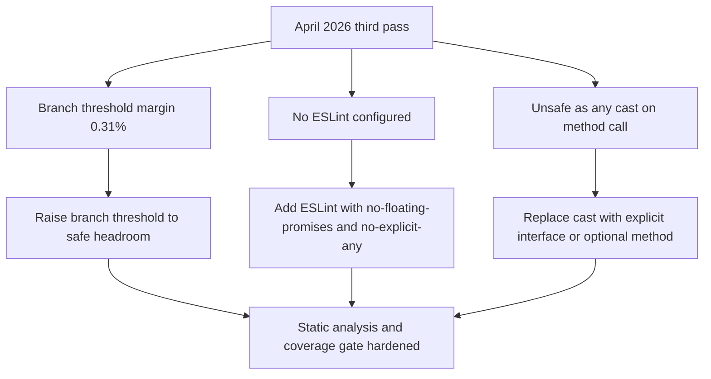

## req_172_harden_static_analysis_and_branch_coverage_safety_net - harden static analysis and branch coverage safety net
> From version: 1.25.4
> Schema version: 1.0
> Status: Ready
> Understanding: 95%
> Confidence: 92%
> Complexity: Medium
> Theme: Maintenance
> Reminder: Update status/understanding/confidence and linked backlog/task references when you edit this doc.

# Needs

A third pass of the April 2026 audit identified three quality-gate gaps that are not covered by `req_170` or `req_171`:

1. **Branch coverage margin is critically thin** — The Vitest threshold for `src` branches is 61%. Current coverage is 61.31%, a margin of 0.31 points. Any new code path added without a matching test will break CI.
2. **No ESLint configured** — The `lint` script runs `tsc --noEmit` only. There is no rule-based static analysis, leaving several high-value safety rules unenforced: `no-floating-promises`, `no-explicit-any`, `no-unused-vars`, and code-style consistency.
3. **Unsafe `as any` cast on a method call** — `src/logicsViewProvider.ts:561` calls `(this as any).injectAgentPromptIntoCodexChat(pick.agent)`. The cast bypasses TypeScript entirely: if the method is renamed or removed, no compile error is raised and the failure surfaces only at runtime inside the VS Code extension host.

# Context

Current Vitest threshold configuration (from `vitest.config.ts`, `src` target only):

```
lines:      68%   actual: 71.82%  margin: +3.82
statements: 68%   actual: 72.13%  margin: +4.13
functions:  73%   actual: 80.44%  margin: +7.44
branches:   61%   actual: 61.31%  margin: +0.31  ← critical
```

`media` target has no threshold (0% is explicitly not a gate per `run-plugin-coverage.mjs`).

ESLint absence impact:
- `no-floating-promises`: unhandled async rejections in VS Code event handlers are silent and hard to trace.
- `no-explicit-any`: 4 current usages in `src/` pass without warning — `logicsViewProviderSupport.ts:29` (index signature), `logicsViewProvider.ts:160,188,561`.
- `no-unused-vars` / `@typescript-eslint/no-unused-imports`: dead code not detected between refactors.

Unsafe cast location:
- `src/logicsViewProvider.ts:561` — `await (this as any).injectAgentPromptIntoCodexChat(pick.agent)` — the method is either inherited dynamically or injected at runtime. The cast hides a design seam that should be made explicit via an interface or optional method declaration.



# Acceptance criteria

- AC1: The Vitest branch threshold for `src` is raised to at least 63% (2-point headroom above current coverage), and the CI gate stays green.
- AC2: ESLint is configured with at minimum `@typescript-eslint/no-floating-promises` and `@typescript-eslint/no-explicit-any` rules, integrated into the `lint` npm script and the CI `Lint` step.
- AC3: The `(this as any).injectAgentPromptIntoCodexChat` call in `src/logicsViewProvider.ts:561` is replaced with a type-safe alternative (explicit interface, optional method on the class, or conditional guard) that compiles without a cast.
- AC4: All existing `any` usages in `src/` either satisfy the ESLint rule (justified with an inline `eslint-disable` comment explaining why) or are removed.
- AC5: The `npm run lint` and `npm run test:coverage:src` steps both pass on CI after the changes.

# Definition of Ready (DoR)

- [x] Problem statement is explicit and user impact is clear.
- [x] Scope boundaries (in/out) are explicit.
- [x] Acceptance criteria are testable.
- [x] Dependencies and known risks are listed.

# Known risks

- Adding `no-floating-promises` may surface existing unhandled promise chains across the codebase — audit before enabling as an error (start as `warn` then promote).
- Raising the branch threshold too aggressively (above current coverage) will immediately break CI; use a 2-point buffer above the current measurement.
- Replacing the `as any` cast requires understanding whether `injectAgentPromptIntoCodexChat` is injected at runtime by a mixin or subclass pattern — investigate callers with `query_graph` before refactoring.

# References
- `logics/request/req_171_address_post_audit_coverage_regressions_dead_shim_and_file_size_drift.md`
- `logics/request/req_170_address_codebase_audit_findings_from_april_2026_settings_hooks_graph_embeddings_and_test_fragmentation.md`

# Companion docs
- Product brief(s): (none yet)
- Architecture decision(s): (none yet)

# AI Context
- Summary: Three quality-gate gaps — branch coverage margin 0.31%, no ESLint, and unsafe as-any cast on a method call in logicsViewProvider.ts.
- Keywords: eslint, branch-threshold, no-floating-promises, no-explicit-any, as-any, vitest, lint, coverage-gate
- Use when: Triaging static analysis and coverage threshold hardening work from the April 2026 third-pass audit.
- Skip when: Work targets feature delivery or unrelated modules.

# Backlog
- `logics/backlog/item_317_add_eslint_raise_branch_threshold_and_fix_unsafe_as_any_cast.md`
