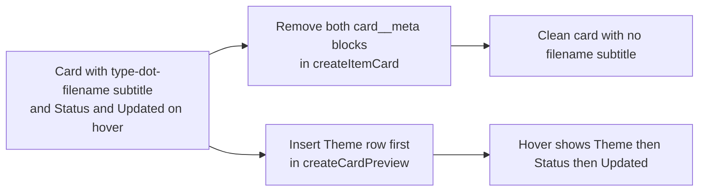

## req_173_remove_filename_subtitle_from_cells_and_add_theme_field_in_cell_metadata_row - remove filename subtitle from cells and add theme field in cell metadata row
> From version: 1.25.4
> Schema version: 1.0
> Status: Done
> Understanding: 95%
> Confidence: 92%
> Complexity: Low
> Theme: UI
> Reminder: Update status/understanding/confidence and linked backlog/task references when you edit this doc.

# Needs

Two targeted UI changes to the board and list card cells, applying to all document types (request, backlog, task, product, architecture, spec):

1. **Remove the faded filename subtitle** — Each card currently renders a `card__meta` line showing `<type> • <filename-id>` (e.g. `request • req_172_harden_static_analysis_and_branch_coverage_safety_net`). This line is redundant: the document prefix badge already shows the type+number, and the title conveys the content. Remove it from all card variants.

2. **Add Theme as the first field in the hover metadata row** — The card preview (visible on hover) shows `Status` then `Updated`. `Theme` should appear as the first row, before `Status`, in the same `card__preview-row` style. If an item has no `Theme` indicator, the row is omitted.

# Context

Card structure is built by `createItemCard` in `media/renderBoardApp.js`. Two locations render the filename subtitle:

- **Line 937–940** — non-compact cards where `!isPrimaryFlowStage(item.stage)`:
  ```js
  const supportMeta = document.createElement("div");
  supportMeta.className = "card__meta";
  supportMeta.textContent = `${getStageLabel(item.stage)} • ${item.id}`;
  card.appendChild(supportMeta);
  ```

- **Lines 953–957** — compact cards (list mode):
  ```js
  const meta = document.createElement("div");
  meta.className = "card__meta";
  meta.textContent = `${getStageLabel(item.stage)} • ${item.id}`;
  card.appendChild(meta);
  ```

Both blocks must be removed. The `card__meta--linkage` block (primary flow summary) on lines 944–951 must be kept — it is a different element with a different class and purpose.

The hover preview is built by `createCardPreview` in `media/renderBoardApp.js` lines 799–816:
```js
preview.appendChild(createPreviewRow("Status", item?.indicators?.Status || "No status"));
preview.appendChild(createPreviewRow("Updated", formatPreviewDate(item.updatedAt)));
```

`Theme` must be inserted before `Status`:
```js
const theme = item?.indicators?.Theme;
if (theme) preview.appendChild(createPreviewRow("Theme", theme));
preview.appendChild(createPreviewRow("Status", item?.indicators?.Status || "No status"));
preview.appendChild(createPreviewRow("Updated", formatPreviewDate(item.updatedAt)));
```



# Acceptance criteria

- AC1: The `card__meta` line showing `<type> • <filename-id>` no longer appears on any card in board view, list view, or compact mode, for all document types.
- AC2: The `card__meta--linkage` line (primary flow summary, e.g. `Unlinked to primary flow`) is unaffected.
- AC3: The card hover preview shows `Theme` as the first row when the item has a `Theme` indicator; the row is absent when `Theme` is empty or missing.
- AC4: `Status` and `Updated` remain in second and third position on the hover preview, unchanged in style.
- AC5: Existing webview tests pass (`npm run test`) and no visual regression is introduced in board, list, or compact layouts.

# Definition of Ready (DoR)

- [x] Problem statement is explicit and user impact is clear.
- [x] Scope boundaries (in/out) are explicit.
- [x] Acceptance criteria are testable.
- [x] Dependencies and known risks are listed.

# Known risks

- The two `card__meta` blocks differ only by their surrounding condition (`compact` vs `!isPrimaryFlowStage`). Removing the wrong block or both without care could break the linkage meta. Verify using `card__meta--linkage` class selector as the discriminator.
- If any test asserts the presence of the `card__meta` text content, it will need updating.

# Companion docs
- Product brief(s): (none yet)
- Architecture decision(s): (none yet)

# AI Context
- Summary: Remove the faded type-dot-filename subtitle from all card cells and add Theme as the first field in the card hover metadata row.
- Keywords: card__meta, filename, subtitle, createItemCard, createCardPreview, Theme, hover, board, list, compact
- Use when: Implementing or reviewing changes to card cell rendering in the board or list views.
- Skip when: Work targets non-UI or non-card surfaces.

# Backlog
- `logics/backlog/item_318_remove_filename_subtitle_from_cells_and_add_theme_to_card_hover_row.md`
