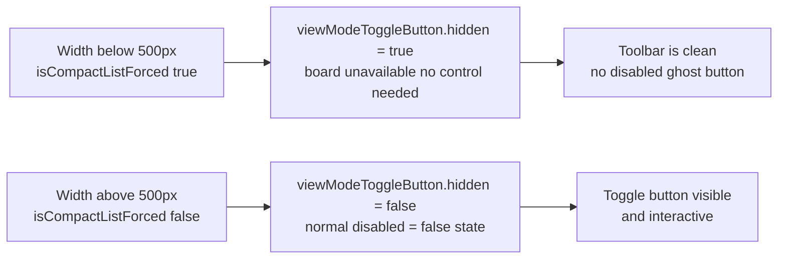

## req_174_hide_view_mode_toggle_button_when_compact_list_is_forced_below_500px - hide view mode toggle button when compact list is forced below 500px
> From version: 1.25.4
> Schema version: 1.0
> Status: Done
> Understanding: 95%
> Confidence: 96%
> Complexity: Low
> Theme: UI
> Reminder: Update status/understanding/confidence and linked backlog/task references when you edit this doc.

# Needs

When the webview width drops below 500px, `isCompactListForced()` returns `true` and list mode is imposed automatically — the board view is structurally unavailable. The view mode toggle button (`viewModeToggleButton`) is already disabled in this state, but it remains visible in the toolbar. A disabled button that controls a feature which cannot be activated is visual noise. The button should be hidden entirely when compact list mode is forced, and restored to its normal visible+enabled state when the width returns above 500px.

# Context

The compact list breakpoint is defined in `media/mainApp.js:136`:
```js
const compactListQuery = window.matchMedia("(max-width: 500px)");
```

The toggle button state is managed by `updateViewModeToggle` in `media/webviewChrome.js:105–133`. The `isCompactListForced()` branch (lines 110–117) currently sets `disabled = true` but does not set `hidden`:

```js
if (isCompactListForced()) {
  setButtonIcon(viewModeToggleButton, listModeIcon());
  viewModeToggleButton.dataset.currentMode = currentMode;
  viewModeToggleButton.setAttribute("aria-pressed", "true");
  viewModeToggleButton.setAttribute("aria-label", "Current mode: list. List mode is required below 500px");
  viewModeToggleButton.title = "Current mode: list. List mode is required below 500px";
  viewModeToggleButton.disabled = true;
  return;
}
```

The fix is a one-line addition in the forced branch (`viewModeToggleButton.hidden = true`) and a one-line reset in the normal branch (`viewModeToggleButton.hidden = false`) before setting `disabled = false`.



# Acceptance criteria

- AC1: `viewModeToggleButton` is hidden (`hidden = true`) whenever `isCompactListForced()` returns `true`, with no layout gap left by the absent button.
- AC2: `viewModeToggleButton` is visible and enabled when the width returns above 500px, with no change to its normal board/list toggle behaviour.
- AC3: The transition is responsive — toggling the window width across the 500px threshold dynamically shows/hides the button without requiring a reload.
- AC4: No other toolbar button is affected.
- AC5: Existing tests pass (`npm run test`) after the change.

# Definition of Ready (DoR)

- [x] Problem statement is explicit and user impact is clear.
- [x] Scope boundaries (in/out) are explicit.
- [x] Acceptance criteria are testable.
- [x] Dependencies and known risks are listed.

# Known risks

- `hidden` on a flex child collapses its space entirely; verify the toolbar does not reflow unexpectedly when the button disappears. A CSS `visibility: hidden` alternative preserves space but that is intentionally not desired here.
- If any test asserts the button is present in the DOM at all times, it will need updating to account for the `hidden` attribute under compact conditions.

# Companion docs
- Product brief(s): (none yet)
- Architecture decision(s): (none yet)

# AI Context
- Summary: Hide viewModeToggleButton entirely (not just disable) when isCompactListForced returns true below 500px, and restore it when width returns above the threshold.
- Keywords: viewModeToggleButton, isCompactListForced, hidden, 500px, compact, list, toolbar, webviewChrome
- Use when: Implementing or reviewing toolbar button visibility under the compact list breakpoint.
- Skip when: Work targets features unrelated to the compact/responsive layout.

# Backlog
- `logics/backlog/item_319_hide_view_mode_toggle_button_when_compact_list_is_forced_below_500px.md`
