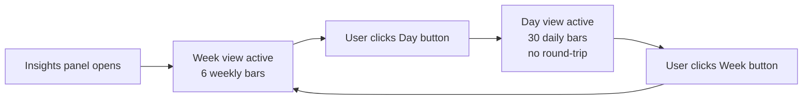

## req_175_add_day_and_week_period_selector_to_delivery_timeline_in_logics_insights - add day and week period selector to delivery timeline in logics insights
> From version: 1.25.4
> Schema version: 1.0
> Status: Done
> Understanding: 95%
> Confidence: 92%
> Complexity: Low
> Theme: UI
> Reminder: Update status/understanding/confidence and linked backlog/task references when you edit this doc.

# Needs

The Delivery timeline in Logics Insights currently shows a fixed view: 6 weekly buckets, hardcoded. Users need two granularity options to analyse delivery rhythm at different scales:

- **Day** — last 30 days, one bar per day, label `Apr 12`.
- **Week** — last 6 weeks (current behaviour), one bar per week, label `Apr 7`.

A compact toggle (two buttons: `Day` / `Week`) should appear above the chart. The default active period on open is `Week` (no change to current behaviour). The selected period switches instantly without a round-trip to the extension host.

# Context

The timeline is built server-side in `src/logicsCorpusInsightsHtml.ts`:

- `summarizeTimeline(items, nowMs, bucketCount = 6)` — creates weekly buckets only; `bucketCount` and `weekMs` are hardcoded.
- `formatTimelineLabel(timestampMs)` — already formats as `Mon DD` (e.g. `Apr 12`), suitable for both day and week labels.
- `renderTimelineChart(title, description, points)` — renders an SVG bar chart from `TimelinePoint[]`.
- Called once at line 422: `summarizeTimeline(items, Date.now())` → `timelinePoints`.

The panel has `enableScripts: true` and pre-existing message passing (`refresh-report`, `open-onboarding`, `about` in `src/logicsCorpusInsightsController.ts`).

**Recommended implementation — pre-compute both datasets, toggle client-side:**

Pre-compute both datasets at render time and embed them as inline JS constants. A small `<script>` block in the insights HTML handles the toggle, swapping the active SVG (or re-rendering bars from data). No round-trip to the extension host is needed — the switch is instant and the data is already present.

```
dayPoints  = summarizeTimeline(items, nowMs, 30, "day")   // new overload
weekPoints = summarizeTimeline(items, nowMs, 6,  "week")  // existing behaviour
```

`summarizeTimeline` must accept a new `period: "day" | "week"` parameter:
- `"week"` — existing logic, `bucketDurationMs = 7 * 24 * 60 * 60 * 1000`.
- `"day"` — `bucketDurationMs = 24 * 60 * 60 * 1000`, align to UTC day start, 30 buckets.



# Acceptance criteria

- AC1: A `Day` / `Week` toggle appears above the delivery timeline chart; `Week` is active by default on open.
- AC2: Clicking `Day` switches the chart to 30 daily bars (last 30 days, UTC day buckets, label `Mon DD`), instantly, without reloading the panel.
- AC3: Clicking `Week` restores the 6 weekly bars (existing behaviour and labels).
- AC4: The active period button is visually distinguished (pressed/active state) from the inactive one.
- AC5: When there are no closed items in the selected period, the empty-state message reflects the chosen period (e.g. "No closed items in the last 30 days." vs "…last 6 weeks.").
- AC6: `summarizeTimeline` in `src/logicsCorpusInsightsHtml.ts` accepts a `period` parameter and the existing call site (week, 6 buckets) remains the default, preserving backward compatibility with any future callers.

# Definition of Ready (DoR)

- [x] Problem statement is explicit and user impact is clear.
- [x] Scope boundaries (in/out) are explicit.
- [x] Acceptance criteria are testable.
- [x] Dependencies and known risks are listed.

# Known risks

- Day view with 30 bars may be visually cramped at narrow panel widths — `barWidth` in `renderTimelineChart` is already clamped to `Math.max(16, Math.min(38, slotWidth - 12))`; verify it degrades gracefully at 30 bars.
- Embedding two full datasets as inline JS inflates the panel HTML slightly; acceptable for a static insights page.
- If the insights panel is opened with very few closed items, the day view may show mostly empty bars — this is expected and the empty-state per AC5 handles the zero-total case.

# Companion docs
- Product brief(s): (none yet)
- Architecture decision(s): (none yet)

# AI Context
- Summary: Add a Day / Week period toggle above the Delivery timeline chart in Logics Insights; pre-compute both datasets server-side and switch client-side with no round-trip.
- Keywords: timeline, delivery, day, week, period, selector, toggle, summarizeTimeline, logicsCorpusInsightsHtml, corpus-insights
- Use when: Implementing or reviewing the delivery timeline period selector in the Logics Insights panel.
- Skip when: Work targets other sections of the insights panel or unrelated surfaces.

# Backlog
- `logics/backlog/item_320_add_day_and_week_period_selector_to_delivery_timeline_in_logics_insights.md`
