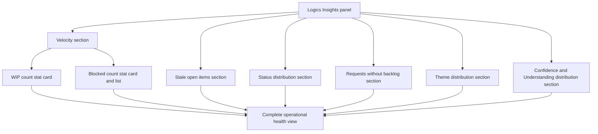

## req_176_enrich_logics_insights_with_wip_blocked_stale_status_theme_and_backlog_coverage_sections - enrich logics insights with wip blocked stale status theme and backlog coverage sections
> From version: 1.25.4
> Schema version: 1.0
> Status: Done
> Understanding: 95%
> Confidence: 92%
> Complexity: Medium
> Theme: UI
> Reminder: Update status/understanding/confidence and linked backlog/task references when you edit this doc.

# Needs

Logics Insights exposes velocity, timeline, progress, and relationship data but leaves several high-value operational dimensions completely dark. Six new sections would give the user a complete daily-driver view of project health without leaving the panel:

1. **WIP + Blocked stat cards** — how many items are actively in flight and how many are stuck.
2. **Stale open items** — items not touched in 30+ days that are not in a terminal status.
3. **Status distribution** — breakdown of all workflow items by current `Status` indicator.
4. **Requests without backlog** — requests that have never been actioned into a backlog item.
5. **Theme distribution** — effort split across `Theme` indicator values.
6. **Confidence and Understanding distribution** — how many items fall below readiness thresholds.

# Context

All data needed is already available on `LogicsItem`: `indicators.Status`, `indicators.Understanding`, `indicators.Confidence`, `indicators.Theme`, `indicators["From version"]`, `updatedAt`, `references`, `usedBy`, `stage`.

The panel is a server-side rendered HTML page built in `src/logicsCorpusInsightsHtml.ts` via `buildLogicsCorpusInsightsHtml`. New sections follow the same `renderList` / `renderStatCard` / `renderPieChart` / inline HTML patterns already in use. No new message types or controller changes are required for pure read-only sections.

**Current sections (unchanged):** Velocity · Delivery timeline · Distribution snapshots · Stage distribution · Progress distribution · Relationship hot spots · Most connected docs · Largest docs · Recently updated.

**New sections detail:**

**WIP + Blocked** (add into the existing Velocity section grid):
- `Status = "In progress"` across request + backlog + task → stat card, tone `warn` if count > 5.
- `Status = "Blocked"` across all workflow stages → stat card, tone `bad` if count > 0; expand into a list of blocked item titles below the card.

**Stale open items** (new section after Delivery timeline):
- Open = status not in `{Done, Archived, Obsolete}`.
- Stale threshold: `updatedAt` older than 30 days from now.
- Render as a list: `stage • title` / `last updated X days ago`.
- Empty state: "No stale items — everything was touched in the last 30 days."

**Status distribution** (new section after Progress distribution):
- Count all workflow items (request + backlog + task) by `indicators.Status`.
- Render as `renderList` rows: Status label / count / hint (e.g. "terminal" or "active").
- Sort: active statuses first (Draft, Ready, In progress, Blocked), then terminal (Done, Archived, Obsolete).

**Requests without backlog** (new section after Relationship hot spots):
- Requests where `status` not in terminal set AND `usedBy` contains no item whose `stage = "backlog"`.
- Render as a list: `title` / `status` / `relPath` hint.
- Empty state: "All open requests have at least one backlog item."

**Theme distribution** (new section, after Stage distribution):
- Group all items by `indicators.Theme`; items with no Theme → bucket `"(none)"`.
- Render as `renderList`: Theme label / count / percentage of total.
- Sort by count descending.

**Confidence and Understanding distribution** (new section, after Progress distribution):
- Buckets for each indicator: `< 70%` / `70–90%` / `> 90%` / `missing`.
- Render two side-by-side stat cards or a compact two-column list.
- Items below 70% on either indicator are candidates for the confidence-booster skill before promotion.

# Acceptance criteria

- AC1: WIP count (In progress) and Blocked count appear as stat cards in the Velocity section; Blocked card expands into a list of blocked item titles when count > 0.
- AC2: A Stale open items section lists workflow items not updated in 30+ days with non-terminal status, showing title, stage, and days since last update; shows an empty-state message when none exist.
- AC3: A Status distribution section lists all workflow items grouped by Status value, sorted active-first then terminal, with count and a terminal/active hint per row.
- AC4: A Requests without backlog section lists open requests that have no linked backlog child, with title, current status, and file path; shows an empty-state message when all requests are covered.
- AC5: A Theme distribution section lists item counts per Theme indicator value (including a catch-all for items with no Theme), sorted by count descending with percentage of total.
- AC6: A Confidence and Understanding distribution section shows how many items fall into each readiness bucket (below 70%, 70–90%, above 90%, missing) for both indicators.
- AC7: All new sections use the existing `renderList`, `renderStatCard`, or `renderPieChart` helpers and are consistent in style with current sections; no new CSS classes are introduced unless strictly necessary.
- AC8: `npm run test` passes after the changes and `npm run compile` produces no type errors.

# Definition of Ready (DoR)

- [x] Problem statement is explicit and user impact is clear.
- [x] Scope boundaries (in/out) are explicit.
- [x] Acceptance criteria are testable.
- [x] Dependencies and known risks are listed.

# Known risks

- The stale threshold (30 days) is hardcoded; if the project moves slowly, all items could appear stale. Consider making it a comment in the code so it can be adjusted easily.
- `updatedAt` may be missing or unparseable for older items — the stale calculation must handle null gracefully (treat as stale or exclude, document the choice).
- The Blocked list could be long in a neglected project — cap the displayed list at 10 items with a count overflow note.
- Understanding and Confidence indicators use a `??%` string format; parsing must handle variants like `90`, `90%`, `??%`, and missing values consistently (reuse `parsePercentIndicator` if it exists, or add a shared helper).
- Adding six sections increases panel length significantly — consider grouping the three new distribution sections (Status, Theme, Confidence/Understanding) under a collapsible or a second visual tier to avoid scroll fatigue.

# References
- `logics/request/req_175_add_day_and_week_period_selector_to_delivery_timeline_in_logics_insights.md`

# Companion docs
- Product brief(s): (none yet)
- Architecture decision(s): (none yet)

# AI Context
- Summary: Six new Logics Insights sections — WIP and Blocked stat cards, stale open items, status distribution, requests without backlog, theme distribution, and confidence/understanding distribution.
- Keywords: logics-insights, WIP, blocked, stale, status-distribution, theme, confidence, understanding, backlog-coverage, logicsCorpusInsightsHtml
- Use when: Implementing or reviewing additions to the Logics Insights panel in src/logicsCorpusInsightsHtml.ts.
- Skip when: Work targets other panels, the board, or non-insights surfaces.

# Backlog
- `logics/backlog/item_321_add_wip_blocked_and_stale_sections_to_logics_insights.md`
- `logics/backlog/item_322_add_status_theme_confidence_and_requests_without_backlog_sections_to_logics_insights.md`
