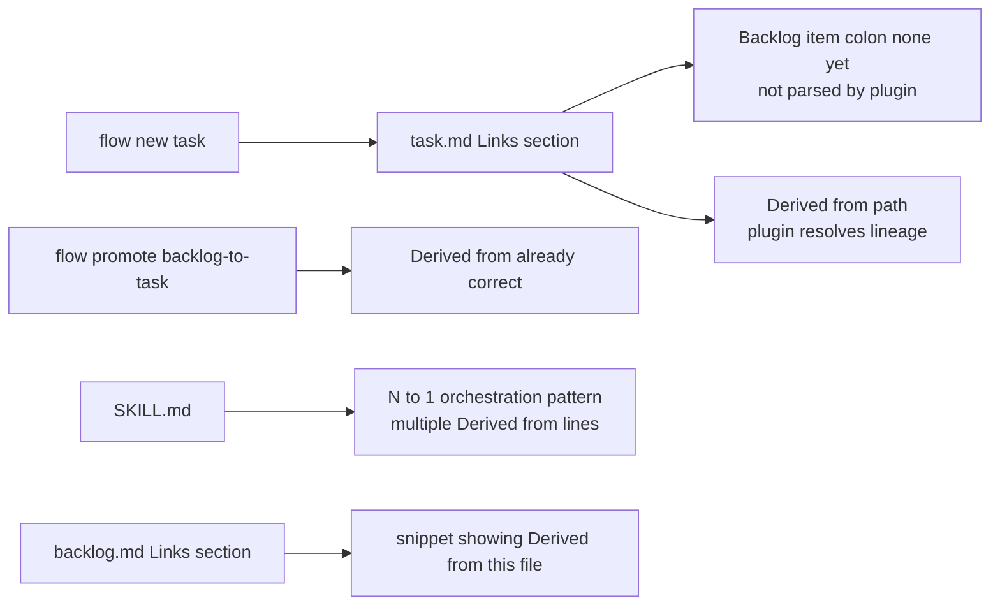

## req_177_fix_flow_manager_to_guide_derived_from_link_pattern_when_a_task_covers_a_backlog_item - fix flow manager to guide derived from link pattern when a task covers a backlog item
> From version: 1.25.4
> Schema version: 1.0
> Status: Done
> Understanding: 95%
> Confidence: 95%
> Complexity: Low
> Theme: Maintenance
> Reminder: Update status/understanding/confidence and linked backlog/task references when you edit this doc.

# Needs

When a task is created with `flow new task` (as opposed to `flow promote backlog-to-task`), the generated `# Links` section contains `- Backlog item: (none yet)`. The plugin does not recognise this label as a lineage link — it only resolves `Derived from \`...\`` patterns. The result: the backlog item does not show its delivery child task badge, and the chain request → backlog → task is invisible in the board.

`flow promote backlog-to-task` already does the right thing: it injects `- Derived from backlog item \`...\`` in `# Context`. But for orchestration tasks that cover multiple backlog items (N:1 pattern), there is no guidance and the template silently produces a broken link format.

Three surfaces need to be corrected:
1. **`task.md` template** — the `- Backlog item:` label in `# Links` must become `- Derived from`.
2. **`logics_flow_support_workflow_core.py`** — the placeholder comment for the backlog link in `flow new task` must hint at the correct `Derived from \`path\`` format.
3. **`SKILL.md`** — the N:1 orchestration pattern (one task covering multiple backlog items) must be documented with a concrete `Derived from` example.
4. **`backlog.md` template** — add a note in `# Links` showing the exact snippet to copy into the task that covers this item.

# Context

The `flow promote backlog-to-task` path (line 778 of `logics_flow_support_workflow_core.py`) correctly injects:
```
- Derived from backlog item `{source_ref}`.
```
into `# Context` of the generated task.

The `flow new task` path resolves `BACKLOG_LINK_PLACEHOLDER` via `_ref_placeholder(ref_text, REF_PREFIXES["backlog"])`, which produces `(none yet)`. The task template renders this as `- Backlog item: (none yet)` — a label the plugin index does not parse as a lineage link.

The plugin parses lineage from patterns matching `Derived from \`...\`` anywhere in the document. Changing the template label to `Derived from` and updating the placeholder hint is sufficient to fix the 1:1 case. For N:1, the operator must add multiple `Derived from` lines manually — SKILL.md must document this.



# Acceptance criteria

- AC1: `task.md` template `# Links` section uses `- Derived from \`{{BACKLOG_LINK_PLACEHOLDER}}\`` instead of `- Backlog item: {{BACKLOG_LINK_PLACEHOLDER}}`.
- AC2: The placeholder comment or default value for the backlog link in `flow new task` reads `(add: Derived from \`logics/backlog/item_XXX_...\`)` to guide the operator.
- AC3: `SKILL.md` documents the N:1 orchestration pattern: when one task covers multiple backlog items, add one `- Derived from \`...\`` line per item in `# Links`.
- AC4: `backlog.md` template `# Links` section includes a `<!-- task: Derived from \`this file\` -->` hint comment or an equivalent inline reminder so the operator knows what to add in the covering task.
- AC5: `flow promote backlog-to-task` is unaffected — it already generates the correct `Derived from` line.
- AC6: Existing tests in `logics/skills/tests/` pass after the template and script changes.

# Definition of Ready (DoR)

- [x] Problem statement is explicit and user impact is clear.
- [x] Scope boundaries (in/out) are explicit.
- [x] Acceptance criteria are testable.
- [x] Dependencies and known risks are listed.

# Known risks

- The submodule `logics/skills` is a separate git repo (`AlexAgo83/cdx-logics-kit`). Changes require a commit in the submodule and a pointer update in the parent repo.
- Changing `task.md` template changes the shape of all future `flow new task` outputs — verify no existing test asserts the old `Backlog item:` label.

# Companion docs
- Product brief(s): (none yet)
- Architecture decision(s): (none yet)

# AI Context
- Summary: Fix task.md template and flow new task generator to use Derived from instead of Backlog item, document the N:1 orchestration pattern in SKILL.md, and add a hint in backlog.md template.
- Keywords: derived-from, backlog-item, task-template, flow-new-task, SKILL.md, plugin-lineage, N-to-1-orchestration, logics-flow-manager
- Use when: Implementing or reviewing fixes to the flow manager template and generator for backlog-to-task lineage links.
- Skip when: Work targets unrelated flow manager features or other surfaces.

# Backlog
- `logics/backlog/item_323_fix_task_template_and_generator_to_use_derived_from_instead_of_backlog_item_label.md`
- `logics/backlog/item_324_document_n_to_1_orchestration_pattern_in_skill_md_and_add_derived_from_hint_in_backlog_template.md`
