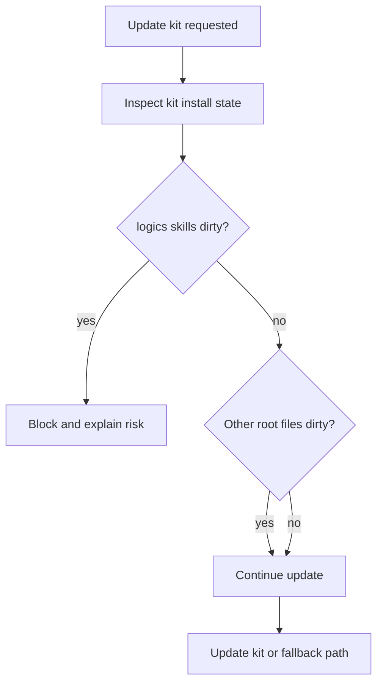

## req_178_allow_kit_update_when_unrelated_root_changes_are_uncommitted - Allow kit update when unrelated root changes are uncommitted
> From version: 1.26.1
> Schema version: 1.0
> Status: Draft
> Understanding: 95%
> Confidence: 90%
> Complexity: Medium
> Theme: Workflow
> Reminder: Update status/understanding/confidence and linked backlog/task references when you edit this doc.

# Needs
- The kit update action should not be blocked just because the repository root has unrelated uncommitted changes.
- The current safety check feels too broad if it treats the whole workspace as a single unit instead of focusing on the `logics/skills` install state that the update actually touches.
- Users should still be protected from updating when `logics/skills` itself is dirty or when the install type is incompatible with an automated update.
- The allowed path should be "root has unrelated changes, but `logics/skills` is clean".

# Context
The update path currently shells out to git before refreshing the kit. That is useful for protecting the submodule or standalone kit install, but it can become frustrating when a repo has unrelated local edits elsewhere in the root.

The desired behavior is narrower:
- block only when the kit install itself is unsafe to update;
- allow the update when changes live outside `logics/skills`;
- keep the existing fallback and copy/clone behavior for non-canonical installs.

# Acceptance criteria
- AC1: Kit update proceeds when the repository has uncommitted changes outside `logics/skills`.
- AC2: Kit update still blocks when `logics/skills` itself has uncommitted changes.
- AC3: The existing behavior for canonical submodule, standalone clone, and fallback installs remains intact.
- AC4: The user-facing message clearly distinguishes between a dirty kit install and unrelated root changes.
- AC5: The update path is covered by tests for both the allowed and blocked cases.

# Scope
- In:
  - Narrowing the update guard so it only blocks on kit-relevant dirty state.
  - Preserving the current submodule, standalone-clone, and fallback flows.
  - Adding or adjusting tests that prove unrelated root edits do not block the update.
- Out:
  - Changing how git records root changes.
  - Auto-committing or stashing user work.
  - Reworking the broader bootstrap flow.

# Risks and dependencies
- Git submodule semantics can be subtle, so the final implementation needs to preserve the existing safety guarantees for the kit itself.
- The fix should avoid creating a false sense of safety if root changes would still make a later commit or publish step noisy.
- The message and tests need to stay aligned with the actual command behavior, not just the desired UX.

# Definition of Ready (DoR)
- [x] Problem statement is explicit and user impact is clear.
- [x] Scope boundaries (in/out) are explicit.
- [x] Acceptance criteria are testable.
- [x] Dependencies and known risks are listed.

# Companion docs
- Product brief(s): (none yet)
- Architecture decision(s): (none yet)

# Backlog
- `logics/backlog/item_327_allow_kit_update_when_unrelated_root_changes_are_uncommitted.md`
