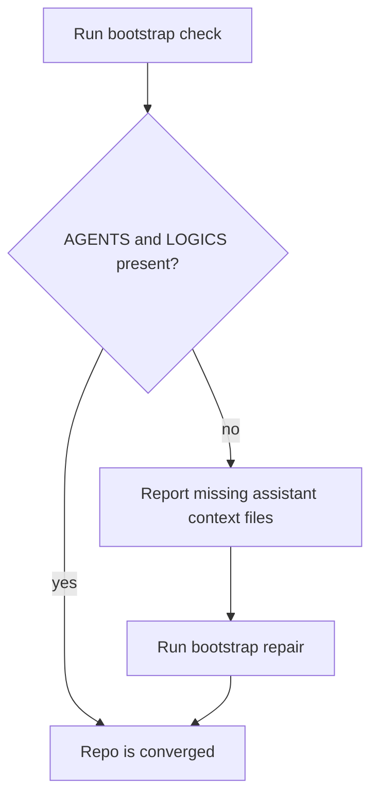

## req_179_extend_bootstrap_convergence_checks_to_cover_agents_and_logics_files - Extend bootstrap convergence checks to cover AGENTS and LOGICS files
> From version: 1.26.1
> Schema version: 1.0
> Status: Done
> Understanding: 95%
> Confidence: 90%
> Complexity: Medium
> Theme: Workflow
> Reminder: Update status/understanding/confidence and linked backlog/task references when you edit this doc.

# Needs
- Bootstrap currently creates or repairs `AGENTS.md` and `LOGICS.md`, but the broader convergence checks do not treat those files as required repo-local bootstrap artifacts.
- That means a repo can look healthy enough for bootstrap-convergence checks while still missing one of the files that teaches the assistant how to use the Logics kit.
- The check path should surface those missing files consistently so old repos can be repaired instead of silently drifting.
- `AGENTS.md` and `LOGICS.md` should be treated as required convergence files, not just bootstrap outputs.

# Context
The bootstrapper already knows how to create `AGENTS.md` and `LOGICS.md`. The gap is not file generation, but consistency in the detection and reporting path:
- `bootstrap --check` should flag missing assistant context files;
- `inspectLogicsBootstrapConvergence()` should include them in the missing-path list;
- the UI or CLI should explain that the repository is only partially converged until both files are present.

# Acceptance criteria
- AC1: `bootstrap --check` reports missing `AGENTS.md` and `LOGICS.md` when either file is absent.
- AC2: The bootstrap convergence inspection used by the plugin includes `AGENTS.md` and `LOGICS.md` in its missing-path output.
- AC3: The user-facing status or prompt makes it clear that the repo is only partially converged until those files exist.
- AC4: The new check remains idempotent and does not rewrite files that are already correct.
- AC5: Tests cover both the missing-file case and the already-converged case.

# Scope
- In:
  - Extending the convergence detection path to include `AGENTS.md` and `LOGICS.md`.
  - Aligning the bootstrap check output with the actual bootstrap repair behavior.
  - Adding tests for the missing and present cases.
- Out:
  - Changing the content template for `AGENTS.md` or `LOGICS.md`.
  - Expanding the scope to unrelated assistant files such as `RTK.md` or `CODE_REVIEW_GRAPH.md`.
  - Redesigning the bootstrap flow itself.

# Risks and dependencies
- The repo already has an existing request for creating and maintaining `AGENTS.md` and `LOGICS.md`, so this request should stay focused on detection and convergence, not re-litigate the file generation work.
- Convergence checks are used in multiple surfaces, so the implementation should keep the reporting consistent across CLI and plugin entry points.
- The check should remain additive and not cause noisy rewrites for repositories that already have the right files.

# Definition of Ready (DoR)
- [x] Problem statement is explicit and user impact is clear.
- [x] Scope boundaries (in/out) are explicit.
- [x] Acceptance criteria are testable.
- [x] Dependencies and known risks are listed.

# Companion docs
- Product brief(s): (none yet)
- Architecture decision(s): (none yet)

# Backlog
- `logics/backlog/item_328_extend_bootstrap_convergence_checks_to_cover_agents_and_logics_files.md`
