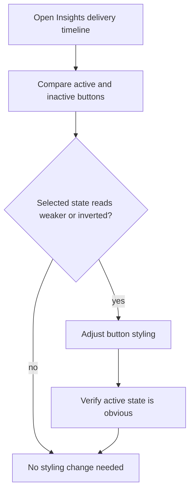

## req_180_fix_inverted_active_state_styling_for_delivery_timeline_period_buttons - Fix inverted active state styling for delivery timeline period buttons
> From version: 1.26.1
> Schema version: 1.0
> Status: Draft
> Understanding: 95%
> Confidence: 90%
> Complexity: Low
> Theme: UI
> Reminder: Update status/understanding/confidence and linked backlog/task references when you edit this doc.

# Needs
- The Day / Week filter buttons above the Delivery timeline in Logics Insights are functionally correct, but the active state reads visually inverted or weaker than the inactive state.
- The selected button should feel clearly pressed, highlighted, or current, while the unselected button should recede.
- The issue is visual only; the filter behavior and timeline data switching should stay unchanged.
- In Day mode, the timeline legend is too verbose for the available space, showing labels like `Mar 13` and `Apr 12`.
- The day-mode legend should use a compact but still readable format such as `Mar13` or `Apr12` so the chart remains scannable without truncation or crowding.

# Context
The Delivery timeline period selector was introduced in `req_175` and implemented in `item_320`. The buttons currently toggle the timeline correctly, but the styling makes the selected state feel backwards or confusing at a glance.

This is most likely a local styling/token problem in the Logics Insights webview, not a data or state-management bug. The fix should focus on the button states, spacing, contrast, and pressed/active affordance without changing the underlying period selector logic.
The same panel also needs a denser day-mode label treatment so the short bars do not compete with long date labels.

# Acceptance criteria
- AC1: The selected Day or Week button is visually stronger than the unselected button and reads as the active filter.
- AC2: The inactive button remains visually subdued enough that the selection is unambiguous at a glance.
- AC3: The fix does not change period-switch behavior, labels, or the underlying timeline data.
- AC4: The visual state remains correct on initial render and after toggling between Day and Week.
- AC5: In Day mode, the timeline uses a more compact month-day legend format than full labels like `Mar 13` or `Apr 12`, so the chart stays readable at typical panel widths.
- AC6: The compact legend format remains unambiguous enough that users can still tell which dates the bars represent.
- AC7: Tests or snapshots cover the active/inactive presentation and the compact day-mode legend so the styling does not regress silently.

# Definition of Ready (DoR)
- [x] Problem statement is explicit and user impact is clear.
- [x] Scope boundaries (in/out) are explicit.
- [x] Acceptance criteria are testable.
- [x] Dependencies and known risks are listed.

# Scope
- In:
  - Adjusting the Day / Week period button styling in the Delivery timeline view.
  - Making the selected state clearly dominant and the unselected state clearly subdued.
  - Tightening the Day-mode legend formatting so labels are more compact.
  - Adding or updating tests/snapshots for the visual states.
- Out:
  - Changing the period selector behavior or timeline data logic.
  - Redesigning the entire Logics Insights panel.
  - Reworking unrelated button styles elsewhere in the app.

# Risks and dependencies
- The selector already exists, so a style-only regression may be easy to miss without a snapshot or browser-based visual check.
- If the current styling relies on shared button tokens, the fix should stay scoped so it does not unintentionally restyle other action buttons.
- The selected state should remain accessible, not just prettier, so contrast and focus affordance matter.
- Any compact legend scheme should stay legible and consistent across day buckets, not just look shorter.

# Companion docs
- Product brief(s): (none yet)
- Architecture decision(s): (none yet)

# Backlog
- `logics/backlog/item_320_add_day_and_week_period_selector_to_delivery_timeline_in_logics_insights.md`

# AC Traceability
- AC1 -> `logics/backlog/item_320_add_day_and_week_period_selector_to_delivery_timeline_in_logics_insights.md`. Proof: the selected Day or Week button reads as the active filter.
- AC2 -> `logics/backlog/item_320_add_day_and_week_period_selector_to_delivery_timeline_in_logics_insights.md`. Proof: the inactive button stays visibly subdued.
- AC3 -> `logics/backlog/item_320_add_day_and_week_period_selector_to_delivery_timeline_in_logics_insights.md`. Proof: styling changes do not alter selector behavior or timeline data.
- AC4 -> `logics/backlog/item_320_add_day_and_week_period_selector_to_delivery_timeline_in_logics_insights.md`. Proof: the active state remains stable on initial render and after toggles.
- AC5 -> `logics/backlog/item_320_add_day_and_week_period_selector_to_delivery_timeline_in_logics_insights.md`. Proof: the compact legend keeps the day view readable.
- AC6 -> `logics/backlog/item_320_add_day_and_week_period_selector_to_delivery_timeline_in_logics_insights.md`. Proof: the labels remain interpretable at a glance.
- AC7 -> `logics/backlog/item_320_add_day_and_week_period_selector_to_delivery_timeline_in_logics_insights.md`. Proof: snapshot and interaction tests can cover both button states and the compact day legend.

# AI Context
- Summary: Fix the visual active/inactive state styling for the Delivery timeline period buttons in Logics Insights and compact the Day-mode legend.
- Keywords: timeline, delivery, period selector, Day, Week, active state, selected button, inactive button, styling, UI, legend, compact labels
- Use when: Use when reviewing or implementing the Delivery timeline period buttons and the Day-mode legend reads too verbose or the selected state reads backwards.
- Skip when: Skip when the problem is about the timeline data itself, the selector behavior, or unrelated button styles.
