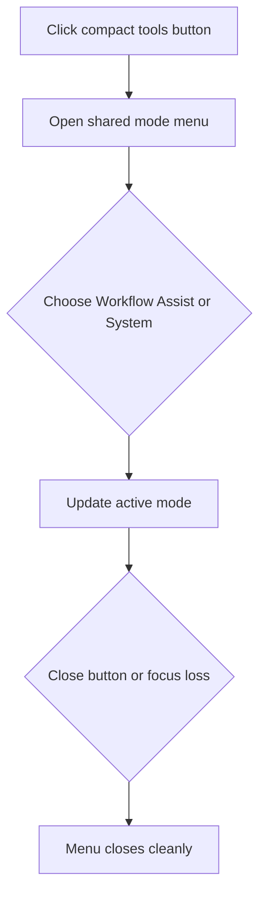

## req_181_consolidate_the_tools_menu_into_a_single_mode_switcher_with_explicit_close_behavior - Consolidate the tools menu into a single mode switcher with explicit close behavior
> From version: 1.26.1
> Schema version: 1.0
> Status: Draft
> Understanding: 95%
> Confidence: 90%
> Complexity: Medium
> Theme: UI
> Reminder: Update status/understanding/confidence and linked backlog/task references when you edit this doc.

# Needs
- The current tools area would be easier to scan if `Workflow`, `Assist`, and `System` were presented as one entry point instead of three separate top-level buttons.
- A single compact action button should open a shared menu that lets the user switch between those three modes inside the same surface.
- The menu needs reliable dismissal behavior, via `Escape`, focus loss, and a compact close control, so it never feels stuck open.
- The interaction should preserve the current action set and only change how the menu is entered, switched, and dismissed.
- The compact entry button should expose the current mode in its label so the user can tell what context they are in before opening the menu.

# Context
The broader tools menu already has a grouping and recommended-actions model in `req_112` and state-aware promotion behavior in `req_123`. This request is narrower: it focuses on the top-level entry point and the open-state lifecycle for the mode menu itself.

The desired pattern is:
- one compact button opens the menu;
- the menu shows the three modes;
- the active mode is visible and can be switched without leaving the surface;
- the menu can be dismissed cleanly, either with a small close button or automatically when focus leaves the menu;
- the selected mode should remain obvious after reopening.

This is a UI and interaction design request, not a command-model change. The underlying workflow, assist, and system actions should remain the same.

# Acceptance criteria
- AC1: A single compact entry button opens the mode menu for `Workflow`, `Assist`, and `System`.
- AC2: The three modes are selectable within one shared menu surface, without requiring separate top-level buttons.
- AC3: The currently active mode is clearly indicated when the menu is open and after it is reopened.
- AC4: The compact entry button shows the current mode in its label or adjacent text.
- AC5: The menu can be dismissed reliably by `Escape`, by focus loss, and by an explicit close control, and it does not remain stuck open.
- AC6: The dismissal behavior preserves keyboard accessibility and does not trap focus.
- AC7: The change does not alter the underlying actions available in each mode, only how the modes are accessed and dismissed.

# Definition of Ready (DoR)
- [x] Problem statement is explicit and user impact is clear.
- [x] Scope boundaries (in/out) are explicit.
- [x] Acceptance criteria are testable.
- [x] Dependencies and known risks are listed.

# Scope
- In:
  - Replacing the three top-level mode buttons with one compact entry button.
  - Rendering the three modes inside one shared menu surface.
  - Adding explicit close behavior or focus-loss dismissal so the menu always closes.
  - Keeping the active mode visible and easy to switch.
- Out:
  - Changing the actual workflow, assist, or system commands.
  - Redesigning unrelated panels or menus.
  - Moving the mode actions out of the tools surface entirely.

# Risks and dependencies
- The request overlaps with existing tools-menu IA work, so implementation should preserve the grouped menu model rather than reintroduce a flat action strip.
- Focus-loss dismissal can be brittle if the menu contains nested interactive controls, so the closing rule should be tested explicitly.
- If a compact close button is chosen, it should be small but not hidden, otherwise the menu can still feel stuck.

# Companion docs
- Product brief(s): (none yet)
- Architecture decision(s): (none yet)

# Backlog
- `logics/backlog/item_199_restructure_the_tools_menu_information_architecture_without_moving_actions_out_of_the_menu.md`
- `logics/backlog/item_219_make_check_environment_explainable_action_first_and_state_promoted_in_tools.md`

# AC Traceability
- AC1 -> `logics/backlog/item_199_restructure_the_tools_menu_information_architecture_without_moving_actions_out_of_the_menu.md`. Proof: the compact entry button opens the shared mode menu.
- AC2 -> `logics/backlog/item_199_restructure_the_tools_menu_information_architecture_without_moving_actions_out_of_the_menu.md`. Proof: Workflow, Assist, and System remain in one shared surface.
- AC3 -> `logics/backlog/item_199_restructure_the_tools_menu_information_architecture_without_moving_actions_out_of_the_menu.md`. Proof: the active mode remains visible through menu reopenings.
- AC4 -> `logics/backlog/item_199_restructure_the_tools_menu_information_architecture_without_moving_actions_out_of_the_menu.md`. Proof: the entry button shows the current mode in its label.
- AC5 -> `logics/backlog/item_199_restructure_the_tools_menu_information_architecture_without_moving_actions_out_of_the_menu.md`. Proof: dismissal via Escape, focus loss, and compact close control is part of the menu interaction.
- AC6 -> `logics/backlog/item_199_restructure_the_tools_menu_information_architecture_without_moving_actions_out_of_the_menu.md`. Proof: keyboard accessibility and non-trapping focus stay intact.
- AC7 -> `logics/backlog/item_199_restructure_the_tools_menu_information_architecture_without_moving_actions_out_of_the_menu.md`. Proof: only menu access and dismissal change, not the underlying commands.

# AI Context
- Summary: Consolidate the tools menu into one compact entry point for Workflow, Assist, and System, with explicit close behavior.
- Keywords: tools menu, mode switcher, workflow, assist, system, compact entry, close button, blur, dismissal, UI
- Use when: Use when planning or implementing the consolidated tools menu entry point and its dismissal behavior.
- Skip when: Skip when the work is about the underlying commands rather than the menu interaction itself.
