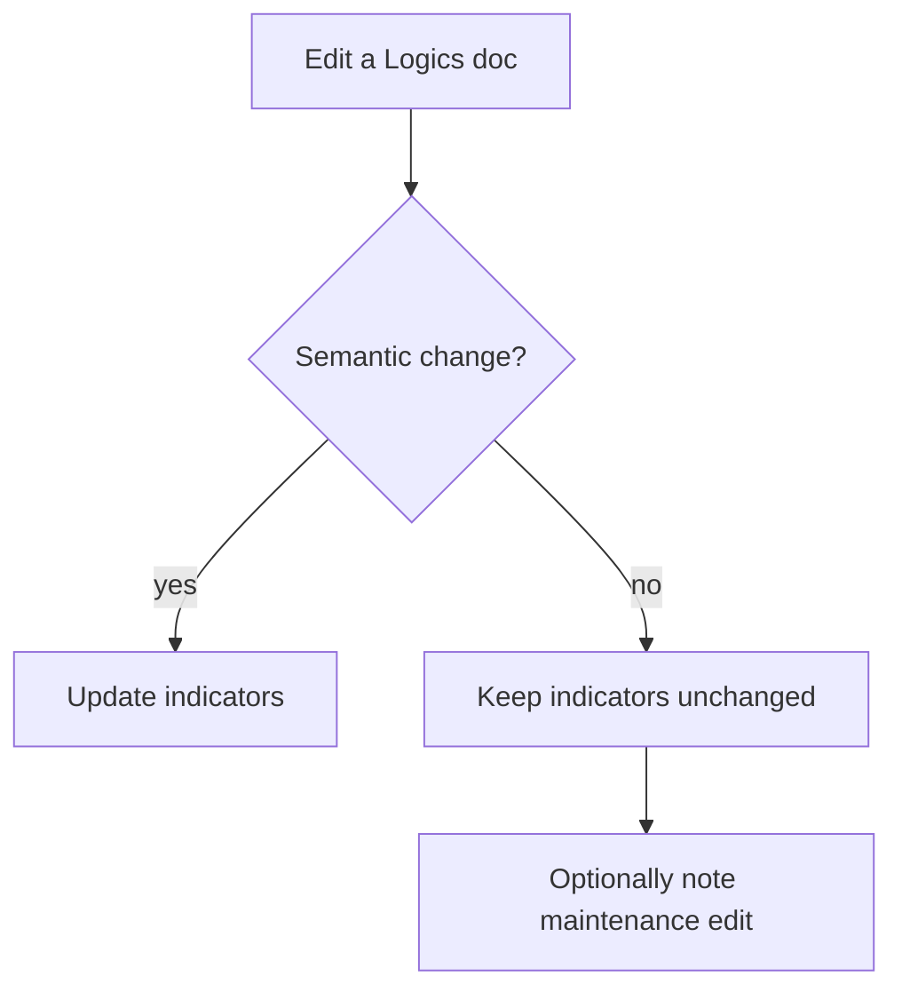

## req_182_allow_logics_indicators_to_stay_unchanged_for_non_semantic_document_edits - Allow Logics indicators to stay unchanged for non-semantic document edits
> From version: 1.26.1
> Schema version: 1.0
> Status: Draft
> Understanding: 95%
> Confidence: 90%
> Complexity: Medium
> Theme: Workflow
> Reminder: Update status/understanding/confidence and linked backlog/task references when you edit this doc.

# Needs
- Logics docs currently feel like they require indicator edits any time the file changes, even when the edit is purely mechanical.
- The workflow should distinguish between semantic edits, where the meaning or decision changes, and non-semantic edits, where the doc is only being maintained.
- Indicator updates should be required for semantic changes, but allowed to stay unchanged for maintenance edits like typo fixes, link updates, formatting, Mermaid signature refreshes, and other editorial changes.

# Context
The Logics kit uses indicators like `From version`, `Understanding`, and `Confidence` as signals about how well a request, backlog item, or task is understood. That signal becomes less trustworthy if every mechanical edit forces a change.

The goal here is not to weaken the indicators. It is to make them more honest by reserving updates for real semantic drift.

# Acceptance criteria
- AC1: The workflow allows maintenance edits to leave `From version`, `Understanding`, and `Confidence` unchanged when the doc meaning does not change, while still requiring review for semantic edits.

# Definition of Ready (DoR)
- [x] Problem statement is explicit and user impact is clear.
- [x] Scope boundaries (in/out) are explicit.
- [x] Acceptance criteria are testable.
- [x] Dependencies and known risks are listed.

# Scope
- In:
  - Defining when Logics indicators must change and when they can remain stable.
  - Updating workflow guidance so maintenance edits are treated differently from semantic edits.
  - Adding validation or documentation support for the distinction.
- Out:
  - Removing indicators entirely.
  - Allowing semantic changes to bypass indicator review.
  - Changing the structure of request/backlog/task docs beyond what is needed to clarify the edit category.

# Risks and dependencies
- The rule needs to be specific enough that it does not become a loophole for skipping indicator updates on real scope changes.
- The distinction should be easy to apply consistently during regular doc maintenance and code review.
- If implemented only as prose, the rule may be forgotten; if implemented as a lint guard, it needs to avoid false positives on harmless edits.

# Companion docs
- Product brief(s): (none yet)
- Architecture decision(s): (none yet)

# Backlog
- `logics/backlog/item_325_allow_logics_indicators_to_stay_stable_for_non_semantic_document_edits.md`

# AC Traceability
- AC1 -> `logics/backlog/item_325_allow_logics_indicators_to_stay_stable_for_non_semantic_document_edits.md` and `logics/tasks/task_136_allow_logics_indicators_to_stay_stable_for_non_semantic_document_edits.md`. Proof: the linked backlog slice and task define the maintenance-edit rule and preserve indicator review for semantic changes.

# AI Context
- Summary: Allow Logics indicators to remain unchanged for non-semantic edits, while preserving indicator updates for meaningful scope or understanding changes.
- Keywords: indicators, semantic edit, maintenance edit, workflow, understanding, confidence, from version, documentation hygiene
- Use when: Use when defining or reviewing how Logics docs should handle indicator updates during maintenance versus meaningful content changes.
- Skip when: Skip when the change is about unrelated content, UI, or runtime behavior rather than doc maintenance policy.
