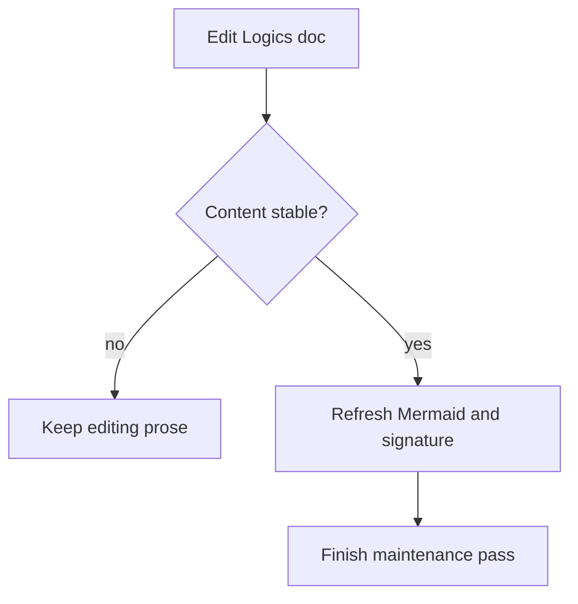

## req_183_make_mermaid_refresh_the_last_step_in_logics_doc_maintenance - Make Mermaid refresh the last step in Logics doc maintenance
> From version: 1.26.1
> Schema version: 1.0
> Status: Done
> Understanding: 95%
> Confidence: 90%
> Complexity: Medium
> Theme: Workflow
> Reminder: Update status/understanding/confidence and linked backlog/task references when you edit this doc.

# Needs
- Logics doc maintenance can bounce between prose edits and Mermaid signature refreshes, which creates avoidable ping-pong.
- The workflow should make Mermaid a final stabilization step after the document content is settled.
- The kit should teach that sequence explicitly so the same rule propagates to future docs and future repositories.
- The rule should reduce stale signatures without encouraging repeated Mermaid rewrites during normal editing.

# Context
The Logics kit already has contextual Mermaid generation and stale-signature refresh support. The missing piece is a clear maintenance rule that says when to touch Mermaid and when not to.

This request is about workflow discipline, not diagram aesthetics:
- stabilize the request, backlog, or task text first;
- then refresh the Mermaid block and signature;
- then avoid touching prose unless the diagram must be refreshed again.

The rule should live in the shared kit instructions so it propagates to repos that bootstrap or update the kit, while still being readable in repo-local docs.

# Acceptance criteria
- AC1: The kit instructions explicitly say to stabilize document content before refreshing Mermaid.
- AC2: The workflow says Mermaid refresh is a late-step maintenance action, not something to chase after every prose edit.
- AC3: The rule is propagated through shared kit instructions so future repos inherit the same guidance.
- AC4: Repo-local docs can reference the same rule without contradicting the shared kit guidance.
- AC5: The guidance is concrete enough that maintenance edits can be made without unnecessary Mermaid ping-pong.
- AC6: Any supporting lint or audit behavior still detects genuinely stale or contradictory Mermaid, while allowing normal maintenance edits to finish without extra churn.

# Definition of Ready (DoR)
- [x] Problem statement is explicit and user impact is clear.
- [x] Scope boundaries (in/out) are explicit.
- [x] Acceptance criteria are testable.
- [x] Dependencies and known risks are listed.

# Scope
- In:
  - Adding a shared instruction that Mermaid refresh happens after content stabilization.
  - Propagating the workflow rule through the kit so new repos inherit it.
  - Keeping lint and audit focused on genuine Mermaid drift, not normal editing cadence.
- Out:
  - Replacing Mermaid with another diagram system.
  - Forcing every minor edit to trigger a Mermaid rewrite.
  - Changing the actual request/backlog/task generation semantics beyond the refresh order.

# Risks and dependencies
- The rule must be short enough to remember and broad enough to apply across doc types.
- If the guidance is only in prose, it may not be followed consistently; if it is too strict, it could make normal maintenance feel brittle again.
- The kit already has Mermaid generation and signature refresh primitives, so the main dependency is packaging the workflow rule in the right shared instructions.

# Companion docs
- Product brief(s): (none yet)
- Architecture decision(s): (none yet)

# Backlog
- `logics/backlog/item_073_generate_context_aware_mermaid_diagrams_and_keep_them_updated_in_logics_docs.md`
- `logics/backlog/item_091_auto_refresh_stale_mermaid_signatures_in_logics_workflow_docs.md`

# AC Traceability
- AC1 -> `logics/backlog/item_091_auto_refresh_stale_mermaid_signatures_in_logics_workflow_docs.md`. Proof: the shared instructions will say to stabilize content before refresh.
- AC2 -> `logics/backlog/item_091_auto_refresh_stale_mermaid_signatures_in_logics_workflow_docs.md`. Proof: Mermaid refresh becomes a late maintenance step instead of an eager edit loop.
- AC3 -> `logics/backlog/item_091_auto_refresh_stale_mermaid_signatures_in_logics_workflow_docs.md`. Proof: the workflow rule is propagated through the shared kit.
- AC4 -> `logics/backlog/item_091_auto_refresh_stale_mermaid_signatures_in_logics_workflow_docs.md`. Proof: repo-local docs can reference the same shared rule.
- AC5 -> `logics/backlog/item_091_auto_refresh_stale_mermaid_signatures_in_logics_workflow_docs.md`. Proof: maintenance edits no longer force Mermaid ping-pong.
- AC6 -> `logics/backlog/item_073_generate_context_aware_mermaid_diagrams_and_keep_them_updated_in_logics_docs.md`. Proof: lint and audit still detect stale or contradictory Mermaid, while normal maintenance stays allowed.

# AI Context
- Summary: Make Mermaid refresh a final step in Logics doc maintenance so content stabilizes first and stale signatures are handled cleanly.
- Keywords: mermaid, refresh, workflow, maintenance, signatures, stale, content stable, kit instructions, propagation
- Use when: Use when defining the maintenance rule that tells the kit and repo-local docs to refresh Mermaid only after prose is settled.
- Skip when: Skip when the work is about diagram content changes, unrelated UI, or non-Logics documentation.
