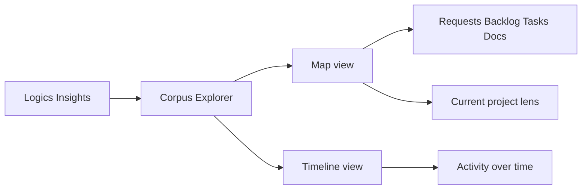

## req_184_add_a_corpus_explorer_with_map_and_timeline_views_to_logics_insights - Add a corpus explorer with map and timeline views to Logics Insights
> From version: 1.26.1
> Schema version: 1.0
> Status: Done
> Understanding: 95%
> Confidence: 90%
> Complexity: Medium
> Theme: UI
> Reminder: Update status/understanding/confidence and linked backlog/task references when you edit this doc.

# Needs
- Logics Insights already shows stats and timelines, but it still lacks a visual way to understand the corpus as a connected system.
- A corpus explorer should help operators see how the current project is shaped across requests, backlog items, tasks, and companion docs.
- The best fit is likely a single Insights surface with two complementary views: a relationship map and a delivery timeline.
- This should feel like a corpus lens, not a generic dashboard.

# Context
The repository already has related work in `req_134` and `item_257` for generated corpus index and relationship views, plus timeline and velocity work in `req_159`, `req_175`, `req_176`, `item_288`, and `item_289`.

This request asks for a more visual, operator-friendly entry point inside Logics Insights:
- **Map view**: show the current project corpus as a node graph, with requests, backlog items, tasks, and companion docs linked by relationships.
- **Timeline view**: show the same corpus over time, so the user can see when work started, when it moved, and where the active clusters are.
- **Current project lens**: default to the active repository corpus, so the user immediately sees their own project rather than a generic example.

The goal is a view that helps answer:
- what is connected to what?
- what is active now?
- where did the corpus grow in time?
- which slice deserves attention next?

# Acceptance criteria
- AC1: Logics Insights includes a corpus explorer entry point that is clearly tied to the current repository corpus.
- AC2: The explorer offers a map view that shows relationships between requests, backlog items, tasks, and companion docs.
- AC3: The explorer offers a timeline view that shows corpus activity or evolution over time.
- AC4: The map and timeline views are complementary and can be switched without losing the selected project context.
- AC5: The default view is usable for the current project without requiring extra setup or navigation.
- AC6: The UI remains readable in a compact panel, with no fake data or decorative filler.
- AC7: Tests or snapshots cover the explorer entry point and at least one representative map/timeline rendering state.

# Definition of Ready (DoR)
- [x] Problem statement is explicit and user impact is clear.
- [x] Scope boundaries (in/out) are explicit.
- [x] Acceptance criteria are testable.
- [x] Dependencies and known risks are listed.

# Scope
- In:
  - Adding a corpus explorer surface inside Logics Insights.
  - Supporting map and timeline views as two lenses on the same corpus.
  - Reusing the current repository as the default project lens.
  - Adding focused tests for the new explorer states.
- Out:
  - Replacing the existing corpus index or relationship view work.
  - Building a full graph editor or arbitrary node manipulation.
  - Turning Insights into a generic analytics dashboard with unrelated charts.

# Risks and dependencies
- The graph view can get dense quickly, so it needs strong filtering or staged expansion to stay readable.
- Timeline labels can become crowded if too much detail is shown at once, so the view should stay compact and scannable.
- This request should likely reuse the generated index and relationship primitives already present in the corpus/navigation work rather than inventing a parallel data model.

# Companion docs
- Product brief(s): `prod_008_add_a_corpus_explorer_with_map_and_timeline_views_to_logics_insights`
- Architecture decision(s): (none yet)
# Backlog
- `logics/backlog/item_331_add_a_corpus_explorer_with_map_and_timeline_views_to_logics_insights.md`
# AC Traceability
- AC1 -> `logics/backlog/item_331_add_a_corpus_explorer_with_map_and_timeline_views_to_logics_insights.md`. Proof: the explorer entry point is tied to the current repository corpus.
- AC2 -> `logics/backlog/item_331_add_a_corpus_explorer_with_map_and_timeline_views_to_logics_insights.md`. Proof: the map view shows corpus relationships across requests, backlog items, tasks, and companion docs.
- AC3 -> `logics/backlog/item_331_add_a_corpus_explorer_with_map_and_timeline_views_to_logics_insights.md`. Proof: the timeline view shows corpus activity over time.
- AC4 -> `logics/backlog/item_331_add_a_corpus_explorer_with_map_and_timeline_views_to_logics_insights.md`. Proof: map and timeline are complementary and keep the same project context.
- AC5 -> `logics/backlog/item_331_add_a_corpus_explorer_with_map_and_timeline_views_to_logics_insights.md`. Proof: the default view uses the current repository corpus without extra setup.
- AC6 -> `logics/backlog/item_331_add_a_corpus_explorer_with_map_and_timeline_views_to_logics_insights.md`. Proof: the corpus explorer surface stays readable in the compact Insights panel and avoids fake data or decorative filler.
- AC7 -> `logics/backlog/item_331_add_a_corpus_explorer_with_map_and_timeline_views_to_logics_insights.md`. Proof: tests or snapshots cover the explorer entry point and representative map/timeline states so the visual surface does not regress silently.

# AI Context
- Summary: Add a corpus explorer inside Logics Insights with map and timeline views for the current project corpus.
- Keywords: corpus explorer, map view, timeline view, insights, relationships, project lens, current project, navigation
- Use when: Use when planning a new Insights surface that visualizes the corpus as a connected map and as a temporal path.
- Skip when: Skip when the change is only about the existing counts, velocity cards, or unrelated navigation surfaces.
