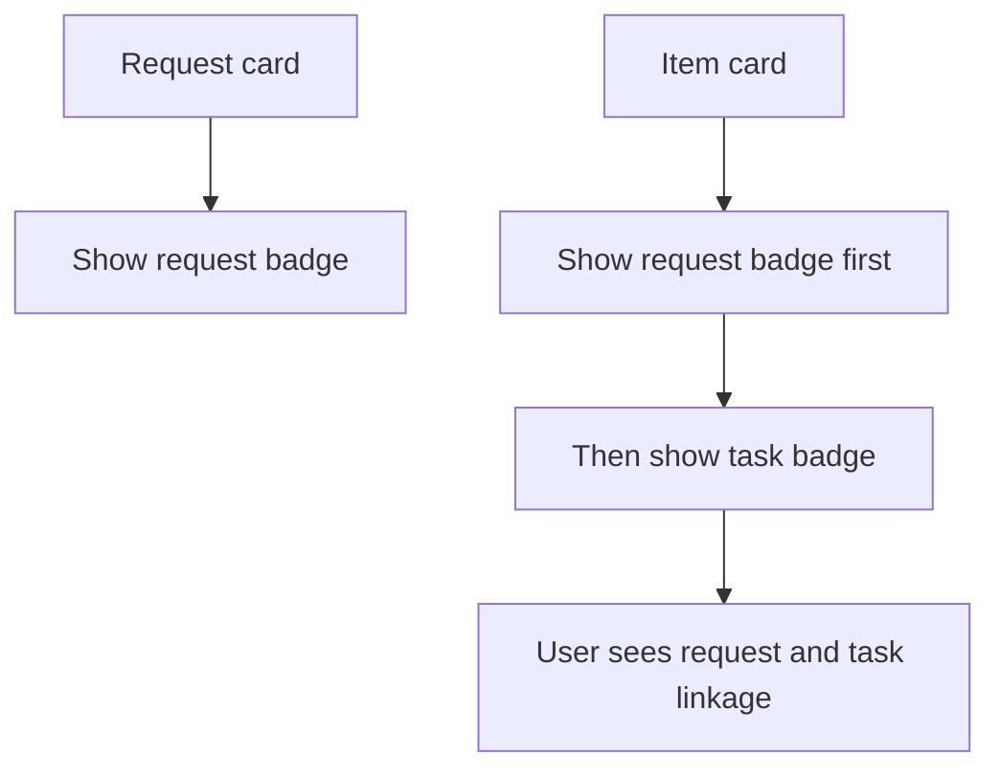

## req_185_add_request_color_badges_to_items_and_requests_to_visualize_request_task_linkage - Add request color badges to items and requests to visualize request-task linkage
> From version: 1.26.1
> Schema version: 1.0
> Status: Draft
> Understanding: 95%
> Confidence: 90%
> Complexity: Medium
> Theme: UI
> Reminder: Update status/understanding/confidence and linked backlog/task references when you edit this doc.

# Needs
- The plugin already uses a compact color badge to show task coverage on task cards and covered item cards.
- The current task badge colors are not separated enough from one another, so distinct tasks can look too similar at a glance.
- The request badge layer should inherit the same stronger visual separation, with request colors amplified as well so request and task families stay easy to tell apart.
- We now need the same idea for request-to-item linkage so an item can show both the request it came from and the task that currently covers it.
- Request cards should also carry their own compact color badge so the provenance is visible from both sides.
- The request badge should use a distinct and visibly stronger color family from the task badge if possible, so the two signals remain readable at a glance.
- The implementation should prefer resolved references, and fall back safely when the request linkage is not available instead of guessing.
- Badge colors should be deterministic from the request identity so the same request stays visually consistent across renders.

# Context
The existing task badge work proves the card surface can support compact relationship markers without crowding the UI.

This request extends that pattern:
- request cards display a request badge;
- item cards display the request badge first, then the existing task badge;
- if an item is linked to both a request and a task, the two badges appear together as a compact stack or row;
- the task badge palette should be amplified enough that separate active tasks are easier to distinguish from one another;
- request badges should follow the same stronger color-separation rule, while still staying visually different from task badges;
- if the request reference cannot be resolved cleanly, the UI should fail soft and show no request badge rather than showing the wrong lineage.

The request-task linkage should be driven from the same managed document relationships already used by the corpus indexer and workflow references. The goal is immediate visual disambiguation, not a second source of truth.

# Acceptance criteria
- AC1: Request cards display a compact request badge using a color family that is visibly distinct from task badges and strong enough to keep separate requests readable at a glance.
- AC2: Item cards that are linked to both a request and a task display both badges, with the request badge before the task badge.
- AC3: The request badge is derived from a real resolved reference, not a guessed or duplicated lineage.
- AC4: If the request reference cannot be resolved cleanly, the UI fails soft and omits the request badge rather than rendering incorrect linkage.
- AC5: Existing task badge behavior remains intact, with a palette strong enough to keep different active tasks visually separable while staying subordinate only by ordering, not by loss of clarity.
- AC6: Tests cover both the request-card rendering and the item-card dual-badge rendering, including the fallback path and the stronger palette differentiation.

# Definition of Ready (DoR)
- [x] Problem statement is explicit and user impact is clear.
- [x] Scope boundaries (in/out) are explicit.
- [x] Acceptance criteria are testable.
- [x] Dependencies and known risks are listed.

# Scope
- In:
  - Rendering a request badge on request cards.
  - Rendering a request badge before the task badge on item cards that are linked to both.
  - Reusing managed document relationships as the source of truth.
  - Adding fallback-safe behavior when request linkage cannot be resolved.
- Out:
  - Changing the underlying request/task relationship model.
  - Adding arbitrary user-configurable badge colors.
  - Showing badges in unrelated views that do not already render item cards.

# Risks and dependencies
- The request linkage has to be resolvable reliably from existing document refs; otherwise the badge can easily become misleading.
- Badge ordering matters because the new request signal must not visually drown out the established task signal.
- Distinct colors should be chosen carefully so request and task badges are distinguishable even in compact sizes and dark themes, and so separate tasks do not collapse into visually similar colors.
- The fallback path needs to be explicit in code and tests, because this feature is about correctness of lineage as much as it is about UI.

# Companion docs
- Product brief(s): (none yet)
- Architecture decision(s): (none yet)

# Backlog
- `logics/backlog/item_329_add_request_color_badges_to_items_and_requests_to_visualize_request_task_linkage.md`
# AC Traceability
- AC1 -> `logics/backlog/item_329_add_request_color_badges_to_items_and_requests_to_visualize_request_task_linkage.md`. Proof: the request-card badge uses a compact deterministic color family distinct from task coverage and keeps request colors visually separated.
- AC2 -> `logics/backlog/item_329_add_request_color_badges_to_items_and_requests_to_visualize_request_task_linkage.md`. Proof: item cards show request badge first and task badge second when both exist.
- AC3 -> `logics/backlog/item_329_add_request_color_badges_to_items_and_requests_to_visualize_request_task_linkage.md`. Proof: the badge derives from resolved managed relationships, not guessed lineage.
- AC4 -> `logics/backlog/item_329_add_request_color_badges_to_items_and_requests_to_visualize_request_task_linkage.md`. Proof: the fallback path omits the request badge instead of rendering incorrect lineage.
- AC5 -> `logics/backlog/item_329_add_request_color_badges_to_items_and_requests_to_visualize_request_task_linkage.md`. Proof: the established task badge remains intact and visually clear, with colors strong enough to distinguish different active tasks.
- AC6 -> `logics/backlog/item_329_add_request_color_badges_to_items_and_requests_to_visualize_request_task_linkage.md`. Proof: the badge rendering tests cover request and item cases plus fallback behavior and palette differentiation.

# AI Context
- Summary: Add request badges to request cards and item cards so the request lineage appears beside the existing task badge, with safe fallback when references cannot be resolved.
- Keywords: request badge, task badge, lineage, usedBy, request-task linkage, compact color badge, fallback, item card, request card
- Use when: Use when planning or implementing the request-to-item badge layer that sits alongside the existing task badge.
- Skip when: Skip when the change is only about task coverage, unrelated UI, or non-card-based reference surfaces.
