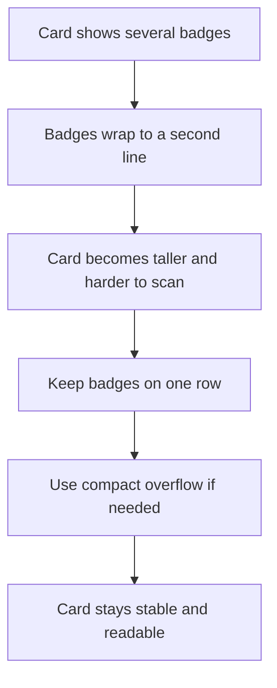

## req_186_keep_card_badges_on_a_single_row - Keep card badges on a single row
> From version: 1.27.0
> Schema version: 1.0
> Status: Done
> Understanding: 94%
> Confidence: 88%
> Complexity: Medium
> Theme: UI
> Reminder: Update status/understanding/confidence and linked backlog/task references when you edit this doc.

# Needs
- The card surfaces currently show several compact badges at once, including `PROD`, `ADR`, `DELIVERY`, request/task lineage, and percentage or state chips.
- Those badges sometimes wrap onto a second line, which makes cards taller and harder to scan vertically.
- We want the badge area to stay on a single horizontal row whenever possible so the card height remains stable and the signal is easier to read at a glance.
- The change should preserve the existing badge meaning and ordering, not replace or rename the badges.
- If the row cannot fit, prefer a compact overflow strategy over vertical wrapping so the card does not become noisy.
- The solution should apply consistently across the card variants that already render these badges.

# Context
The current UI already uses small badges as quick metadata signals, but their layout can become unstable when several badges are present together.

This request focuses on layout only:
- keep the badge strip on one row;
- keep badge spacing tight and predictable;
- avoid a second badge line that increases card height;
- preserve current badge order and semantics;
- use a compact overflow treatment if the available width is too small.

The goal is scanability: users should be able to read the card metadata without the row breaking into two lines or making the cell feel crowded.

# Acceptance criteria
- AC1: Cards that already show multiple badges keep those badges on a single horizontal row by default.
- AC2: The badge row does not wrap into a second line under normal card widths.
- AC3: If the available space is too small, the layout uses a compact overflow or truncation strategy instead of breaking the row.
- AC4: The existing badge order and meanings remain unchanged.
- AC5: The layout change applies consistently to the affected card variants without altering their underlying data or badge logic.

# Definition of Ready (DoR)
- [x] Problem statement is explicit and user impact is clear.
- [x] Scope boundaries (in/out) are explicit.
- [x] Acceptance criteria are testable.
- [x] Dependencies and known risks are listed.

# Scope
- In:
  - Keep badge clusters on one row on cards that already render multiple badges.
  - Prevent the badge row from increasing card height through wrapping.
  - Use a compact fallback when the row cannot fit.
- Out:
  - Changing badge semantics or badge colors.
  - Adding new badge types.
  - Reworking the card layout outside the badge strip.

# Risks and dependencies
- The row has to stay readable on narrow cards, so the fallback cannot hide important state without some compact indicator.
- Different card variants may have different badge counts, so the layout needs to be resilient without assuming a fixed number of badges.
- The implementation should not interfere with the existing request/task lineage badges or with the `PROD`, `ADR`, and `DELIVERY` chips.

# Companion docs
- Product brief(s): (none yet)
- Architecture decision(s): (none yet)

# AI Context
- Summary: Keep multiple card badges on one row so the cards stay compact and readable.
- Keywords: badge row, card density, nowrap, compact overflow, PROD, ADR, DELIVERY, request badge, task badge
- Use when: Use when planning or implementing the badge strip layout on cards that show several metadata chips at once.
- Skip when: Skip when the work is about badge color, badge meaning, or a different card surface.
# Backlog
- `item_332_keep_card_badges_on_a_single_row`
- `item_333_implement_badge_row_layout_for_compact_card_display`
- `item_334_handle_badge_overflow_and_wrapping_on_cards`
- `item_335_define_badge_strip_styling_and_behavior_guidelines`
