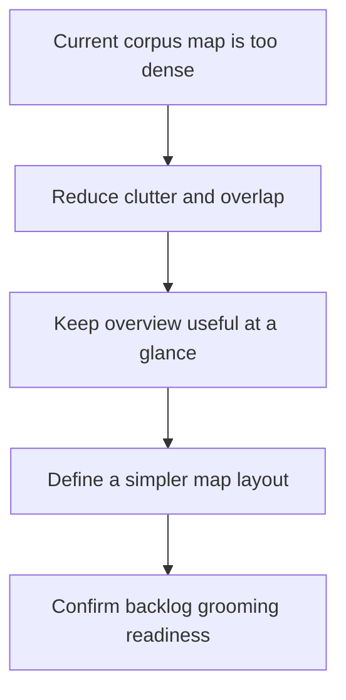

## req_187_improve_corpus_map_readability - Improve corpus map readability
> From version: 1.27.0
> Schema version: 1.0
> Status: Done
> Understanding: 90%
> Confidence: 85%
> Complexity: Medium
> Theme: General
> Reminder: Update status/understanding/confidence and linked backlog/task references when you edit this doc.

# Needs
- Make the corpus relationship map readable at a glance in Logics Insights.
- Reduce visual clutter from overlapping labels, dense edges, and repeated counts.
- Keep the overview useful without forcing the user to parse the full graph.

# Context
- The current corpus map is too dense for quick scanning.
- Node labels overlap near the center, edge labels add noise, and the right panel already carries detailed counts.
- The map should act as an overview, not duplicate every detail already shown in the side panel.
- A simpler hierarchy, fewer default labels, and details-on-demand are all acceptable directions.
- This should improve the current project lens first, without changing the underlying corpus data model.

# Acceptance criteria
- AC1: The request clearly states that the map must be readable at a glance.
- AC2: The request explains that the map should stay an overview and not duplicate all detail from the side panel.
- AC3: The request leaves room for a simpler hierarchy, reduced labels, or details-on-demand.

# Definition of Ready (DoR)
- [x] Problem statement is explicit and user impact is clear.
- [x] Scope boundaries (in/out) are explicit.
- [x] Acceptance criteria are testable.
- [x] Dependencies and known risks are listed.

# Companion docs
- Product brief(s): (none yet)
- Architecture decision(s): (none yet)

# AI Context
- Summary: Improve corpus map readability
- Keywords: improve, corpus, map, readability
- Use when: Use when framing scope, context, and acceptance checks for Improve corpus map readability.
- Skip when: Skip when the work targets another feature, repository, or workflow stage.
# Backlog
- `item_336_improve_corpus_map_readability`
- `item_337_simplify_corpus_map_structure`
- `item_338_reduce_map_labels_and_add_details_on_demand`
