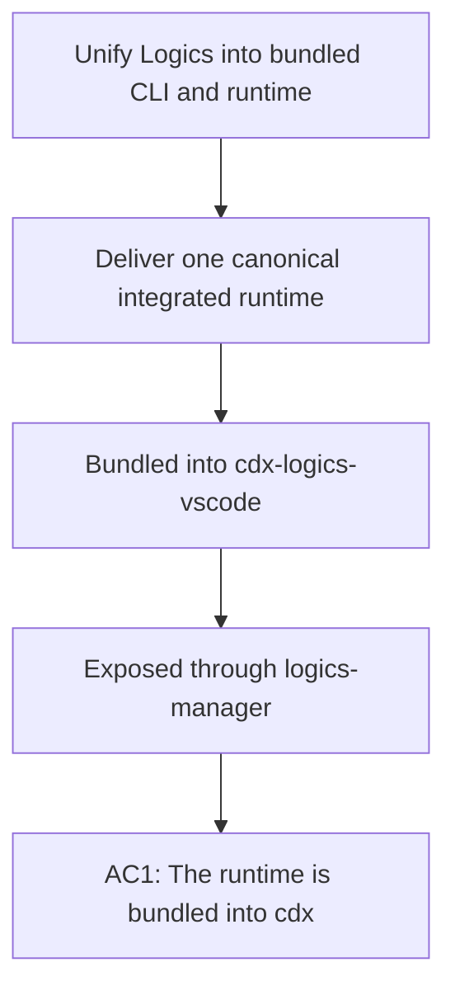

## req_188_unify_logics_into_a_bundled_cli_and_integrated_runtime - Unify Logics into a bundled CLI and integrated runtime
> From version: 1.28.0
> Schema version: 1.0
> Status: Ready
> Understanding: 100%
> Confidence: 96%
> Complexity: High
> Theme: Runtime packaging and operator workflow
> Reminder: Update status/understanding/confidence and linked backlog/task references when you edit this doc.

# Needs
- Deliver a single canonical Logics runtime that is bundled into `cdx-logics-vscode`, exposed through `logics-manager`, and usable without a separate `logics/skills` checkout.
- Remove the operational burden of bootstrapping skills, bridges, or assistant wiring by hand.
- Keep the client repository focused on project content while the runtime, assistant integration, and CLI packaging are handled by the toolchain.

# Context
Today the Logics experience is split across multiple layers:
- repository Markdown docs for requests, backlog items, tasks, product briefs, and ADRs;
- a separately managed `logics/skills` runtime tree;
- bridge and overlay style helper files;
- plugin behavior that still relies on repo-local and kit-local assumptions.

That split is the core product problem. The target state is simpler:
- one repo-level source of truth for project docs;
- one integrated Python runtime bundled with `cdx-logics-vscode`;
- one canonical CLI surface, `logics-manager`;
- zero required local skills bootstrap;
- zero required manual bridge management;
- zero residue from the old `cdx-logics-kit` boundary in the client repository.

The TypeScript surface should stay strictly limited to what the VS Code extension host requires for commands, webviews, and local UI integration. All workflow semantics, assistant-generation semantics, packaging logic, and repository operations should live in Python.

The CLI should remain usable by itself, but the plugin should treat it as the local API. The CLI should have polished human output, stable JSON where needed, and enough coverage to replace the full current plugin and kit behavior surface without regressions.
The canonical product logic should be implemented in Python, while TypeScript is retained only for the VS Code extension host and UI plumbing that cannot move out of the plugin.

# Acceptance criteria
- AC1: The runtime is bundled into `cdx-logics-vscode` and can be used without a separate `logics/skills` checkout.
- AC2: `logics-manager` is the canonical CLI surface for the Logics runtime.
- AC3: The client repository can remain content-only, with only project Markdown docs and no manually managed runtime scaffolding.
- AC4: Skills, bridges, and assistant instructions are generated, bundled, or derived by the toolchain rather than maintained by hand in each client repo.
- AC5: The migration can replace the existing `cdx-logics-kit` boundary without leaving a residual compatibility requirement for normal use.
- AC6: The product plan covers both human-friendly CLI UX and machine-readable automation output.
- AC7: The canonical product logic is implemented in Python, and TypeScript is limited to the minimum VS Code plugin shell required by the extension host and UI.

# AC Traceability
- AC1 -> Backlog: `item_339_integrate_the_runtime_into_cdx_logics_vscode_and_remove_the_skills_checkout`. Proof: the runtime is bundled into `cdx-logics-vscode` and the separate skills checkout is removed.
- AC1 -> Task: `task_148_integrate_the_runtime_into_cdx_logics_vscode_and_remove_the_skills_checkout`. Proof: the implementation task covers bundling the runtime and removing the skills checkout.
- AC2 -> Backlog: `item_340_package_logics_manager_as_a_polished_installable_cli`. Proof: `logics-manager` is the canonical CLI surface and the packaging slice covers installable CLI delivery.
- AC2 -> Task: `task_149_package_logics_manager_as_a_polished_installable_cli`. Proof: the implementation task covers polished CLI packaging and installability.
- AC3 -> Backlog: `item_339_integrate_the_runtime_into_cdx_logics_vscode_and_remove_the_skills_checkout`. Proof: the client repo stays content-only with no managed runtime scaffolding.
- AC3 -> Task: `task_148_integrate_the_runtime_into_cdx_logics_vscode_and_remove_the_skills_checkout`. Proof: the implementation task covers the content-only repo shape and runtime integration.
- AC4 -> Backlog: `item_341_generate_assistant_bridges_and_instructions_from_the_integrated_runtime`. Proof: skills, bridges, and assistant instructions are toolchain-derived instead of hand-maintained.
- AC4 -> Task: `task_150_generate_assistant_bridges_and_instructions_from_the_integrated_runtime`. Proof: the implementation task covers generating assistant bridges and instructions from the runtime.
- AC5 -> Backlog: `item_339_integrate_the_runtime_into_cdx_logics_vscode_and_remove_the_skills_checkout`. Proof: the migration removes the legacy kit boundary without a residual compatibility requirement.
- AC5 -> Task: `task_148_integrate_the_runtime_into_cdx_logics_vscode_and_remove_the_skills_checkout`. Proof: the implementation task removes the residual compatibility path together with the skills checkout.
- AC6 -> Backlog: `item_340_package_logics_manager_as_a_polished_installable_cli`. Proof: the CLI plan covers both human UX and structured automation output.
- AC6 -> Task: `task_149_package_logics_manager_as_a_polished_installable_cli`. Proof: the implementation task covers both polished human output and machine-readable contracts.
- AC7 -> Backlog: `item_339_integrate_the_runtime_into_cdx_logics_vscode_and_remove_the_skills_checkout`. Proof: the runtime architecture moves product semantics into Python and leaves only plugin shell work in TypeScript.
- AC7 -> Task: `task_148_integrate_the_runtime_into_cdx_logics_vscode_and_remove_the_skills_checkout`. Proof: the implementation task covers the Python runtime integration and the minimal plugin shell boundary.

# Definition of Ready (DoR)
- [x] Problem statement is explicit and user impact is clear.
- [x] Scope boundaries (in/out) are explicit.
- [x] Acceptance criteria are testable.
- [x] Dependencies and known risks are listed.

# Companion docs
- Product brief(s): `logics/product/prod_009_logics_cli_as_the_primary_operator_surface_and_unified_runtime_api.md`
- Architecture decision(s): (none yet)

# AI Context
- Summary: Unify Logics into a bundled CLI and integrated runtime with no separate skills checkout.
- Keywords: logics-manager, bundled runtime, cli, plugin, skills, bridges, assistant instructions, packaging, no bootstrap
- Use when: Use when framing the runtime integration, packaging, or repository-shape work for the new Logics CLI model.
- Skip when: Skip when the work is unrelated to runtime bundling, CLI packaging, or removal of the separate skills checkout.
# Backlog
- `logics/backlog/item_339_integrate_the_runtime_into_cdx_logics_vscode_and_remove_the_skills_checkout.md`
- `logics/backlog/item_340_package_logics_manager_as_a_polished_installable_cli.md`
- `logics/backlog/item_341_generate_assistant_bridges_and_instructions_from_the_integrated_runtime.md`
- `logics/backlog/item_342_remove_the_legacy_logics_skills_submodule_and_manual_bootstrap_path.md`
- `logics/backlog/item_343_eliminate_legacy_cdx_logics_kit_compatibility_surfaces_from_the_extension_runtime.md`
- `logics/backlog/item_344_add_an_npm_distribution_surface_for_logics_manager.md`
