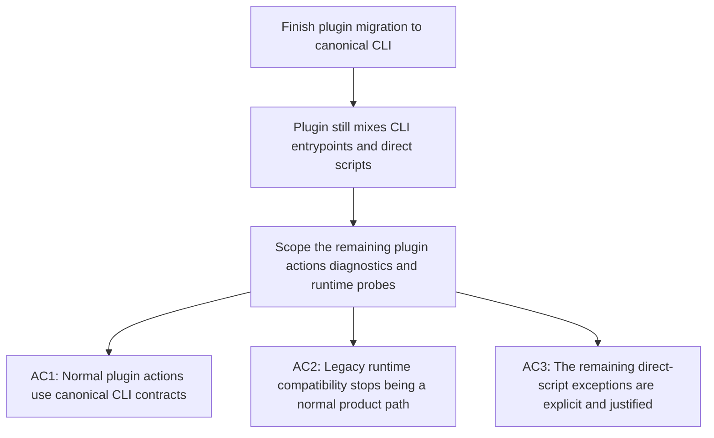

## req_189_finish_plugin_migration_to_canonical_logics_manager_cli_surface - Finish plugin migration to canonical logics-manager CLI surface
> From version: 1.28.1
> Schema version: 1.0
> Status: Done
> Understanding: 98%
> Confidence: 91%
> Complexity: Medium
> Theme: Runtime integration
> Reminder: Update status/understanding/confidence and linked backlog/task references when you edit this doc.

# Needs
- Finish the plugin migration so the VS Code extension acts as a thin client over the canonical `logics-manager` CLI surface instead of mixing direct script calls, legacy `logics/skills` compatibility checks, and partially unified runtime entrypoints.
- Remove the remaining ambiguity between "the plugin uses the integrated runtime" and "the plugin uses the canonical CLI contract" by making the supported operator path explicit in code, diagnostics, and packaging-facing behavior.

# Context
- `prod_009` promises one stable operator surface, one integrated runtime, and a thin plugin shell over that runtime.
- The repository already bundles the Python runtime and exposes `logics-manager` through both Python packaging and the npm wrapper, but the plugin still calls some dedicated scripts directly and still contains residual legacy messaging tied to `logics/skills` or `cdx-logics-kit`.
- A recent cleanup wave removed a real blocking legacy path from runtime update/repair behavior, but the migration is not fully complete while the plugin still needs knowledge of internal script layout or legacy compatibility states for normal product behavior.
- Assistant-surface audit on 2026-04-23: generated `logics/instructions.md` already points to `logics-manager flow ...`, but Claude bridge variants and fallback prompts still expose `flow-manager` as the apparent workflow agent name, the plugin still prefers `$logics-flow-manager` for request authoring, and several runtime-global/test surfaces still treat `logics/skills` as a visible assistant/runtime shape.

# Assistant-surface audit snapshot
- Already aligned:
  - `logics/instructions.md` tells assistants to use `python3 -m logics_manager flow ...`, `lint`, `audit`, and `bootstrap`.
  - The generated Claude instructions emitted from `logics_manager/assist.py` already describe `logics-manager` as the canonical workflow API.
- Still hybrid:
  - `logics_manager/assist.py` still publishes a Claude bridge variant named `flow-manager` with a `$logics-flow-manager` fallback prompt.
  - `src/logicsViewProviderSupport.ts` still prefers `$logics-flow-manager` when the plugin selects a request-authoring agent.
  - Some assistant/runtime-global docs, tests, and historical surfaces still expose `logics/skills` or `flow-manager` as if they were part of the normal supported model.
- Product implication:
  - The assistant contract is operational, but it is not yet clean enough to say the product consistently teaches one canonical workflow surface.

# Problem
- The extension still partially depends on runtime internals instead of consistently treating `logics-manager` as the product API.
- That keeps product semantics split across Python CLI commands, plugin-specific direct script execution, and leftover TypeScript knowledge of legacy runtime layout.
- As long as that split remains, the plugin can drift from the canonical CLI surface and `prod_009` stays only partially delivered.
- The same ambiguity still leaks into assistant-facing surfaces: the generated assistant instructions describe the canonical CLI correctly, but bridge names, fallback prompts, request-authoring defaults, and some runtime-global surfaces still teach a partly historical `flow-manager` / `skills` mental model.

# Acceptance criteria
- AC1: Plugin actions that belong to the canonical operator surface invoke `logics-manager` entrypoints or a clearly defined equivalent canonical runtime wrapper, not ad hoc direct script paths.
- AC2: Normal plugin diagnostics, repair flows, and runtime gating no longer model `logics/skills` or `cdx-logics-kit` compatibility as a supported steady-state requirement.
- AC3: Any remaining direct-script paths are reduced to explicitly scoped exceptions, documented with justification, and are not ambiguous with the canonical CLI contract.
- AC4: The user-visible plugin contract, tests, and packaging signals consistently describe the plugin as a thin client over the integrated `logics-manager` runtime.
- AC5: Assistant-facing generated instructions, bridge prompts, and request-authoring defaults consistently steer operators toward `logics-manager` as the canonical workflow API, with any retained `flow-manager` naming reduced to explicit legacy/compatibility labeling only.

# Scope
- In:
- finish the migration of plugin-triggered workflow, diagnostics, repair, and assistant-facing runtime actions toward canonical `logics-manager` entrypoints;
- remove or isolate residual legacy compatibility branches and messaging that still treat the old kit boundary as a normal runtime model;
- update tests and operator-facing copy so the supported contract is unambiguous.
- align generated assistant instructions, Claude bridge prompts, and plugin agent-selection defaults with the canonical CLI contract.
- Out:
- redesigning unrelated plugin UI;
- changing hybrid-assist policy beyond what is needed to align with the canonical CLI contract;
- broad packaging or release work unrelated to plugin-to-CLI delegation.

# Dependencies and risks
- Depends on the current integrated runtime remaining the single Python source of truth for workflow behavior.
- Depends on identifying the remaining plugin actions that still bypass the canonical CLI surface.
- Risk: some dedicated helper scripts may still be useful implementation details; collapsing them too aggressively without an explicit CLI contract could create churn instead of clarity.
- Risk: diagnostics and migration copy may still mention legacy paths for repair/migration support, so the work must distinguish historical troubleshooting from supported normal operation.
- Risk: assistant prompts and bridge IDs may still need some compatibility stability for existing operator habits, so naming cleanup must distinguish stable generated artifacts from the canonical API the artifacts recommend.

# Current closure state
- Closed in recent waves:
  - runtime update/repair no longer treats `logics/skills` as a normal blocking requirement;
  - companion-doc creation now routes through `logics-manager flow companion` instead of plugin-side direct script calls;
  - user-visible runtime diagnostics already use softer migration framing instead of presenting the old kit boundary as a canonical runtime source.
- Still open under this request:
  - assistant-triggered workflow entrypoints still expose the historical `$logics-flow-manager` contract in generated bridges and plugin agent selection;
  - residual assistant/runtime-global labels and tests still blur the line between canonical `logics-manager` usage and compatibility naming;
  - contract/documentation cleanup still needs to make any retained aliases explicit and reviewable.

# Definition of Ready (DoR)
- [ ] Problem statement is explicit and user impact is clear.
- [ ] Scope boundaries (in/out) are explicit.
- [ ] Acceptance criteria are testable.
- [ ] Dependencies and known risks are listed.

# Companion docs
- Product brief(s): `logics/product/prod_009_logics_cli_as_the_primary_operator_surface_and_unified_runtime_api.md`
- Architecture decision(s): (none yet)

# References
- `logics/product/prod_009_logics_cli_as_the_primary_operator_surface_and_unified_runtime_api.md`
- `src/logicsViewDocumentController.ts`
- `src/logicsCodexWorkflowOperations.ts`
- `src/logicsEnvironment.ts`
- `src/claudeBridgeSupport.ts`
- `src/logicsViewProviderSupport.ts`
- `logics_manager/assist.py`
- `logics/instructions.md`
- `scripts/logics-manager.py`
- `package.json`

# AI Context
- Summary: Finish the plugin migration so the extension consistently delegates to the canonical integrated `logics-manager` runtime surface.
- Keywords: plugin, logics-manager, runtime integration, cli contract, legacy cleanup
- Use when: Use when scoping the remaining product work needed to make the plugin a thin client over the canonical CLI/runtime surface.
- Skip when: Skip when the work is only about unrelated UI polish or generic runtime packaging not tied to plugin delegation.

# Backlog
- `logics/backlog/item_345_route_plugin_workflow_actions_through_canonical_logics_manager_entrypoints.md`
- `logics/backlog/item_346_orchestrate_plugin_migration_to_the_canonical_logics_manager_cli_surface.md`
- `logics/backlog/item_347_remove_legacy_runtime_compatibility_surfaces_from_plugin_diagnostics_and_gating.md`
- `logics/backlog/item_348_document_and_validate_the_canonical_plugin_to_cli_contract.md`
