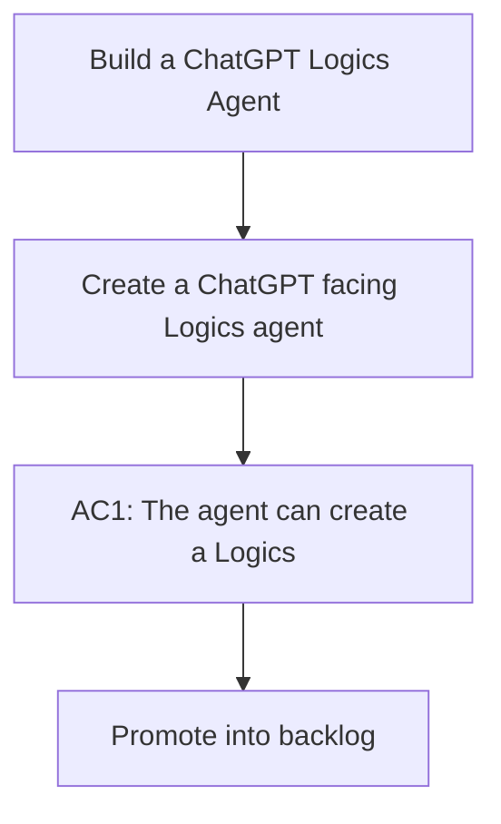

## req_191_build_a_chatgpt_logics_agent - Build a ChatGPT Logics Agent
> From version: 2.0.5
> Schema version: 1.0
> Status: Draft
> Understanding: 90%
> Confidence: 85%
> Complexity: Medium
> Theme: Operator workflow
> Reminder: Update status/understanding/confidence and linked backlog/task references when you edit this doc.

# Needs
- Create a ChatGPT-facing Logics agent that turns product conversation into structured Logics documents while leaving implementation work to Codex.
- Make the first version local-first: the MCP server runs on the operator machine, acts only inside this repository, and exposes a narrow set of safe Logics actions to ChatGPT through an HTTPS-compatible access path.

# Context
- ChatGPT is where many ideas are discussed and clarified, but Logics is where the project expects those ideas to become durable workflow artifacts.
- Codex can execute well-scoped tasks, but the handoff is only strong when the request, backlog, and task documents are already clear.
- ChatGPT cannot directly connect to a pure `localhost` MCP server, so local execution needs a controlled HTTPS exposure layer for ChatGPT usage.
- The product direction is captured in `logics/product/prod_010_chatgpt_logics_agent.md`.

# Acceptance criteria
- AC1: The agent can create a Logics request from a ChatGPT conversation through a bounded MCP action.
- AC2: The agent can promote existing workflow docs only through canonical `logics-manager` commands.
- AC3: The MCP surface rejects arbitrary shell execution and absolute path writes.
- AC4: Each write returns the changed artifact path, validation status, and a human-readable diff summary.
- AC5: Codex remains the execution agent and can later consume generated tasks without extra translation.

# AC Traceability
- AC1 -> Backlog: `item_352_build_a_chatgpt_logics_agent`. Proof: the backlog slice includes the bounded MCP action for creating a Logics request from ChatGPT conversation.
- AC1 -> Task: `task_153_build_a_chatgpt_logics_agent`. Proof: the implementation task covers the request creation action and its acceptance check.
- AC2 -> Backlog: `item_352_build_a_chatgpt_logics_agent`. Proof: the backlog slice requires all promotions to go through canonical `logics-manager` commands.
- AC2 -> Task: `task_153_build_a_chatgpt_logics_agent`. Proof: the implementation task covers the promotion actions and canonical command usage.
- AC3 -> Backlog: `item_352_build_a_chatgpt_logics_agent`. Proof: the backlog slice includes command and path restrictions for the MCP surface.
- AC3 -> Task: `task_153_build_a_chatgpt_logics_agent`. Proof: the implementation task covers rejecting arbitrary shell execution and absolute path writes.
- AC4 -> Backlog: `item_352_build_a_chatgpt_logics_agent`. Proof: the backlog slice includes validation and diff reporting after write actions.
- AC4 -> Task: `task_153_build_a_chatgpt_logics_agent`. Proof: the implementation task covers changed path, validation status, and diff summary reporting.
- AC5 -> Backlog: `item_352_build_a_chatgpt_logics_agent`. Proof: the backlog slice keeps Codex as the execution agent and limits ChatGPT to Logics document preparation.
- AC5 -> Task: `task_153_build_a_chatgpt_logics_agent`. Proof: the implementation task covers the Codex handoff boundary and avoids direct ChatGPT implementation.

# Definition of Ready (DoR)
- [x] Problem statement is explicit and user impact is clear.
- [x] Scope boundaries (in/out) are explicit.
- [x] Acceptance criteria are testable.
- [x] Dependencies and known risks are listed.

# Companion docs
- Product brief(s): `logics/product/prod_010_chatgpt_logics_agent.md`
- Architecture decision(s): `logics/architecture/adr_022_chatgpt_logics_agent_mcp_contract.md`

# References
- `LOGICS.md`
- `logics/product/prod_010_chatgpt_logics_agent.md`
- `logics/architecture/adr_022_chatgpt_logics_agent_mcp_contract.md`
- `logics/product/prod_009_logics_cli_as_the_primary_operator_surface_and_unified_runtime_api.md`

# AI Context
- Summary: Build a local-first ChatGPT Logics Agent that creates and promotes workflow docs through bounded MCP actions while Codex handles implementation.
- Keywords: chatgpt, mcp, logics-manager, local-first, codex handoff, product workflow
- Use when: You need to scope the ChatGPT-facing entrypoint for Logics document creation and Codex handoff.
- Skip when: The work is about direct code execution by ChatGPT or a public hosted multi-tenant Logics service.

# Backlog
- `item_352_build_a_chatgpt_logics_agent`

# Tasks
- `task_153_build_a_chatgpt_logics_agent`
