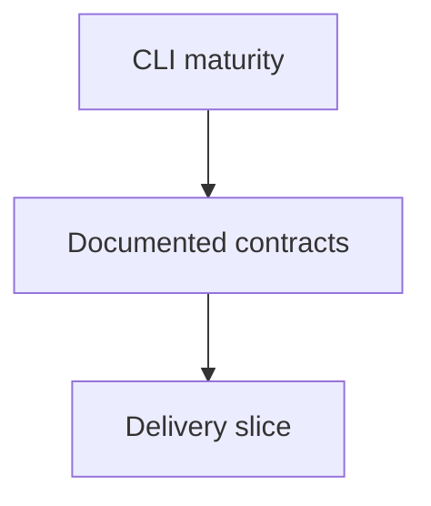

## req_197_mature_cli_product_contracts - Mature CLI product contracts
> From version: 2.1.2 delivered
> Schema version: 1.0
> Status: Done
> Understanding: 100%
> Confidence: 95%
> Complexity: Medium
> Theme: Operator workflow
> Reminder: Update status/understanding/confidence and linked backlog/task references when you edit this doc.

# Needs
- Mature the Logics Manager CLI from a hardened command surface into a documented, scriptable, and resilient primary product surface.
- Keep manual terminal use, local automation, npm wrapper use, and agent workflows aligned on the same CLI contracts.

# Context
- Builds on the CLI hardening captured in `logics/product/prod_013_cli_primary_usage_audit_and_hardening.md`.
- Builds on the mutation safety work captured in `logics/product/prod_014_cli_mutation_safety_and_automation_contract.md`.
- Extends the roadmap captured in `logics/product/prod_015_cli_product_maturity_roadmap.md`.
- The CLI is now the primary user path, so contracts such as JSON output, path boundaries, target resolution, and mutation behavior need product-level clarity.

# Acceptance criteria
- AC1: The CLI JSON contract is documented and covered by representative subprocess tests.
- AC2: Workflow target input forms and path boundary behavior are documented for operators.
- AC3: Shared CLI helpers reduce repeated output/path handling across high-use commands.
- AC4: Multi-file mutation risks have a defined mitigation path or documented limitation.
- AC5: Product briefs, backlog, and task docs are linked so CLI maturity work is traceable.

# Definition of Ready (DoR)
- [x] Problem statement is explicit and user impact is clear.
- [x] Scope boundaries (in/out) are explicit.
- [x] Acceptance criteria are testable.
- [x] Dependencies and known risks are listed.

# Risks and dependencies
- Depends on the native Python CLI and npm wrapper staying aligned on the same entrypoint.
- Main residual risk is interrupted multi-file Markdown mutation; recovery is documented through `git status`/`git diff` and rerun after cleanup.

# Companion docs
- Product brief(s): `logics/product/prod_013_cli_primary_usage_audit_and_hardening.md`, `logics/product/prod_014_cli_mutation_safety_and_automation_contract.md`, `logics/product/prod_015_cli_product_maturity_roadmap.md`
- Architecture decision(s): (none yet)

# References
- `logics_manager/flow.py`
- `logics_manager/assist.py`
- `python_tests/test_logics_manager_cli.py`

# AI Context
- Summary: Draft a bounded request for mature cli product contracts.
- Keywords: request-draft, logics-manager, python runtime, bundled CLI
- Use when: You need a new bounded request doc for the Logics workflow.
- Skip when: The work already has an existing request or should go straight to a backlog slice.

# Backlog
- `item_361_mature_cli_product_contracts`
