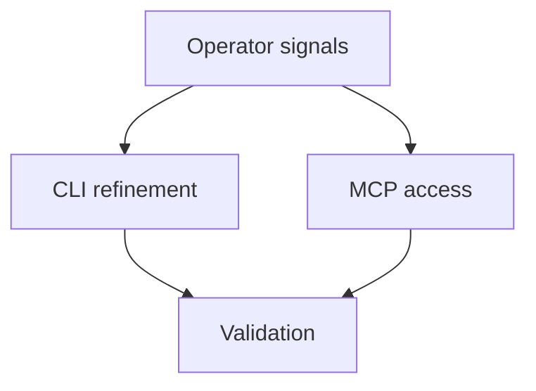

## req_198_refine_logics_operator_signal_commands - Refine Logics operator signal commands
> From version: 2.1.2
> Schema version: 1.0
> Status: Done
> Understanding: 90%
> Confidence: 85%
> Complexity: Medium
> Theme: Operator workflow
> Reminder: Update status/understanding/confidence and linked backlog/task references when you edit this doc.

# Needs
- Refine the new Logics operator signal commands so they produce actionable, low-noise triage output.
- Keep CLI, MCP, documentation, and tests aligned around the same operator workflow.

# Context
- Builds on `prod_016_logics_operator_signal_refinement`.
- The first live run of `status`, `health`, `followups`, and `product-consistency` showed useful signals, but also exposed follow-up noise and a product-lineage gap.
- Operators and assistants need the same read-only signals without relying on ad hoc shell exploration.

# Acceptance criteria
- AC1: `followups` defaults to open actionable work and supports source/closed-state filters.
- AC2: `product-consistency` supports strict release-check behavior and no longer reports valid proposed briefs as blocking.
- AC3: Read-only operator signal commands are available through MCP.
- AC4: Subprocess tests cover the new commands and the `--json` alias.
- AC5: README guidance documents the operator triage flow.
- AC6: Follow-up request title suggestions are concise and shell-safe.

# AC Traceability
- AC1 -> `task_163_refine_logics_operator_signal_commands`. Proof: `followups_payload` filters by source kind and closed/open state, with tests for default open behavior.
- AC2 -> `task_163_refine_logics_operator_signal_commands`. Proof: `product-consistency --strict` exits non-zero only when enforced lineage checks fail.
- AC3 -> `task_163_refine_logics_operator_signal_commands`. Proof: MCP exposes `get_logics_status`, `get_logics_health`, `list_logics_followups`, and `check_product_consistency`.
- AC4 -> `task_163_refine_logics_operator_signal_commands`. Proof: subprocess JSON contract coverage includes `status`, `health`, `followups`, `search`, and `product-consistency`.
- AC5 -> `task_163_refine_logics_operator_signal_commands`. Proof: README includes the operator triage flow.
- AC6 -> `task_163_refine_logics_operator_signal_commands`. Proof: follow-up title generation strips inline Markdown, bounds length, and shell-quotes commands.

# Definition of Ready (DoR)
- [x] Problem statement is explicit and user impact is clear.
- [x] Scope boundaries (in/out) are explicit.
- [x] Acceptance criteria are testable.
- [x] Dependencies and known risks are listed.

# Companion docs
- Product brief(s): `logics/product/prod_016_logics_operator_signal_refinement.md`
- Architecture decision(s): (none yet)

# References
- `logics_manager/flow.py`
- `logics_manager/assist.py`
- `python_tests/test_logics_manager_cli.py`

# AI Context
- Summary: Draft a bounded request for refine logics operator signal commands.
- Keywords: request-draft, logics-manager, python runtime, bundled CLI
- Use when: You need a new bounded request doc for the Logics workflow.
- Skip when: The work already has an existing request or should go straight to a backlog slice.

# Backlog
- `item_362_refine_logics_operator_signal_commands`
