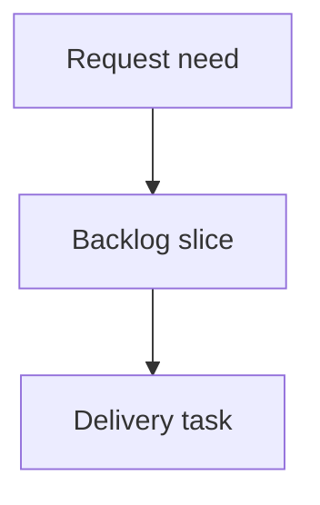

## req_200_implement_agent_closeout_loop_ergonomics - Implement agent closeout loop ergonomics
> From version: 2.1.2
> Schema version: 1.0
> Status: Draft
> Understanding: 90%
> Confidence: 85%
> Complexity: Medium
> Theme: Operator workflow
> Reminder: Update status/understanding/confidence and linked backlog/task references when you edit this doc.

# Needs
- Deliver a bounded request for implement agent closeout loop ergonomics.

# Context
- Generated locally by logics-manager.
- No manual skills bootstrap or bridge editing is required.

# Acceptance criteria
- AC1: The request states the bounded need for implement agent closeout loop ergonomics.
- AC2: Scope boundaries and operator impact are explicit.
- AC3: The request is ready to be promoted into a backlog slice.

# Definition of Ready (DoR)
- [x] Problem statement is explicit and user impact is clear.
- [x] Scope boundaries (in/out) are explicit.
- [x] Acceptance criteria are testable.
- [x] Dependencies and known risks are listed.

# Companion docs
- Product brief(s): `prod_018_agent_closeout_loop_ergonomics`
- Architecture decision(s): (none yet)

# References
- `logics_manager/flow.py`
- `logics_manager/assist.py`
- `python_tests/test_logics_manager_cli.py`

# AI Context
- Summary: Draft a bounded request for implement agent closeout loop ergonomics.
- Keywords: request-draft, logics-manager, python runtime, bundled CLI
- Use when: You need a new bounded request doc for the Logics workflow.
- Skip when: The work already has an existing request or should go straight to a backlog slice.

# Backlog
- none
- `item_364_implement_agent_closeout_loop_ergonomics`
