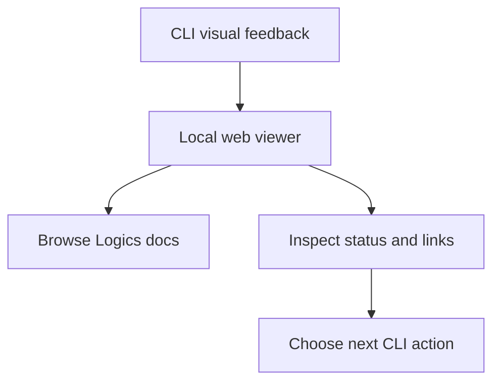

## req_201_add_a_local_web_viewer_for_cli_driven_logics_work - Add a local web viewer for CLI-driven Logics work
> From version: 2.2.1
> Schema version: 1.0
> Status: Draft
> Understanding: 95%
> Confidence: 90%
> Complexity: Medium
> Theme: Operator workflow
> Reminder: Update status/understanding/confidence and linked backlog/task references when you edit this doc.

# Needs
- Give CLI-first Logics operators a visual feedback surface for browsing workflow docs, relationships, validation state, and markdown content without launching VS Code.
- Reuse the existing VS Code webview experience where possible through a standalone local browser viewer.
- Keep the CLI as the canonical workflow entrypoint while adding a richer local read surface for document-heavy work.

# Context
- The CLI is now mature enough to be a primary operator surface, but terminal output is not ideal for scanning a large Logics corpus.
- The existing VS Code webview already contains useful board, detail, filter, and document-rendering behavior.
- A local web viewer could bridge the gap between raw CLI output and the full VS Code extension experience.
- The first product direction should be local-only and read-only by default to avoid introducing a weaker mutation path.
- The viewer should start as an operator cockpit with board, document, and health views instead of a generic landing page.

# Acceptance criteria
- AC1: The product direction explains why CLI output alone is insufficient for document-heavy Logics work.
- AC2: The first version is scoped as a local browser viewer, not a VS Code replacement or cloud service.
- AC3: The proposal preserves the CLI/runtime as the authority for data and future mutations.
- AC4: The brief identifies reuse points from the existing webview and the need for a host adapter boundary.
- AC5: Security and scope guardrails are explicit, especially localhost-only behavior by default.
- AC6: The concrete viewer experience covers command launch, terminal feedback, layout, initial views, and local API shape.

# Definition of Ready (DoR)
- [x] Problem statement is explicit and user impact is clear.
- [x] Scope boundaries (in/out) are explicit.
- [x] Acceptance criteria are testable.
- [x] Dependencies and known risks are listed.

# Companion docs
- Product brief(s): `logics/product/prod_020_local_web_viewer_for_cli_driven_logics_work.md`
- Architecture decision(s): (none yet)

# References
- `logics/product/prod_020_local_web_viewer_for_cli_driven_logics_work.md`
- `logics/product/prod_005_logics_corpus_navigation_views.md`
- `logics/product/prod_009_logics_cli_as_the_primary_operator_surface_and_unified_runtime_api.md`
- `logics/product/prod_015_cli_product_maturity_roadmap.md`
- `src/logicsWebviewHtml.ts`
- `media/mainApp.js`
- `tests/webviewHarnessTestUtils.ts`

# AI Context
- Summary: Explore a CLI-launched local web viewer that provides visual feedback for Logics docs while preserving CLI authority.
- Keywords: local-viewer, cli-visual-feedback, webview-reuse, browser-host-adapter, logics-corpus
- Use when: Planning a visual companion surface for CLI-first Logics workflows.
- Skip when: The work is only about terminal formatting, remote MCP exposure, or VS Code-only UI changes.

# Backlog
- `item_365_add_a_local_web_viewer_for_cli_driven_logics_work`
