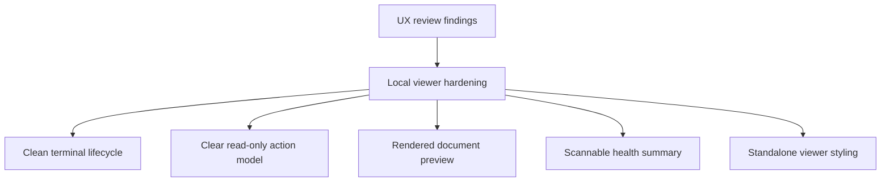

## req_202_harden_local_viewer_ux_after_first_operator_review - Harden local viewer UX after first operator review
> From version: 2.2.0
> Schema version: 1.0
> Status: Draft
> Understanding: 92%
> Confidence: 88%
> Complexity: Medium
> Theme: Operator workflow
> Reminder: Update status/understanding/confidence and linked backlog/task references when you edit this doc.

# Needs
- Make the first local viewer feel like a coherent read-only operator cockpit rather than a lightly adapted VS Code webview.
- Remove confusing mutation affordances from the browser surface while preserving the CLI as the authoritative command path.
- Turn document and health inspection into usable browser views instead of raw debug-style output.
- Ensure the viewer lifecycle is comfortable for CLI-first use, especially clean shutdown from the terminal.

# Context
- `req_201_add_a_local_web_viewer_for_cli_driven_logics_work` delivered the first local viewer slice with local API endpoints, shared webview assets, board/detail browsing, document reads, lint/audit endpoints, and refresh.
- A first UX review found that the core data path works, but several details weaken the intended product experience:
  - `Ctrl-C` can leave `logics-manager view` stuck because shutdown is triggered from the signal handler while the server loop is active.
  - The read-only viewer still exposes `Promote`, `Done`, `Obsolete`, and `Status` actions after selection, even though those actions cannot complete in the local browser.
  - `Open` and `Read` inherit VS Code-oriented wording such as "Edit selected item", which is misleading in a read-only browser viewer.
  - Document viewing currently displays raw markdown in a separate unstyled `pre` block instead of a rendered markdown preview.
  - `viewer-topbar`, `viewer-document`, and related local viewer shell classes have no dedicated CSS, so standalone browser hierarchy is weak.
  - The Health button renders raw lint/audit JSON instead of a scannable validation summary with links back to affected documents.
- These issues do not invalidate the first slice, but they should be handled before the viewer is treated as a polished operator surface.

# Acceptance criteria
- AC1: `logics-manager view` stops cleanly on `Ctrl-C` without hanging and without printing noisy `BrokenPipeError` tracebacks for interrupted browser/API requests.
- AC2: The local viewer does not present mutating actions as available browser commands in read-only mode; unavailable future actions are hidden, disabled with clear copy, or moved out of the primary action path.
- AC3: The primary document action is clear and read-only, using viewer-appropriate wording such as `Read document` or `Preview`; `Open` no longer implies editing in the local browser surface.
- AC4: Document view renders markdown through the shared markdown renderer or an equivalent browser-safe path, including headings, lists, links, tables, code blocks, and readable long-line behavior.
- AC5: The local viewer shell has dedicated styling for the topbar, status/meta line, document panel, and responsive layout so it feels intentional outside VS Code.
- AC6: Health view summarizes lint and audit results visually, highlights blocking issues and warnings, and provides a path to inspect affected documents instead of dumping raw JSON as the primary display.
- AC7: The read-only local viewer behavior is covered by focused tests or a harness check for action availability, document rendering, health rendering, and shutdown behavior where practical.

# Definition of Ready (DoR)
- [x] Problem statement is explicit and user impact is clear.
- [x] Scope boundaries (in/out) are explicit.
- [x] Acceptance criteria are testable.
- [x] Dependencies and known risks are listed.

# Companion docs
- Product brief(s): `logics/product/prod_020_local_web_viewer_for_cli_driven_logics_work.md`
- Architecture decision(s): (none yet)

# References
- `logics/request/req_201_add_a_local_web_viewer_for_cli_driven_logics_work.md`
- `logics/product/prod_020_local_web_viewer_for_cli_driven_logics_work.md`
- `logics_manager/viewer.py`
- `clients/viewer/index.html`
- `clients/viewer/browser-host.js`
- `clients/shared-web/media/webviewChrome.js`
- `clients/shared-web/media/hostApi.js`
- `clients/shared-web/media/renderMarkdown.js`
- `clients/shared-web/media/css/toolbar.css`
- `clients/shared-web/media/css/layout.css`
- `clients/shared-web/media/css/details.css`
- `tests/python/test_logics_manager_cli.py`
- `tests/webview.harness-core.test.ts`

# AI Context
- Summary: Harden the local browser viewer after first UX review so it has clean shutdown, clear read-only action hierarchy, rendered document preview, styled standalone shell, and scannable health output.
- Keywords: local-viewer, viewer-ux, read-only-actions, markdown-preview, health-summary, shutdown, browser-host-adapter
- Use when: Improving the CLI-launched local viewer after the initial `req_201` delivery.
- Skip when: The work is about VS Code-only webview behavior, remote MCP tunnel exposure, or adding broad browser mutations.

# Backlog
- none
