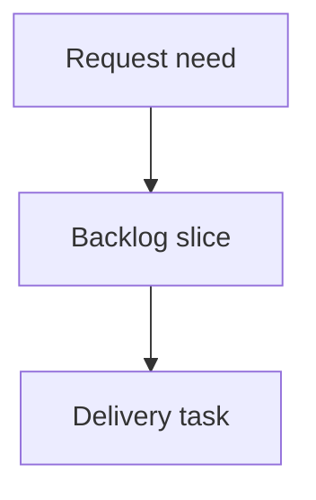

## req_203_improve_local_viewer_corpus_navigation - Improve local viewer corpus navigation
> From version: 2.2.0
> Schema version: 1.0
> Status: Ready
> Understanding: 92
> Confidence: 86
> Complexity: High
> Theme: UI
> Reminder: Update status/understanding/confidence and linked backlog/task references when you edit this doc.

# Needs
- Make the local browser viewer useful for managing a large Logics corpus, not only reading individual docs.
- Add a local `Corpus insights` entry point so CLI-driven operators can see corpus health, relationship gaps, and recent activity without opening VS Code.
- Redesign the filter and sort controls so operators can quickly answer practical questions such as "what is active", "what is blocked", "what needs promotion", "what is unlinked", and "what changed recently".

# Context
- The local viewer now supports reading documents, rendering Mermaid, showing validation health, and opening selected docs with the system default app.
- The VS Code extension already has a richer Logics Insights panel, but the local viewer does not expose comparable corpus-level signals.
- The current filter panel mixes visibility toggles, grouping, sorting, and companion-doc controls in a compact row that is hard to scan and does not match how an operator thinks about corpus triage.
- The target experience should stay viewer-native: compact, fast, no decorative dashboard shell, and usable from `python3 -m logics_manager view`.

# Scope
- Add local corpus insights built from the existing viewer item payload or a small `/api/insights` payload.
- Surface high-value corpus signals first: counts by type/status, active/done/blocked/stale work, relationship gaps, isolated docs, recently updated docs, and incomplete request to backlog to task chains.
- Replace the current filter/sort panel with a clearer corpus-control model: persistent search plus stage/status chips, an advanced filter drawer, readable sort/group controls, active filter summary, and reset behavior that only appears when needed.
- Add corpus presets such as `Active work`, `Blocked`, `Needs promotion`, `Recently changed`, `Unlinked`, and `Companion docs`.
- Keep the local viewer read-mostly; this work should not introduce workflow mutation actions beyond existing document editing.

# Out of scope
- Rebuilding the entire VS Code `Logics Insights` implementation inside the local viewer.
- Adding a charting framework or heavy frontend dependency.
- Changing the canonical Logics document schema.
- Reworking the VS Code extension filters in the same delivery slice unless shared-web changes make that unavoidable.

# Acceptance criteria
- AC1: The local viewer exposes corpus insights from its top-level UI, including overview counts, flow health, relationship gaps, and recent activity.
- AC2: Corpus insights reuse existing indexed Logics item data where practical and avoid duplicating the full VS Code insights implementation.
- AC3: The filter and sort UI is reorganized around operator tasks, with visible search, quick stage/status filters, advanced filters, presets, active-filter count, and clear reset behavior.
- AC4: The revised controls make it easy to isolate active work, blocked work, unlinked docs, recently changed docs, companion docs, and items needing promotion.
- AC5: The local viewer remains lightweight, responsive, and read-mostly; existing read, health, refresh, and edit-document flows keep working.
- AC6: Browser-host tests and Python viewer tests cover the new insights payload/rendering and the filter/sort control behavior.

# Definition of Ready (DoR)
- [x] Problem statement is explicit and user impact is clear.
- [x] Scope boundaries (in/out) are explicit.
- [x] Acceptance criteria are testable.
- [x] Dependencies and known risks are listed.

# Companion docs
- Product brief(s): (none yet)
- Architecture decision(s): (none yet)

# References
- `logics_manager/viewer.py`
- `clients/viewer/browser-host.js`
- `clients/viewer/index.html`
- `clients/shared-web/media/mainApp.js`
- `clients/shared-web/media/css/toolbar.css`
- `clients/vscode/src/logicsCorpusInsightsHtml.ts`
- `clients/vscode/src/logicsCorpusInsightsController.ts`
- `tests/viewer.browser-host.test.ts`
- `tests/python/test_logics_manager_cli.py`

# AI Context
- Summary: Improve local viewer corpus navigation with lightweight corpus insights and a task-oriented filter/sort redesign.
- Keywords: local-viewer, corpus-insights, filters, sorting, corpus-navigation, operator-workflow
- Use when: Planning or implementing local viewer improvements that help operators triage and navigate large Logics corpora.
- Skip when: The work is only about VS Code extension insights or unrelated workflow document schema changes.

# Backlog
- none
- `item_367_improve_local_viewer_corpus_navigation`
